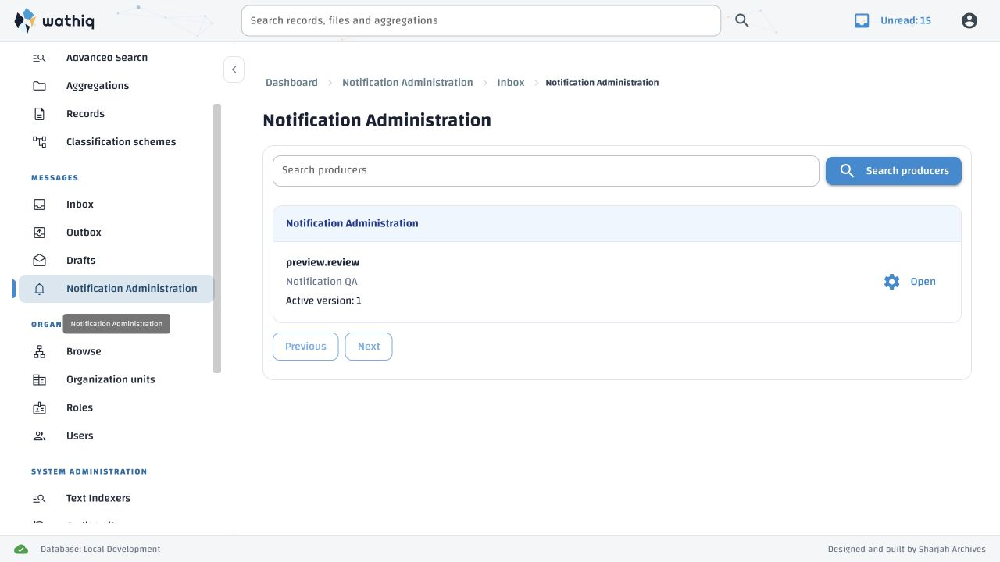
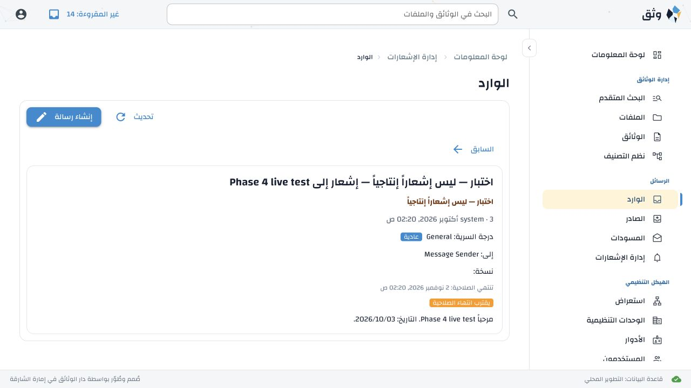

# Notifications and messaging — Phase 4 report

Specification: `specs/notifications-and-messaging.md`, approved revision 1.20.
Scope: §16.4, System notifications and administration. Verified 3 October 2026.

**Status: implementation and functional verification complete.** New Arabic
wording remains subject to the normal administrator review described below.

## Implementation

Backend features can register explicit, code-owned notification contracts and
emit localized durable notifications inside the causing business transaction.
The internal service requires an existing transaction, validates typed context,
resolves only the registered audience and resource builders, and uses the shared
canonical envelope writer and recipient fan-out. An enabled notification failure
rolls back the business operation. Stable event identities make retries idempotent.
Required producers cannot be disabled; missing or incompatible required contracts
or active configurations fail readiness. Startup reconciliation is read-only.

Notification Administration provides bounded producer, version and test-history
lists, shared remote recipient selectors, bilingual preview, immutable version
creation, and activation. Changes require a reason and optimistic concurrency
checks. Saving requires review of the current rendered preview. Activation
requires reviewed and published templates for English and every enabled language.
Database guards also protect language enablement and configuration activation,
including concurrent transactions using an older snapshot.

System envelopes use the lowest security level and cannot request receipts or
actions. Resource links still require ordinary resource authorization and cannot
exceed the message level. Users without person-to-person exchange privilege can
receive and read system notifications. Sent language variants remain immutable;
message views select the current preferred stored variant, while live toast
subjects use the recipient's language at send time.

Controlled tests require the exact saved version and explicitly selected individual
recipients. They never resolve the production audience. Tests use the canonical
send path, retain immutable initiator/test provenance, have a 30-day expiry, and
are limited to 10 recipients and 20 sends per administrator per hour. Concurrent
requests cannot evade the rate limit. Toasts, Inbox rows, message views and test
history visibly identify tests. Tests cannot be replied to, forwarded or captured.
Safe audit events record configuration changes, activation and test outcomes
without retaining message bodies or placeholder values.

No production feature triggers were invented. `application_definitions()` is an
explicit empty registry until a feature supplies its separately approved contract,
seed/migration and integration. The preview producer exists only in the disposable
test application. There is no production system-send REST endpoint.

## Requirement traceability

Backend test names refer to `backend/services/api/tests/test_messaging_phase4.py`.
Paths in the implementation column are relative to `backend/services/api/messaging`
unless otherwise indicated.

| Requirement | Implementation | Verification |
| --- | --- | --- |
| Code-owned registry, reconciliation, required readiness (MSG-018; AC-MSG-046) | `notification_registry.py`, `notification_configuration.py`, API lifespan/health | `test_registry_readiness_required_and_configuration_guards`; `test_registry_unknown_and_missing_required_contracts_fail_closed` |
| Atomic business commit, enabled failure rollback, optional disablement (AC-MSG-001B–001E, 044) | `notifications.py`, shared `envelopes.py` and `service.fan_out` | `test_atomic_system_send_immutable_variants_and_system_only_inbox`; `test_failure_rolls_back_business_change_and_notification`; `test_optional_disable_and_context_authority`; `test_internal_service_requires_existing_transaction` |
| Stable retries, single fan-out | Event receipts, transaction retry and advisory locks | `test_concurrent_event_retries_create_one_complete_fanout` |
| Typed context and registered audiences/resources only (AC-MSG-045) | Registry validation, named resolver dispatch, resource policy checks | `test_typed_context_rejects_coercion_nonfinite_and_oversized_values`; `test_dynamic_audience_is_allowlisted_and_never_resolved_for_tests`; `test_resource_builder_cannot_bypass_baseline_or_authorization` |
| Lowest level, no actions/receipts, system-only Inbox (AC-MSG-010AA, 028, 050) | Shared schema constraints, system send validation, existing mailbox authorization | `test_atomic_system_send_immutable_variants_and_system_only_inbox`; `test_test_send_rate_is_atomic_and_system_messages_cannot_be_reused` |
| Static expansion and To precedence without exchange privilege | Configuration audience resolver | `test_static_role_overlap_deduplicates_to_precedence_without_exchange` |
| Administrator boundary, reasons, immutable versions, stale edits (MSG-019; AC-MSG-038–040) | `notification_routes.py`, configuration service, policy inventory, administration UI | `test_templates_publication_concurrency_and_administration_boundaries`; policy/global-privilege regression suites; UI stale-edit test |
| Complete publication coverage and historic variants (MSG-021; AC-MSG-047–048) | Configuration validation, localization enablement guard, migration 036, `reading.py` | `test_template_parity_coverage_and_database_immutability`; `test_language_enablement_requires_published_active_variant`; `test_language_activation_race_preserves_coverage`; `test_language_variants_escape_values_and_preserve_send_language` |
| Controlled test provenance, expiry, limits, restrictions (AC-MSG-041–043) | Test service and history, immutable schema fields, UI test labels | `test_controlled_test_marking_limits_audit_and_retry`; `test_test_send_ignores_stale_static_audience_and_pending_draft_is_valid`; concurrent rate test; live English/Arabic send, toast, Inbox and detail |
| Bounded UI, abandonment, repeat navigation, LTR/RTL (AC-MSG-022, 024) | `frontend/webui/notification_administration.py`, shared selectors, active-view/revision guards | `frontend/webui/interaction/tests/test_notification_administration.py`; live repeat navigation and narrow RTL inspection |
| Catalogue coverage and provenance (AC-MSG-025) | EN catalogue and preserved Arabic merge base | Catalogue checker, messaging artifact regression, 18 localization catalogue tests |

## Verification results

- The combined backend regression run finished with **118 passed and two failed**.
  Both failures were older catalogue assertions that assumed all checked-in Arabic
  translations had generated provenance. The current artifact includes curated
  administrator exports. The tests now verify each entry's actual provenance and
  preserve the original review/publication assertions. The complete affected
  catalogue suite then passed: **18 passed**. Thus all **120 distinct backend
  tests** in the combined selection have passing evidence; no failure remains.
- All **19 Phase 4 backend tests** passed in that combined run, including transaction
  rollback, concurrency, language-activation races and simultaneous test rate limits.
- **35 frontend unit tests passed**, including live test-summary handling,
  relationship selectors, capabilities and security-operation localization.
- **15 NiceGUI interaction tests passed** after the final layout change, covering
  notification administration, messaging and the shared security selector.
- Fresh canonical schema and populated predecessor upgrades through migration 036
  produced identical schema dumps and preserved existing data.
- Catalogue references, matching active keys, ordering, placeholders, nonblank
  values, artifact hash and preservation of curated entries passed. Python
  compilation and `git diff --check` passed.

Live browser verification created, previewed, saved and activated an English/Arabic
configuration through the real UI, then sent controlled tests in both interface
languages. Tests reached the Inbox through the live transport, showed a permanent
test label and lowest security level, and offered no reply, forward or capture.
Reading updated the unread count. Changing the recipient language selected the
stored Arabic variant. Repeated navigation reloaded the active configuration.
Test history showed initiator, version and outcome without message content.

The Arabic producer list initially exposed a double reversal: the global RTL
`.row` rule reversed an already direction-aware flex row. Following the standard
NiceGUI layout approach, producer rows now use native `ui.grid`, and wrapping
actions reuse Wathiq's existing `detail-action-row` pattern. No new CSS override
was introduced. The result was checked in English and Arabic at the normal desktop
size and in Arabic at the affected 670-pixel width; the temporary override was reset.

Screenshots are in `docs/verification/messaging-phase-4/`, including bilingual
preview, English/Arabic test confirmation, English live toast, Inbox/detail,
Arabic history, and final English/Arabic administration layouts.





All database-backed verification used uniquely named disposable databases through
`tools/test_messaging.py`. The combined regression, catalogue rerun and browser
preview each confirmed removal of both their fresh and upgrade databases. Final
preview databases `erms_messaging_test_b9106cb76d254bc8_fresh` and
`erms_messaging_test_f8815c83469d421c_upgrade` were dropped successfully. Preview
servers stopped and verification tabs closed. No persistent database was migrated.

### Reproduction

```sh
backend/services/api/.venv/bin/python tools/test_messaging.py \
  backend/services/api/tests/test_messaging.py \
  backend/services/api/tests/test_messaging_phase2.py \
  backend/services/api/tests/test_messaging_phase3.py \
  backend/services/api/tests/test_messaging_phase4.py \
  backend/services/api/tests/test_policy_inventory.py \
  backend/services/api/tests/test_global_privilege_enforcement.py \
  backend/services/api/tests/test_localization.py \
  backend/services/api/tests/test_localization_catalogue.py
frontend/webui/.venv/bin/python -m pytest -q \
  frontend/webui/tests/test_messaging_live.py \
  frontend/webui/tests/test_relationship_search.py \
  frontend/webui/tests/test_capabilities.py \
  frontend/webui/tests/test_security_operations_localization.py
frontend/webui/.venv/bin/python -m pytest -q --asyncio-mode=auto \
  frontend/webui/interaction/tests/test_notification_administration.py \
  frontend/webui/interaction/tests/test_messaging_workspace.py \
  frontend/webui/interaction/tests/test_security_level_selector.py
frontend/webui/.venv/bin/python frontend/webui/scripts/check_i18n_catalogue.py
```

Add `--preview-notifications` to the database runner for the disposable browser
fixture. Ctrl-C stops the preview and drops both databases.

## Remaining work and deployment

**53 new Arabic entries** are generated drafts requiring normal administrator
review. Existing Arabic wording and provenance were preserved. Browser verification
published fixture copies only in disposable databases. The two existing curated
terminology findings in `classification_transfer.error.checksum_mismatch` and
`classification_transfer.retention_rule` remain unchanged. Existing Starlette/httpx
and AnyIO deprecation warnings remain in test dependencies.

Apply migration `036_notification_administration_guards.sql` after 035 for an
existing database; initialize a new database from `database/schema.sql` alone.
Deployment documentation now explains producer readiness, template publication,
language enablement, feature integration and controlled tests. The Phase 3
PostgreSQL connection calculation is unchanged by Phase 4.

Phase 5 remains planned: human-message record capture, PDF conformance, expiry and
restoration workflows, atomic whole-group purge without tombstones, cleanup,
monitoring, metrics and production hardening. Test envelopes already carry their
30-day expiry; physical cleanup belongs to Phase 5. This phase report does not
declare the entire subsystem production-ready.
