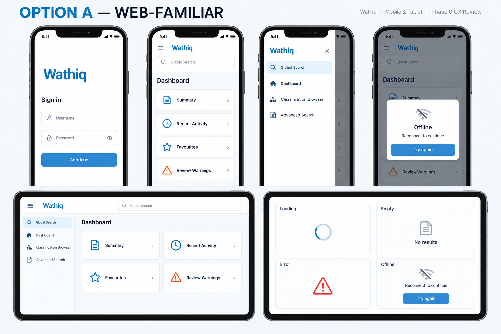
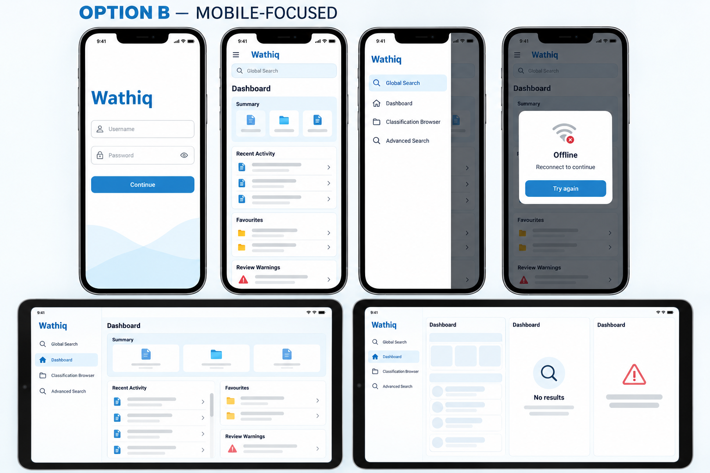

# Phase 0 mockup review

Status: Option B approved  
Created: 30 September 2026
Approved: 30 September 2026

These proposal boards establish visual direction only. They do not add product
behavior, API contracts, permissions, or workflows. Final implementation must
use canonical catalogue text and will receive separate English, Arabic, LTR,
RTL, phone, and tablet validation.

## Option A — Web-familiar

This direction most closely mirrors the current Web UI. It uses simple outlined
cards, a restrained information density, and a persistent desktop-like rail on
larger tablet layouts.

## Option B — Mobile-focused

This direction keeps Wathiq's terminology and navigation hierarchy while using
denser mobile cards, a clearer dashboard hierarchy, and more touch-oriented
summary and activity regions.

## Decision

The user selected **Option B — Mobile-focused** as the foundation visual
direction. This approval applies only to the foundation direction; each
implementation phase will still receive its own detailed screen mockups for
approval as required by the mobile specification.
