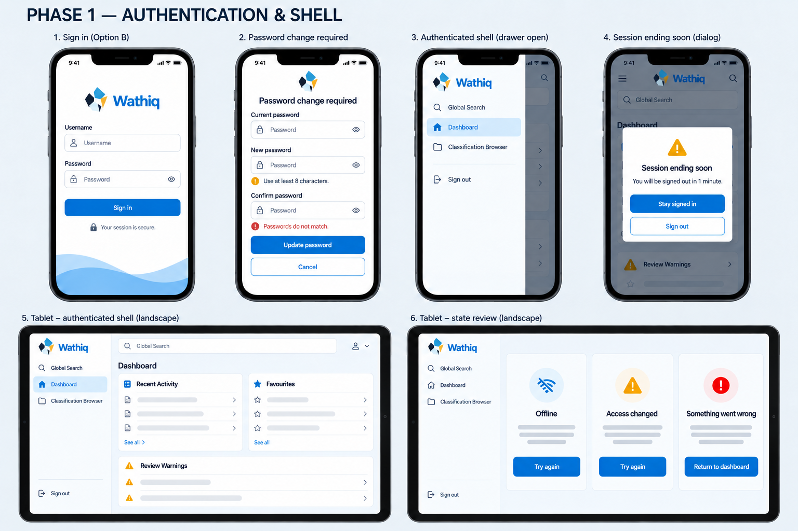
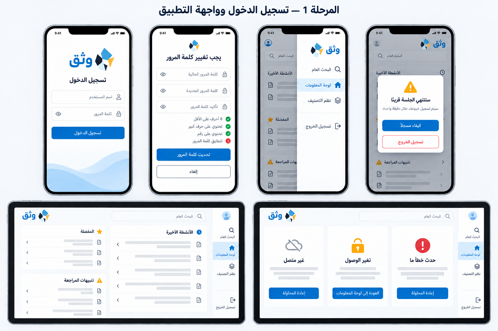

# Phase 1 authentication and shell mockup review

Status: Approved with WebUI logo refinement

Created: 30 September 2026

Approved: 30 September 2026

These boards apply the approved Option B — Mobile-focused foundation direction
to Phase 1 authentication and application-shell requirements. They establish
layout and interaction presentation only. They do not add API contracts,
permissions, destinations, credential states, or session behavior beyond the
approved mobile specification.

## English and LTR

The board covers sign-in, required password change, the authenticated drawer,
the session-expiry warning, a responsive tablet shell, and central offline,
authorization-change, and non-disclosing error presentation.

## Arabic and RTL

The Arabic board mirrors directional structure, including the drawer and tablet
navigation rail on the right. Final implementation must use canonical catalogue
messages; text shown here is a visual-layout proposal and does not itself amend
the catalogue.

## Decision

The user approved both boards with one required refinement: authentication and
dashboard branding must use the canonical WebUI logo from
`frontend/webui/static/brand/wathiq-mark.svg`. The revised boards include that
mark on the authentication pages and dashboard/application-shell headers.

Approval authorizes implementation of the already specified Phase 1 scope only.
It does not approve new workflows, endpoints, authorization rules, or persistent
credential storage.
