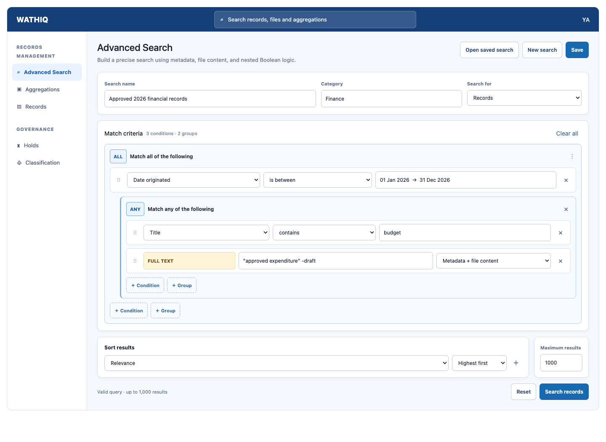

# Advanced Search and Saved Searches — Implementation Specification

**Status:** Approved  
**Project:** ERMS / Wathiq  
**Prepared:** 25 September 2026  
**Revision:** 1.0 — approved component-metadata-search amendment

## 1. Purpose

This specification defines an Advanced Search workspace for aggregations and
records. It provides a visual builder for the existing controlled JSON search
grammar, permits structured metadata and full-text predicates in the same
nested Boolean expression, renders authorized results as pageable cards, and
allows a person user to save a query for later execution or controlled sharing.

A saved search stores a query definition, not a result snapshot. Every execution
returns fresh results and applies the executing user's current privileges,
security clearance, resource ACLs, organizational access, and resource state.
Sharing a saved search never shares the records or aggregations returned by it.

## 2. Relationship to existing search

The approved Full-Text Content Search specification and the implemented search
grammar are prerequisites and remain authoritative. They already define the
`full_text` expression leaf and permit it anywhere a comparison can appear
inside nested `and`, `or`, and `not` expressions.

This feature shall not introduce another filter language, accept SQL or raw
PostgreSQL `tsquery`, or implement a second search compiler. The Advanced Search
builder shall produce the same `SearchRequest` accepted by:

```text
POST /api/v1/aggregations/search
POST /api/v1/records/search
```

The existing `POST /api/v1/full-text-search` endpoint remains the convenience
surface for header search and its mixed relevance-ranked result stream. It is
not the persistence format for an advanced search.

### 2.1 Recommended target model

**Recommendation: one advanced search targets exactly one resource type,
`aggregations` or `records`.** The two resources have different searchable
fields, full-text sources, result summaries, and useful sort keys. A single
target preserves the complete existing sort/offset/limit contract and avoids
inventing misleading cross-resource comparisons or ordering.

The page supports both resource types through a target selector. A user can
save separate record and aggregation searches. The existing header search
continues to provide mixed record-and-aggregation discovery.

Supporting one saved definition with independent record and aggregation
branches is a possible later extension, but is outside this initial scope.

## 3. Goals and non-goals

### 3.1 In scope

- an **Advanced Search** navigation item and page;
- a visual, recursively nested Boolean query builder;
- structured comparison and full-text conditions in one expression tree;
- controlled sorting and page-size selection;
- server validation and execution through the existing search compiler;
- pageable aggregation or record result cards based on the current full-text
  result-card visual language;
- creating, renaming, updating, listing, opening, executing, sharing, and
  deleting saved searches under explicit authorization rules;
- private, role, and organizational-unit audiences;
- optimistic concurrency, event history for saved-search changes, and
  requirement-to-implementation-to-test traceability; and
- explicit loading, empty, validation, partial-index, and error states.

### 3.2 Out of scope

- scheduled execution, alerts, subscriptions, email, or exports;
- result snapshots, cached result sets, or result-count promises;
- public/anonymous links or an `everyone` audience;
- saved searches for digital components, users, roles, audit history, or other
  administrative entities;
- changing resource access, ACLs, clearance, or privileges through sharing;
- user-authored JSON, SQL, regular expressions outside the grammar's existing
  controlled operators, raw `tsquery`, or database configuration selection;
- collaborative editing or folders/tags for saved searches; and
- changing the existing header-search behavior.

## 4. Controlled query contract

### 4.1 Query document

The visual builder and saved-search API use this versioned document:

```json
{
  "schema_version": 1,
  "resource_type": "records",
  "max_results": 1000,
  "request": {
    "where": {
      "and": [
        {
          "field": "date_originated",
          "operator": "between",
          "value": ["2026-01-01T00:00:00Z", "2026-12-31T23:59:59Z"]
        },
        {
          "or": [
            {"field": "title", "operator": "contains_ci", "value": "budget"},
            {
              "full_text": {
                "query": "\"approved expenditure\" -draft",
                "sources": ["metadata", "components"]
              }
            }
          ]
        }
      ]
    },
    "sort": [
      {"field": "_relevance", "direction": "desc"},
      {"field": "date_originated", "direction": "desc"}
    ],
    "include": ["full_text_matches"],
    "limit": 25,
    "offset": 0
  }
}
```

The existing grammar rules remain binding, including field/operator type
validation, resource field allowlists, maximum 50 leaf conditions, maximum
nesting depth five, bounded `in` values, bounded sort fields, deterministic ID
tie-breaking, and full-text length/token/source limits.

### 4.2 Full-text criteria

The builder shall expose a **Full text** condition for both supported targets.
For records, sources are **Record metadata** and **File names and content**;
for aggregations, the only source is **Aggregation metadata**. The control shall
not expose configurations, dictionaries, weights, SQL, or raw `tsquery`.

A full-text condition may be nested, negated, or combined with structured
conditions exactly like any other leaf. A non-indexable full-text value is a
validation error and must never become an unbounded query.

`_relevance` is offered as a sort only when the expression contains a positive
full-text leaf. When match details are useful, the UI adds
`include: ["full_text_matches"]`; this remains response decoration and does not
change which resources match.

### 4.3 Record digital-component metadata fields

When `resource_type` is `records`, the ordinary structured-condition `field`
allowlist additionally includes built-in digital-component metadata fields.
They use the existing comparison-leaf shape and do not introduce a relationship
node, another grammar, or a full-text operation:

```json
{
  "and": [
    {
      "field": "component.file_name",
      "operator": "starts_with_ci",
      "value": "A"
    },
    {
      "field": "component.size_in_bytes",
      "operator": "lt",
      "value": 100
    }
  ]
}
```

This expression returns records having at least one authorized digital
component whose name starts with `A` and whose size is less than 100 bytes.
The result resource remains the record; digital components never become result
rows through these fields.

The initial component metadata field catalogue is:

| Search field | Type | Component metadata |
| --- | --- | --- |
| `component.file_name` | text | File name |
| `component.mime_type` | text | MIME type |
| `component.size_in_bytes` | integer | Size in bytes |
| `component.date_created` | datetime | Date created |
| `component.date_originated` | datetime | Date originated |
| `component.checksum_algorithm` | text | Checksum algorithm |
| `component.checksum_value` | text | Checksum value |
| `component.content_status` | text | Controlled content-status value |

Each field uses the existing operators for its declared type and nullability.
Values remain bound parameters, and the public field names map to controlled
digital-component columns inside the compiler. Storage keys, storage-provider
details, extracted content, search vectors, and other internal fields are not
searchable through this catalogue.

Component predicates use the existing `and`, `or`, and `not` operators. Within
one `and` scope, all component predicates—including nested component-only
`or` groups—must be satisfied by the same authorized digital component. Thus:

```json
{
  "or": [
    {"field": "component.file_name", "operator": "starts_with_ci", "value": "A"},
    {"field": "component.file_name", "operator": "starts_with_ci", "value": "B"}
  ]
}
```

means that at least one component has a name beginning with `A` or `B`, while:

```json
{
  "and": [
    {"field": "component.file_name", "operator": "starts_with_ci", "value": "A"},
    {"field": "component.size_in_bytes", "operator": "lt", "value": 100}
  ]
}
```

requires one component to satisfy both properties. It must never match because
one component satisfies the name predicate and another satisfies the size
predicate. A negated component expression has the ordinary Boolean meaning in
the same component scope; when negation is the complete component criterion,
it means that no authorized component satisfies the negated criterion.

Record fields and component fields may appear together in the same nested
Boolean query. The compiler shall preserve normal Boolean meaning while using
an authorization-aware correlated component existence test wherever component
metadata is referenced. Component predicates count toward the existing
50-leaf and five-level limits. Component fields are filters only and are not
valid sort fields because a record can have multiple components.

These fields are unavailable when `resource_type` is `aggregations`. Aggregation
results are not implicitly matched through records or components in descendant
aggregations. Adding these allowlisted fields is backward-compatible with
stored schema version 1 definitions and does not reinterpret an existing saved
definition.

### 4.4 Persisted normalization

The server shall validate a submitted definition using the same schema and
compiler used for execution, then persist canonical API JSON with defaults and
deterministic sort tie-breakers. The following are runtime state and shall not
be persisted in the definition:

- `offset` other than canonical `0`;
- cursors;
- `debug`;
- selected result-page number; and
- returned results, counts, snippets, scores, or index-freshness state.

`max_results` is part of the saved definition. It is the maximum number of
authorized matching resources that may be returned across all pages of one
execution. The creator selects a value from `1` through the system-fixed maximum
of **5,000**; the default is **1,000**. The client cannot raise either the saved
cap or the system cap while executing the search.

The page size may be persisted as the user's preferred bounded `limit`, but it
does not change `max_results`. Executing or reopening a saved search always
begins at offset `0`.

Unknown `schema_version` values shall be rejected. A future grammar change that
cannot execute an older definition shall return a stable
`saved_search_definition_unsupported` error rather than silently rewriting its
meaning.

## 5. Advanced Search page

### 5.1 Navigation and visibility

Under the **Records Management** navigation category, the order shall be:

```text
Advanced Search
Aggregations
Records
...
```

The link appears above **Aggregations**. It is visible when the person has at
least one of `aggregation.view` or `record.view`. The target selector hides a
target for which the user lacks the corresponding view privilege. If neither
is effective, the link is hidden and direct navigation returns `403`.

Opening or executing an accessible saved search does not require a saved-search
management privilege. Ordinary aggregation/record view authorization is still
required.

### 5.2 Page composition

The page is ordered around the user's primary task, **build → execute → review**.
It contains:

1. a heading and concise explanation;
2. a target selector for **Records** or **Aggregations**;
3. the visual query builder;
4. sort controls, page-size selection, and the execution maximum;
5. **Search**, **Reset**, and validation-summary actions;
6. saved-search controls for **Save search**, **Save as**, **Open saved search**,
   **New search**, and permitted administration or deletion; and
7. the results area.

On desktop-width layouts, the saved-search controls occupy a compact panel to
the right of the dominant Criteria panel. The panel identifies whether the
current query is unsaved or names the opened saved search and its category. On
narrow screens it stacks below Criteria without changing action order or
behavior. When an editable saved search is open, **Save search** is relabelled
**Update saved search** so the route for changing its name, category,
description, definition, or audience is explicit.

On a new search, **Save search** is the sole creation action; **Save as** is
hidden because there is no existing saved search to copy. When a saved search
is open, **Save as** is available to a user with the save privilege and creates
a new independent copy. Saved-search name, category, description, and audience fields
shall not occupy the primary search workspace or appear above the query
builder. Choosing **Save search** or **Save as** opens the save workflow and
then requests those values. When an existing saved search is open, a compact
context banner may identify it without displacing the builder.

The URL may identify the saved-search ID and current result offset. It shall not
place the complete query or sensitive search values in the URL.

### 5.3 Visual query builder



The mockup above is the approved conceptual layout and interaction baseline. It
establishes the nested
Boolean-group presentation, typed condition rows, full-text treatment, sorting,
maximum-results control, and primary actions. The task-first ordering in
section 5.2 supersedes the mockup's earlier always-visible saved-search metadata
placement. Exact spacing may adapt to the
implemented Wathiq component system and responsive viewport, but implementation
must preserve the specified information hierarchy, behaviors, accessibility,
and established Wathiq visual language.

The builder is a tree of **All**, **Any**, and **Not** groups, corresponding to
`and`, `or`, and `not`. Each group is visibly bounded and indented. A group
provides contextual actions to add a condition, add a group, negate/wrap a
node, duplicate a node, or remove it.

Structured-condition rows expose only valid combinations:

- field selector, using human labels rather than API names;
- operator selector filtered by field type and nullability; and
- one or more typed value controls appropriate to the operator.

Relationship fields use governed, searchable pickers and submit only the
selected ID. Picker dropdown entries use Wathiq card rows with an entity icon,
human-readable name or title, and a separate code, number, or email identity.
The selected condition value may use a compact code/name presentation.

Classification, organizational-unit, and aggregation values additionally
provide a **Browse** action. Classification browsing follows published scheme
and classification hierarchy; organizational-unit browsing uses the governed
organization structure; aggregation browsing begins with a published
classification scheme and lets the user drill through the classification tree
to its governed root and child aggregations. Selecting a visible aggregation
closes the browser and populates the value control. Security levels remain a small ordered catalogue and do not require a
hierarchy browser. Role and user values, wherever a controlled field exposes
them, use searchable governed selectors; roles and users may use the existing
organization browser when organizational context is useful. Picker searches,
cards, and browsers must not reveal inaccessible entities.

Date/time controls serialize explicit ISO-8601 values.
`between` presents two ordered values. `in` and `not_in` use a bounded
multi-value editor. Null operators show no value control. Selectors and typed
value controls are clearable so a mistaken value can be removed. Record and
aggregation `medium` use the controlled Digital, Physical, and Mixed selector;
`component.content_status` uses the controlled committed-component statuses
Pending, Uploading, Available, Failed, Quarantined, and Deleted. These status
options and the selected status are rendered as labelled chips while remaining
clearable and keyboard operable.

For a Records target, the field selector groups fields into **Record** and
**Digital component** sections. Component fields use the same typed operator
and value controls as equivalent record fields. Only while at least one
component metadata field is present, the builder explains that component
conditions in the same **All** scope apply to one component. It does
not expose joins, relationship quantifiers, SQL, component-table names, or
full-text controls when the user selects a component metadata field.

The builder shall prevent a sixth nesting level and a 51st leaf before submit,
while the server independently enforces the same limits. Empty Boolean groups,
incomplete leaves, incompatible values, and invalid sort choices are shown
inline and in a focusable validation summary. Search and save are disabled
until the client-side tree is structurally complete; server validation remains
authoritative.

Changing the target after adding criteria requires confirmation because the
field allowlist changes. On confirmation, the definition is reset rather than
silently translating or dropping conditions.

The page shall support keyboard operation, visible focus, descriptive labels,
logical tab order, screen-reader group descriptions, and Arabic/RTL layout.

### 5.4 Unsaved changes

Editing the builder, sort, target, or maximum results marks the page dirty.
Within the save workflow, changing a saved search's name, category,
description, or audience also forms part of the pending saved-search update.
Opening another saved search, starting a new search, changing target, or leaving
the page prompts the user to discard unsaved changes. Executing a query does not
implicitly save it.

Opening the saved-search selection or administration dialog is non-destructive
and shall not display a discard warning. If the user selects a saved search
whose definition would replace dirty workspace state, confirmation is requested
at that point, before the replacement occurs. Cancelling leaves both the dialog
and current workspace available.

### 5.5 Drill-down continuity

The client retains the active Advanced Search workspace when a user opens a
record or aggregation result. Returning through the detail page's **Back**
action or breadcrumb restores the query tree, target, sort, page size, maximum,
current page, displayed results, and opened saved-search context. Returning
must not re-execute the query automatically; the restored cards represent the
last execution until the user searches again. **New search** and **Reset**
remain the explicit ways to clear the applicable workspace state.

## 6. Execution and results

### 6.1 Execution

Unsaved searches are sent directly to the existing resource search endpoint.
Saved searches are executed through the endpoint in section 9.4, which loads
the stored definition and invokes the same validation/compiler path. The client
must not retrieve a saved definition and treat client-side audience checks as
authorization.

An execution uses the caller's current identity and authorization at request
time. Results are filtered before counts, sorting, pagination, relevance, and
snippet selection. No search path may fetch broadly and filter in the client or
application process.

### 6.2 Pagination and ordering

Results use offset/limit pagination because a single advanced search targets
one existing resource endpoint. The initial page size is 25; allowed choices
are 25, 50, and 100. The UI provides First, Previous, Next, and Last controls
and displays **Showing X–Y of Z**. Changing criteria, target, sort, or page size
returns to offset `0`.

For a saved search, `offset + limit` may not exceed its `max_results`. The final
page is shortened when necessary. The API may report that more authorized
matches exist, but it shall not return them through that saved search. The UI
then states, for example, **Showing the first 1,000 of 2,438 matches — this
saved search is limited to 1,000 results**. Raising the saved cap requires an
authorized update and can never exceed 5,000.

The requested sort is respected. The existing compiler appends `id ASC` when
needed for deterministic pagination. A positive full-text search with no
explicit sort uses the existing `_relevance DESC, id ASC` default.

### 6.3 Result cards

Results shall reuse the established Wathiq full-text result-card presentation,
not a raw/default NiceGUI `ui.table`.

An aggregation card shows at minimum its type, aggregation number, title,
bounded description/snippet when available, relevant lifecycle summary, and
**Open aggregation** action.

A record card shows at minimum its type, record number, title, containing
aggregation, bounded description or matched-component snippets when available,
and **Open record** action. The card shows only digital components attributed as
matches by the executed search criteria; it must not enumerate the record's
other components. Each matched row retains its safe highlighted snippet and
provides a **Preview digital component** icon that opens the established
governed record-component viewer focused on that component. Authorized
component metadata may be fetched solely to determine current previewability,
without adding unmatched rows. The icon remains visible but disabled with
explanatory guidance when its format or state is not previewable. The viewer
rechecks current component-list and component-view authorization; the search
response is not treated as viewer authorization.
Match markers are rendered as escaped text using the existing safe highlighter.
A component is never exposed independently of an authorized record.

The results area provides deliberate loading, no-results, validation-error,
service-error, and partially-indexed states. No-results wording must disclose
that recently added content may be absent when authorized content indexing is
pending. Re-execution replaces the prior result set; page navigation shall not
rebuild or lose the query builder.

## 7. Saved-search domain model

### 7.1 Ownership and audience

Every saved search has exactly one owning person user. The API derives the owner
from the authenticated principal on creation and never accepts a creator/owner
ID from the client.

The owner always retains access while the account is effective. A saved search
has one of these audience modes:

| Mode | Meaning |
| --- | --- |
| `private` | Owner only |
| `shared` | Owner plus the union of explicitly granted roles and organizational units |

A shared search must have at least one audience grant. Role grants match users
with a currently effective assignment to that role. Organizational-unit grants
match users with any currently effective role belonging directly to that unit.

**Recommendation:** organizational-unit grants do not include descendant units.
This avoids implicit audience expansion when the hierarchy is reorganized.
Administrators can select each required unit explicitly. Descendant inclusion
may be added later only as an explicit, stored grant option.

Audience membership is evaluated when the saved search is listed, opened, or
executed. An expired assignment, inactive role/unit, or ineffective user does
not confer access. Service identities cannot own, receive, or execute saved
searches.

### 7.2 Tables

`saved_searches` contains:

| Column | Type | Rules |
| --- | --- | --- |
| `id` | `bigint` | Primary key |
| `owner_user_id` | `bigint` | Required person user; `ON DELETE CASCADE` |
| `name` | `text` | Trimmed, nonblank, maximum 120 characters |
| `category` | `text` | Optional creator-defined grouping label; trimmed, maximum 80 characters |
| `description` | `text` | Optional, maximum 500 characters |
| `resource_type` | `text` | `aggregation` or `record` |
| `definition` | `jsonb` | Canonical versioned query document |
| `audience_mode` | `text` | `private` or `shared` |
| `date_created` | `timestamptz` | Required |
| `date_updated` | `timestamptz` | Required |
| `version` | `bigint` | Positive optimistic-concurrency version |

Names are case-insensitively unique per owner. Category values are
case-preserving but compared case-insensitively for filtering and grouping. A
category is a label on the saved search, not a separately administered entity;
the UI offers autocomplete from categories already visible to the user to
reduce spelling variants. Blank categories are stored as null. The definition
has a database shape/version check, but semantic field/operator validation
remains in the API through the shared query validator.

`saved_search_role_grants(saved_search_id, role_id)` and
`saved_search_org_unit_grants(saved_search_id, org_unit_id)` use composite
primary keys and `ON DELETE CASCADE` from the saved search. Target deletion is
`ON DELETE RESTRICT`; normal role/unit lifecycle changes make a grant
ineffective without erasing the administrator's configured audience.

Separate grant tables are required for referential integrity; a polymorphic
principal ID is prohibited.

### 7.3 Lifecycle

- `Save` creates a new saved search when the user has the save privilege, or
  updates the currently owned search based on ownership.
- `Save as` is shown only while an existing saved search is open and always
  creates a new owner-scoped search.
- The user who created a saved search may rename it and update its category,
  description, and definition, including criteria, sort, and maximum results.
  This owner right remains available even if the owner later loses the save
  privilege. Ownership cannot be transferred.
- Only the owner or a user with `search.saved_search.administrator` may modify a
  saved search's name, category, description, or definition.
- An owner with the save privilege may update the search's permitted audience.
- A recipient can open and execute but cannot edit, reshare, rename, or delete.
- An administrator may update another owner's definition metadata or audience
  only as defined in section 8; ownership transfer is not supported.
- Deletion is permanent after confirmation and requires a reason.
- Deleting a user permanently cascades their owned saved searches.
- Deactivating/suspending a user retains their saved searches but makes owner
  access ineffective until the user is restored.

Saving an exact duplicate definition is allowed when its owner-visible name is
different. There is no deduplication by JSON value.

## 8. Privileges and authorization

### 8.1 Recommended privilege names

The canonical privilege catalogue shall add:

| Code | Purpose |
| --- | --- |
| `search.saved_search.save` | Create saved searches, create copies with **Save as**, and update the audience of an owned search within the user's own effective roles and organizational units |
| `search.saved_search.administrator` | List any saved search; modify any saved search's name, category, description, definition, and audience; and select any eligible active role or organizational unit as its audience; does not permit deletion or reveal search results/resources |
| `search.saved_search.delete` | Delete an owned saved search; when combined with `search.saved_search.administrator`, delete any saved search |

These names are recommended over generic `query.save`, `query.administrator`,
and `query.delete` because the `search.saved_search` namespace matches the
product entity and does not imply database-query administration.

Reading and executing a saved search needs no management privilege: ownership
or current audience membership is sufficient, together with the relevant
`aggregation.view` or `record.view` privilege. The owner may modify the saved
search's name, category, description, and definition based on ownership; this
authority does not depend on retaining `search.saved_search.save`.

`search.saved_search.save` does not let an owner select arbitrary audiences. A
non-administrator may grant only currently effective non-system person roles
assigned to them and their directly associated active organizational units.
The server derives this allowlist; submitted IDs outside it return `403`.

`search.saved_search.administrator` allows any active, non-platform person role
or active organizational unit to be selected. It also permits modification of
any saved search's name, category, description, and definition, but does not
grant membership in a
saved-search audience, resource visibility, security clearance, ACL permission,
or the right to execute a saved search that the administrator cannot otherwise
access. Administrative inspection returns the definition and audience metadata
but never results unless the administrator is owner/audience-authorized and has
the underlying resource view access.

Only a principal with `search.saved_search.delete` can delete. The owner cannot
delete merely because they created the search. Deleting another user's search
requires both `search.saved_search.delete` and
`search.saved_search.administrator`.

### 8.2 Recommended default profile grants

- `ALL_PRIVS` and `SYS_ADMIN`: all three privileges.
- `INFO_GOV_MGR`: `save`, `administrator`, and `delete`.
- `INFO_GOV_OFFICER`: `save` and `delete`, but not `administrator`.
- other profiles: no automatic grant unless separately approved.

This proposed seeding is a product decision and must be confirmed during
approval. Existing custom profiles can receive the privileges through normal
privilege administration.

### 8.3 Capability responses

Saved-search reads shall include server-computed capabilities such as
`update`, `manage_audience`, `delete`, and `execute`, with stable denial reason
codes. The UI uses these to show, hide, or disable actions, but the API enforces
every operation independently.

## 9. REST API

All endpoints require an authenticated person principal. IDs are opaque to the
authorization decision: inaccessible saved searches return `404` to avoid
confirming their existence, except that an authenticated administrator using
an explicit administration listing may receive them.

### 9.1 List accessible searches

```http
GET /api/v1/saved-searches?resource_type=record&scope=all&limit=25&offset=0
```

`scope` is one of `all`, `owned`, or `shared_with_me`. `owned` contains only
searches created by the current user; `shared_with_me` contains only searches
created by another user and made accessible through the current user's
effective role or organizational-unit audience; and `all` is the union of
those two sets. Results are ordered by
`date_updated DESC, id DESC` and include category, owner, target, maximum
results, audience summary, capabilities, total, limit, and offset. Bounded
case-insensitive name and category filters may be supplied. Ordinary listing
returns only owned or currently shared searches.

### 9.2 Create

```http
POST /api/v1/saved-searches
```

Requires `search.saved_search.save`. The body contains name, optional category,
optional description, the query document including target, criteria, sort and
`max_results`, audience mode, role IDs, and organizational-unit IDs. The
response is `201 Created` with the canonical definition and version.

### 9.3 Read and update

```http
GET /api/v1/saved-searches/{saved_search_id}
PUT /api/v1/saved-searches/{saved_search_id}
```

Read requires ownership, effective audience membership, or administration.
Changing the name, category, description, or definition requires ownership or
`search.saved_search.administrator`. Changing the audience requires ownership
plus `search.saved_search.save`, or `search.saved_search.administrator`. `PUT`
requires `If-Match` with the current version and a nonblank `X-Change-Reason`;
stale writes return `409`.

An administrator changing another user's saved search shall not change its
owner. If the administrator lacks ordinary access to execute it, the API may
validate its controlled shape and allowlists but must not execute it or reveal
results during update.

### 9.4 Execute

```http
POST /api/v1/saved-searches/{saved_search_id}/execute
```

The body may override only page `limit`, `offset`, and `debug`. `debug` retains
the existing `search.query.debug` requirement. It cannot override criteria,
target, sort, `max_results`, include, owner, or audience. The server loads the
canonical definition, revalidates its supported schema version, checks audience
access, enforces the saved and system result caps, and executes through the
existing resource-search compiler.

The response is the ordinary resource search response plus saved-search
identity and current index-freshness metadata where full text is involved.

### 9.5 Delete

```http
DELETE /api/v1/saved-searches/{saved_search_id}
If-Match: <version>
X-Change-Reason: <nonblank reason>
```

Authorization follows section 8.1. Successful deletion returns `204`.

### 9.6 Administration listing

```http
GET /api/v1/saved-searches/administration?limit=25&offset=0
```

Requires `search.saved_search.administrator` and supports bounded filters for
owner, resource type, role audience, organizational-unit audience, name,
category, maximum-results range, and update date. This is an administrative
card/list view, not a result-execution bypass.

## 10. Saved-search user experience

**Open saved search** uses a search-first dialog. Its initially visible controls
are a prominent name search, a collapsed **Filters** action, and these scope
tabs:

- **Created by me** — only searches owned by the current user;
- **Shared with me** — only searches owned by another user and currently
  accessible through the user's effective role or organizational-unit
  audience; and
- **All** — the default view and the union of **Created by me** and **Shared
  with me**.

**All** never means every saved search in the system. A saved-search
administrator uses the separate administration view to inspect searches that
they do not own and that have not been shared with them.

Target and category are hidden initially and appear under **Filters**. The
administration dialog follows the same search-first presentation, with its
additional administrative filters in that collapsed area.

Searches appear as a single scan-friendly list rather than being interrupted by
category headings. Each entry shows name, description, target, category,
ownership, maximum results, audience summary, and last-updated time. A null
category is labelled **Uncategorized**. Selecting one loads the builder without
executing it automatically; the user activates **Search** to obtain fresh
results.

The creation/save dialog contains:

- required name;
- optional category with autocomplete and **Uncategorized** support;
- optional description;
- resource target and the visually built criteria;
- ordered sort fields and directions;
- maximum total results, defaulting to 1,000 and never exceeding 5,000; and
- audience selection.

The initial audience is **Only me**. Choosing **Roles or organization units**
shows a searchable, paginated selector constrained by the server-computed
audience choices. It explains that recipients see the saved query but only
their own authorized matching resources.

The server supplies owner ID, schema version normalization, timestamps, version,
and capabilities. These are not creator-editable fields. Page offset, current
page, debug mode, results, counts, relevance scores, snippets, and index state
are runtime state and are never creation fields.

When a user opens a shared search, the page identifies its owner and presents
it read-only. If the user has the save privilege, **Save as** creates an
independent private copy owned by that user; sharing grants are not copied.

Delete requires a confirmation that names the search and a mandatory reason.
The delete action is absent or disabled with an explanatory tooltip when the
capability is false.

## 11. Audit, privacy, and security

Creating, updating, changing audience, and deleting a saved search are audited
as saved-search entity-history events with actor, request/correlation ID,
reason where required, and bounded before/after snapshots. Execution remains a
search operation and does not create governed `event_history`, consistent with
current search behavior; privacy-safe operational metrics may be recorded.

Audit snapshots may contain the controlled query definition because it is the
governed object being changed, but application logs and metrics must not record
query values, result titles, snippets, or returned resource IDs by default.

The implementation shall additionally ensure:

- all values remain bound parameters and identifiers come from allowlists;
- audience checks occur in the database transaction used to read/execute;
- authorization precedes counts, paging, ranking, snippets, and freshness;
- component metadata predicates inspect only digital components the executor is
  currently authorized to view and cannot be used to infer hidden components;
- CSRF, session, account-type, and request-size controls match existing APIs;
- queries and saved-search names are rendered as escaped text;
- no audience or diagnostics response leaks hidden roles, units, users,
  resources, SQL, plans, credentials, or authorization predicates; and
- per-user/IP rate limits and bounded query complexity apply to unsaved and
  saved execution equally.

## 12. Lifecycle and concurrency edge cases

- If a target role/unit becomes inactive, its grant remains stored but confers
  no access; the owner/administrator sees it marked unavailable.
- If all shared grants are ineffective, only the owner and administrators can
  read the saved search; the persisted audience mode remains `shared` so the
  configuration is not silently changed.
- If the owner loses `search.saved_search.save`, existing searches remain and
  the owner may still execute them and modify their name, category, description,
  or definition. The owner cannot create another saved search, use **Save as**,
  or change an audience until the privilege is restored.
- If the owner loses resource view privilege, they may view saved-search
  metadata but cannot execute that target.
- If a recipient loses audience membership, subsequent list/read/execute calls
  no longer expose the search.
- If a field is removed from a later grammar version, execution fails with the
  explicit unsupported-definition error; the stored JSON is retained for an
  administrator to inspect and repair.
- Concurrent updates use optimistic version checks; there is no last-write-wins
  behavior.

## 13. Performance and observability

Saved-search lookup indexes shall support owner/date ordering, accessible role
and unit grant lookup, name uniqueness, and administration filters. Search
execution shall retain the existing indexes and query-plan protections; saved
execution must not deserialize and filter candidate resources in Python.

Metrics shall distinguish validation failures, successful/failed executions,
target type, latency, page size, configured result-cap bands, cap-reached
outcomes, timeouts, and unsupported stored definitions without recording search
text or result data. Alerts should cover sustained error/timeout rates rather
than individual no-result searches.

Component metadata predicates shall compile to indexed, correlated existence
checks in PostgreSQL and shall not materialize or filter candidate components
in Python. Implementation shall review indexes for the approved component
fields and add only those justified by measured query plans and representative
data volumes.

## 14. Delivery phases

### Phase 0 — contract and prototypes

- approve this specification and privilege/profile decisions;
- reconcile the existing full-text grammar as a prerequisite;
- prototype the recursive builder, nested keyboard behavior, RTL layout, and
  record/aggregation result cards; and
- record live-browser comparison with established Wathiq card/list patterns.

### Phase 1 — schema, privileges, and saved-search APIs

- add canonical schema and transactional migration objects;
- add privilege catalogue/profile grants and policy-registry entries;
- implement audience resolution, CRUD, optimistic concurrency, history, and
  capability responses; and
- verify fresh-schema/migration parity using a uniquely named disposable
  PostgreSQL database that is dropped after testing.

### Phase 2 — builder and execution

- implement navigation and the Advanced Search page;
- implement the recursive typed builder and existing-endpoint execution;
- implement pageable cards, safe snippets, and all page states; and
- add API/UI integration and live-browser visual/accessibility verification.

### Phase 3 — saved-search UX and final hardening

- implement open/save/save-as/share/delete/administration experiences;
- complete authorization, concurrency, performance, security, and RTL tests;
- reconcile every requirement to implementation and verification evidence; and
- perform final canonical-schema and migration verification.

### Phase 4 — record component metadata criteria

- extend the controlled record field catalogue and compiler with the approved
  `component.*` metadata fields;
- preserve same-component semantics across nested Boolean component criteria;
- add the **Digital component** field group and typed controls to the Records
  query builder without changing result types;
- apply current record/component authorization before matching, counts, and
  pagination;
- verify positive, negative, mixed record/component, nested `and`/`or`/`not`,
  same-component, hidden-component, limit, injection, and query-plan cases in a
  uniquely named disposable PostgreSQL database; and
- complete live-browser English and Arabic/RTL verification for the added
  builder controls and record result behavior.

## 15. Acceptance criteria

| ID | Requirement | Minimum verification |
| --- | --- | --- |
| AS-01 | The Advanced Search link appears above Aggregations under Records Management only for a user able to view at least one supported target | navigation and privilege UI tests |
| AS-02 | The builder represents nested `and`, `or`, and `not` groups and emits the existing controlled JSON grammar without SQL/raw `tsquery` inputs | builder unit and API contract tests |
| AS-03 | A full-text leaf combines with structured leaves at any permitted nesting position for records and aggregations | grammar/database integration tests |
| AS-04 | Field, operator, value, source, depth, leaf-count, and sort constraints are enforced by both client guidance and authoritative server validation | boundary and injection tests |
| AS-05 | Changing target cannot silently retain, translate, or discard incompatible criteria | UI interaction tests |
| AS-06 | Results are card-based, sorted deterministically, and pageable with total/range controls | UI/API pagination tests and live-browser evidence |
| AS-07 | Record result cards show only components attributed as matches by the executed criteria, preserve each matched component's safe highlighted snippet, and offer governed preview on those rows without enumerating unmatched components | multi-user ACL/clearance, attribution, preview-wiring, and snippet tests |
| AS-08 | A saved search stores its target, criteria, sort and creator-selected `max_results`, but no page offset, cursor, debug flag, result, count, score, or snippet | schema/API tests |
| AS-09 | Executing a saved search returns fresh results under the executor's current authorization and never grants resource access through sharing | multi-user mutation/authorization tests |
| AS-10 | A user with `search.saved_search.save` can create searches, use **Save as**, and share an owned search only to their own eligible roles/units | privilege and audience tests |
| AS-11 | Only the creator or a user with `search.saved_search.administrator` can modify a saved search's name, category, description, or definition; administrator authority permits arbitrary eligible audience administration but neither deletion nor result-authorization bypass | ownership and negative authorization tests |
| AS-12 | Deletion always requires `search.saved_search.delete`; deleting another owner's search additionally requires administration | privilege matrix tests |
| AS-13 | Role/unit audience access follows current effective membership and direct-unit semantics | lifecycle and hierarchy tests |
| AS-14 | Version conflicts reject stale updates/deletes and preserve the winning definition | concurrency tests |
| AS-15 | Saved-search changes are audited, while execution does not create governed entity-history | event-history tests |
| AS-16 | Service accounts cannot own, receive, or execute saved searches | account-type tests |
| AS-17 | Old/unknown definition versions fail explicitly without semantic reinterpretation or data loss | compatibility tests |
| AS-18 | Loading, empty, invalid, error, and partial-index states are deliberate and accessible in English and Arabic/RTL layouts | UI and accessibility tests |
| AS-19 | Canonical schema and migration produce equivalent saved-search objects and constraints | disposable-database parity test |
| AS-20 | Requirement-to-implementation-to-test reconciliation contains no unexplained omissions or unapproved behaviors | traceability review |
| AS-21 | Category grouping is case-insensitive, preserves display casing, supports Uncategorized, and requires no separately administered category entity | API and UI grouping tests |
| AS-22 | `max_results` defaults to 1,000, is bounded from 1 through the fixed 5,000 system maximum, limits all pages of an execution, and cannot be overridden at execution | boundary, pagination, and authorization tests |
| AS-23 | Record searches accept the approved `component.*` metadata fields through ordinary comparison leaves, while aggregation searches reject them and result resources remain records or aggregations | grammar, API, and negative target tests |
| AS-24 | Component predicates within one `and` scope are correlated to the same authorized digital component, including nested component-only `or` alternatives | multi-component database tests designed to detect false cross-component matches |
| AS-25 | Component metadata fields use existing typed operators, Boolean nesting and complexity limits, cannot be used as sort fields, and expose no SQL, storage internals, extracted content, or raw component rows | boundary, injection, sorting, and response-contract tests |
| AS-26 | The Records builder groups component metadata fields separately, explains same-component behavior, and remains keyboard-operable and usable in English and Arabic/RTL layouts | UI unit tests and live-browser accessibility/visual verification |

## 16. Required traceability

Implementation shall create
`docs/advanced-search-implementation-traceability.md`. Each normative section
and acceptance criterion shall map to its planned phase, concrete implementation
evidence, concrete automated/live-browser verification, status, and any
explicitly approved deferral. A phase is not complete solely because tests pass;
both missing requirements and unapproved implementation behavior must be
reconciled.

## 17. Approved product decisions

The product owner approved the following decisions on 25 September 2026:

1. an advanced/saved search targets one resource type, while header search
   remains the mixed-resource experience;
2. the saved-search result-cap default is 1,000 and the fixed system maximum is
   5,000;
3. categories are optional creator-defined labels rather than administered
   entities;
4. organizational-unit audiences include the selected unit directly, not its
   descendants;
5. non-administrators may share only with their own effective roles and
   associated organizational units;
6. the creator may modify the name, category, description, criteria, sort, and
   result limit, while `search.saved_search.administrator` may modify any saved
   search;
7. changing an audience requires creator ownership plus
   `search.saved_search.save`, or `search.saved_search.administrator`;
8. deletion requires `search.saved_search.delete`, and deleting another owner's
   search additionally requires `search.saved_search.administrator`;
9. administrators cannot execute a saved search or view its results unless it
   is accessible to them and they possess the underlying resource privileges;
10. shared-search recipients can execute or **Save as**, but cannot edit or
    reshare the original;
11. opening a saved search does not auto-execute it;
12. saved-search changes are governed history events, while executions are not;
    and
13. the initial profile grants in section 8.2 are accepted.

The separately approved accessible-search filters are **All**, **Created by
me**, and **Shared with me**, with **All** as the default combined view and the
semantics defined in section 10. The conceptual mockup in section 5.3 is also
approved as the visual and interaction baseline.

The product owner approved revision 0.9 on 25 September 2026 as the
authoritative implementation contract. Product-level additions, departures, or
deferrals require an explicitly approved specification revision.
