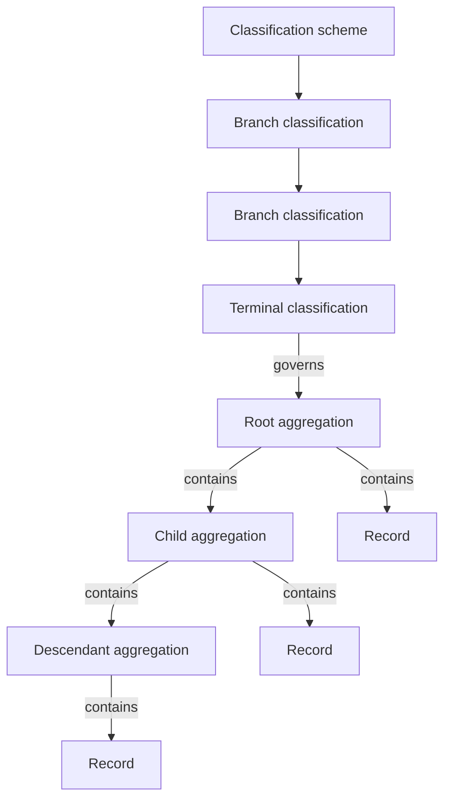

# Aggregation Classification Browser — Technical Specification

**Status:** Implemented  
**Project:** ERMS  
**Prepared:** 17 September 2026  
**Revision:** 1.1 — implementation completed

## 1. Purpose

This specification defines a scalable, read-only browsing experience for
discovering aggregations and records through published classification schemes.
It supplements the existing aggregation search and recent-activity workflows;
it does not replace them.

The browser must allow a user to:

- choose an available classification scheme;
- navigate its classification hierarchy;
- expand a terminal classification to see the root aggregations it governs;
- navigate child aggregations to any depth;
- see records contained by any aggregation;
- select an aggregation or record without closing or losing the tree context;
- inspect a concise summary in an adjacent details pane; and
- navigate from that summary to the existing full aggregation or record view.

The design must remain responsive when a classification or aggregation has
hundreds or thousands of immediate children. It must also provide a clean
enforcement point for the future authorization subsystem.

## 2. Relationship to existing features

The Aggregations page currently supports:

1. search for aggregations; and
2. recently created and recently updated aggregation lists.

The new browser becomes a second, first-class page mode. It must not be a modal
dialog: classification and aggregation exploration is a substantial workflow,
and a dialog would unnecessarily constrain the hierarchy, details pane, and
independent scrolling regions.

The page-level mode selector appears in the current search area, immediately
before the mode-specific content:

```text
Aggregations
Find aggregations by searching or browsing their classification context

┌─────────────────────── Page mode ────────────────────────┐
│  [ Search ]  [ Browse classification ]                   │
└───────────────────────────────────────────────────────────┘
```

Only one mode is active at a time. Switching modes preserves the state of each
mode for the lifetime of the browser page where practical, including the
search query, selected scheme, expanded tree paths, loaded pages, selected
entity, and scroll position.

## 3. Page layouts

### 3.1 Search mode

Search mode retains the current aggregation workflow:

```text
┌───────────────────────────────────────────────────────────┐
│ Search controls                                           │
├───────────────────────────────────────────────────────────┤
│ Search results                                            │
├───────────────────────────────────────────────────────────┤
│ Recently created / Recently updated                       │
└───────────────────────────────────────────────────────────┘
```

### 3.2 Browse-classification mode

Browse mode uses a persistent two-pane workspace. Recent activity remains
available below it but is collapsed by default so that the hierarchy receives
the useful vertical space.

```text
┌───────────────────────────────────────────────────────────┐
│ Scheme  [ Electricity and Water Authority FCS       ▾ ]  │
├───────────────────────────────┬───────────────────────────┤
│ Classification and records   │ Selected item             │
│ hierarchy                    │                           │
│                               │ Concise metadata          │
│ Independently scrollable      │ Counts and lifecycle      │
│                               │ Effective retention rule  │
│                               │ [ Open aggregation ]      │
├───────────────────────────────┴───────────────────────────┤
│ ▸ Recent aggregation activity                             │
└───────────────────────────────────────────────────────────┘
```

The hierarchy and details panes have a fixed responsive height and scroll
independently. Selecting an item updates only the details pane and selection
highlight; it must not collapse, rebuild, jump, or close the tree.

At narrow viewport widths, the details pane may stack below the tree. The tree
state must remain intact during that layout change.

## 4. Displayed hierarchy

### 4.1 Domain hierarchy

The classification and containment relationships are displayed as follows:



Only root aggregations appear directly beneath a terminal classification.
Child aggregations appear only beneath their actual parent aggregation. They
must not be duplicated beneath the classification because their classification
governance is inherited through their root aggregation.

Records appear beneath the aggregation that directly contains them. Digital
components do not appear as tree nodes: they are dependent record content, not
first-class browsing entities. A selected record summary may display its
digital-component count and link to the existing record interface.

### 4.2 Tree presentation

Node types must be visually distinct:

| Node type | Icon | Expandable content |
|---|---|---|
| Classification scheme | classification-scheme icon | root classifications |
| Branch classification | hierarchy/schema icon | child classifications |
| Terminal classification | label/tag icon | governed root aggregations |
| Aggregation | folder icon | child aggregations and records |
| Record | document icon | none |

An aggregation separates its two child collections instead of intermixing
folders and records:

```text
▾ 📁 FIN-2026 — Annual financial administration
    CHILD AGGREGATIONS                                     118
      ▸ 📁 FIN-2026-01 — Budget preparation
      ▸ 📁 FIN-2026-02 — Budget monitoring
      Load 50 more child aggregations · 50 of 118

    RECORDS                                              1,247
        📄 FIN-R-001 — Approved budget
        📄 FIN-R-002 — First-quarter review
        …
        Load 50 more records · 50 of 1,247
```

Empty collection headings should normally be omitted. Counts are shown before
expansion, allowing users to understand collection size without loading it.

## 5. Selection and concise details

### 5.1 Aggregation selection

Selecting an aggregation updates the adjacent pane with, at minimum:

- aggregation number and title;
- description;
- open or closed status;
- date created, date opened, and date closed where applicable;
- direct child-aggregation count;
- direct record count;
- classification context for a root aggregation;
- effective retention rule and whether it is local or inherited; and
- an **Open aggregation** action that navigates to the existing full detail
  page.

### 5.2 Record selection

Selecting a record updates the same pane with, at minimum:

- record number and title;
- description;
- date originated and date created;
- containing aggregation number and title;
- digital-component count; and
- an **Open record** action that opens the existing record interface.

Selection must not trigger a full tree render. The selected row remains visible
unless the user scrolls it away. Re-selecting an already selected row is a
no-op.

## 6. Incremental loading model

### 6.1 Lazy loading plus pagination

Lazy loading by itself is insufficient: an expanded node could still return
thousands of children. Every potentially large child collection must therefore
be both lazy-loaded and server-paginated.

Nothing below a collapsed node is requested. On first expansion, the client
requests only the first page of that node's immediate children. It never
recursively preloads descendant data.

The same rule applies to:

- root classifications in a scheme;
- child classifications under a branch;
- root aggregations governed by a terminal classification;
- child aggregations under an aggregation; and
- records directly contained by an aggregation.

The initial page size is 50 items. API endpoints must enforce a reasonable
maximum page size, initially 100. Page size may become configurable later
without changing the UI contract.

### 6.2 Synthetic continuation nodes

When a response indicates that more results exist, the tree adds a synthetic
continuation row after the loaded items:

```text
Load 50 more records                                      50 of 1,247
```

The continuation row:

- is not a domain entity and has no database identifier;
- is visually subordinate to real nodes;
- identifies the collection it will extend;
- shows loaded and total counts;
- requests only the next page when activated;
- appends new nodes without rebuilding earlier pages;
- is disabled and shows progress while its request is active; and
- disappears when no further page exists.

If fewer than 50 results remain, the label should reflect the actual possible
increment, for example `Load 17 more records`.

### 6.3 Per-collection client state

Each loaded collection maintains independent state:

```text
owner node and collection type
├── items already loaded
├── opaque next cursor, or null
├── total count
├── loading flag
├── loaded-at-least-once flag
├── current filter and ordering
└── recoverable error, if any
```

Collection type is necessary because an aggregation has two separately paged
collections: child aggregations and records.

The state cache must include the scheme or owning entity identity, not merely a
parent identifier. Results from an older asynchronous request must be discarded
if the user has switched scheme, changed a filter/order, refreshed the tree, or
initiated a newer request for the same collection. This prevents stale results
from contaminating the visible hierarchy.

### 6.4 Loading, empty, and failure states

On initial expansion, an inline spinner appears at the location where children
will be inserted. The expansion control must not imply that loading failed
while a request is still active.

An empty-state row such as `No records in this aggregation` is shown only after
a successful response confirms a total of zero. It must never be inferred from
an absent, pending, cancelled, or stale cache entry.

If loading fails:

- keep every page already loaded;
- show an inline error under the affected collection;
- provide a **Retry** action;
- do not collapse unrelated nodes; and
- do not replace the entire page with an error.

## 7. Pagination and ordering

### 7.1 Cursor pagination

The browser uses opaque cursor-based pagination rather than offsets. Cursor
pagination is more stable when other users create entities while a hierarchy
is being browsed.

The server owns the cursor format. Clients must treat it as opaque and return
it unchanged. A cursor represents:

- the endpoint and parent scope;
- the active ordering;
- the last stable sort values; and
- any server-side filter.

Invalid, expired, or mismatched cursors return a controlled `400` response;
the client clears only the affected collection and offers to reload it.

### 7.2 Default ordering

Default order is deterministic and based on business identifiers:

| Collection | Primary order | Stable tie-breaker |
|---|---|---|
| Root and child classifications | `code` ascending | `id` ascending |
| Root and child aggregations | `aggregation_number` ascending | `id` ascending |
| Records | `record_number` ascending | `id` ascending |

For the initial implementation, PostgreSQL uses deterministic lexical ordering
with the `C` collation:

```sql
ORDER BY aggregation_number COLLATE "C", id
ORDER BY record_number COLLATE "C", id
```

This may order `AG-10` before `AG-2`. Natural ordering is intentionally deferred
until demonstrated necessary; if introduced, normalized indexed sort-key
columns should be used rather than repeatedly parsing identifiers at query
time.

Future collection-level choices may include number descending, title,
recently created, and recently updated. Changing order or filter invalidates
that collection's cursor and loaded pages, then requests its first page again.

## 8. Filtering large collections

A terminal classification with many governed aggregations should offer an
inline **Filter aggregations** control. An aggregation with many immediate
children should likewise permit filtering its child aggregations and records.

Filtering is server-side and scoped to the immediate collection; it must not
pretend to search unloaded client data. Initial matching covers:

- aggregation number and title for aggregation collections; and
- record number and title for record collections.

The filter is submitted explicitly with Enter or its search action, avoiding a
request for every keystroke. Submitting a changed filter clears that
collection's loaded pages and cursor without affecting expanded ancestors or
unrelated siblings.
Whether descendant-wide searching is later added is a separate feature from
this immediate-child filter.

## 9. Browse API

The UI must use purpose-built read endpoints rather than assembling the tree
through unbounded generic list requests. The proposed surface is:

```http
GET /api/v1/browse/classification-schemes/{scheme_id}/roots
GET /api/v1/browse/classifications/{classification_id}/children
GET /api/v1/browse/classifications/{classification_id}/aggregations
GET /api/v1/browse/aggregations/{aggregation_id}/children
GET /api/v1/browse/aggregations/{aggregation_id}/records
GET /api/v1/browse/aggregations/{aggregation_id}/summary
GET /api/v1/browse/records/{record_id}/summary
```

Paged endpoints accept:

```text
limit     requested page size, default 50, maximum 100
cursor    opaque continuation cursor
query     optional immediate-collection filter
order     controlled allow-listed order, initially number_asc/code_asc only
```

A representative response is:

```json
{
  "items": [
    {
      "id": 123,
      "type": "aggregation",
      "number": "FIN-2026-001",
      "title": "Annual budget",
      "child_aggregation_count": 8,
      "record_count": 1247,
      "date_closed": null
    }
  ],
  "next_cursor": "opaque-server-value",
  "total": 1247
}
```

The exact item fields vary by node type, but every expandable item returns the
counts needed to decide whether expansion controls and collection headings are
required. Summary endpoints may be avoided when the node response already
contains all concise-detail fields, but list responses must remain reasonably
small.

## 10. Scheme visibility and lifecycle

The scheme selector is read-only browsing, not classification administration.
It should initially show published schemes that are visible to the user.

Deactivation prevents new aggregation assignments but does not invalidate
existing governance. Therefore, a deactivated scheme that still governs
existing aggregations may need to remain browsable and be clearly marked
**Inactive**. Draft schemes are not available in the normal end-user browser.
Administrative preview of drafts, if desired later, requires an explicit
privilege and visual preview state.

Inactive classifications remain visible where necessary to explain existing
aggregation governance, but are marked as inactive.

## 11. Refresh and consistency behavior

Refreshing the browser should refresh the selected collection or entire tree
without discarding unrelated page state unnecessarily.

If an entity disappears between page requests, the next response simply omits
it. If the selected entity no longer exists or becomes invisible, clear the
details pane and show a restrained notification. Duplicate items must be
removed by identifier when appending pages.

Counts are informational snapshots and may change during a browsing session.
The loaded/total label updates from the most recent response.

The client must prevent overlapping requests for the same collection and must
ignore responses superseded by a newer scheme, filter, order, refresh, or
selection context.

## 12. Future authorization boundary

The browse API is an authorization boundary. When the authorization subsystem
is introduced, every endpoint must return only classifications, aggregations,
and records visible to the current application user.

Counts and totals must also be authorization-filtered. A response must never
leak the existence of inaccessible entities through:

- child counts;
- total counts;
- continuation availability;
- summaries;
- empty/non-empty indicators; or
- timing-dependent fallback queries.

Authorization filtering belongs in the server-side query path before
pagination, ordering, and totals are calculated. It must not be implemented by
fetching unauthorized rows and hiding them in NiceGUI.

## 13. Accessibility and interaction requirements

- Expansion controls, rows, continuation nodes, retry actions, mode tabs, and
  navigation actions must be keyboard accessible.
- Tree rows expose their expanded, selected, and disabled states to assistive
  technology.
- Icons are reinforced with text and are not the sole indicator of node type.
- Loading indicators include accessible text.
- Focus remains predictable after loading another page; activating a synthetic
  row should move focus to the first newly appended item or retain it on the
  updated continuation row.
- The tree and detail pane must not unexpectedly scroll the overall page.

## 14. Performance requirements

- Opening Browse mode must not download all classifications, aggregations, or
  records.
- Selecting a scheme initially loads only its first page of root
  classifications.
- Expanding one node loads only the requested immediate collection.
- No page contains more than the API maximum page size.
- Appending a page must not rebuild the entire hierarchy.
- Detail selection should update independently from tree rendering.
- The server should use indexes supporting parent relationships and the stable
  ordering keys. Query plans must be inspected with representative large data
  volumes before release.

## 15. Validation and test plan

### 15.1 API tests

- Correct hierarchy scoping for every browse endpoint.
- Branch and terminal classification behavior.
- Only root aggregations returned beneath terminal classifications.
- Child aggregations and records returned beneath their direct owner.
- Deterministic identifier-plus-ID ordering.
- Cursor continuation without duplicates or omissions.
- Cursor rejection when reused with another parent, filter, or order.
- Correct totals and child counts.
- Filtering by number and title.
- Empty collections.
- Page-size default and maximum enforcement.
- Published, inactive, and draft scheme visibility rules.
- Temporary PostgreSQL instances are used and torn down after tests.

### 15.2 UI tests

- Search/Browse mode switching preserves independent state.
- Scheme selection loads roots only.
- Expansion triggers a single scoped request.
- Loading, empty, failure, and retry states.
- Synthetic continuation nodes append results in place.
- Separate child-aggregation and record pagination under one aggregation.
- Selecting items updates the details pane without rebuilding the tree.
- Open-entity actions navigate to existing detail interfaces.
- Scroll position and expanded paths remain stable.
- Stale responses cannot populate a newer scheme or filter context.
- Recent activity is collapsed by default in Browse mode.

### 15.3 Scale tests

Test fixtures must include:

- a terminal classification with thousands of root aggregations;
- an aggregation with thousands of records;
- an aggregation with hundreds of child aggregations;
- a deep aggregation hierarchy; and
- concurrent inserts while cursor pagination is in progress.

## 16. Implementation sequence

1. Define browse response schemas and opaque cursor utilities.
2. Add indexed, authorization-ready browse queries and API endpoints.
3. Add disposable-database API and pagination tests.
4. Add the Aggregations page mode selector and browse workspace shell.
5. Implement scheme and classification lazy loading.
6. Implement root-aggregation, child-aggregation, and record nodes.
7. Implement synthetic continuation, loading, empty, retry, and filtering
   states.
8. Implement concise in-browser summaries with navigation to the dedicated
   Aggregation and Record Detail pages.
9. Add UI regression and scale-oriented tests.
10. Update user-facing and API documentation after implementation.

## 17. Explicit non-goals for the initial implementation

- Editing classifications, aggregations, or records directly inside the tree.
- Displaying digital components as tree nodes.
- Drag-and-drop reclassification or aggregation movement.
- Natural alphanumeric identifier sorting.
- Cross-descendant full-text search from an expanded node.
- Loading an entire scheme for client-side filtering.
- Final authorization policy design; only the required enforcement boundary is
  established here.
