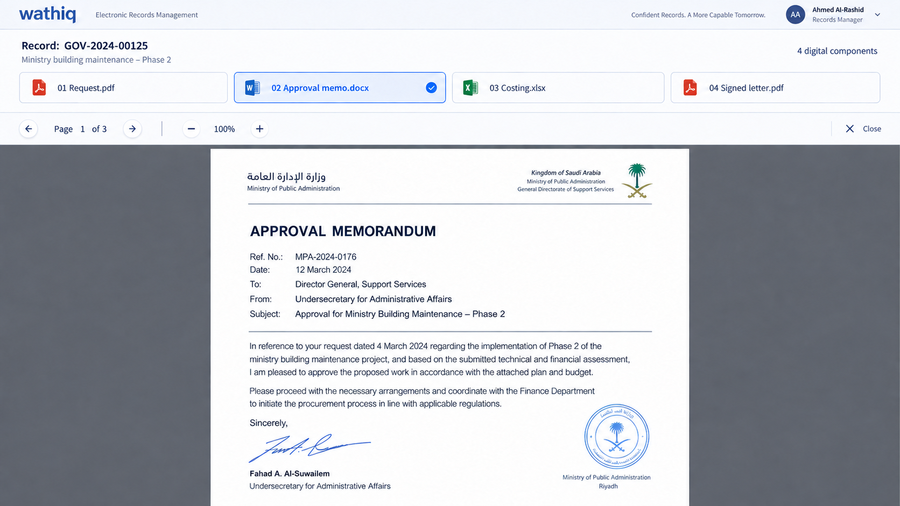
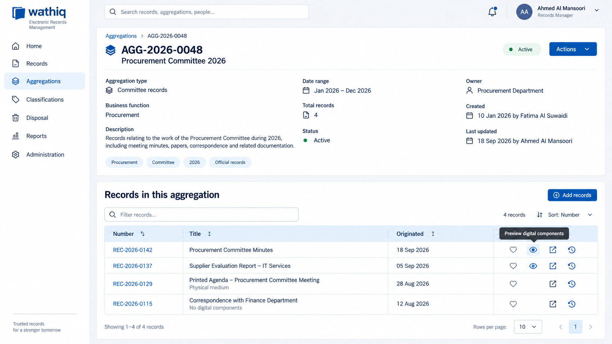
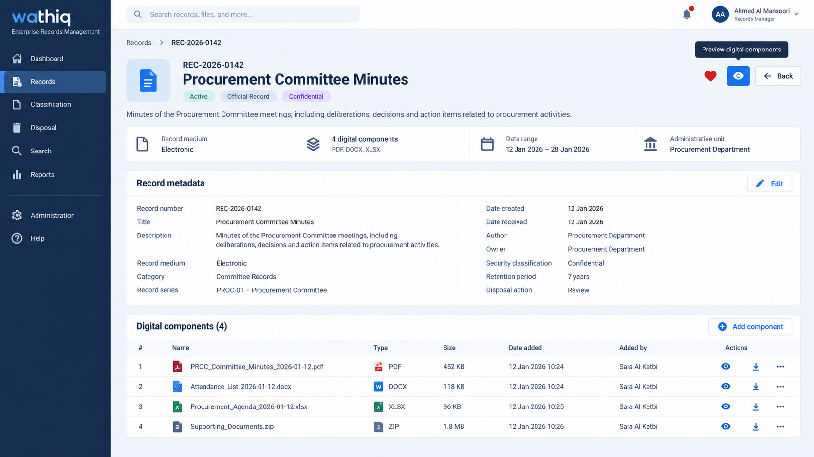

# Digital component preview and collaboration roadmap

## Purpose

Deliver record-level digital-component preview improvements in three phases. Phase 1 is approved for implementation. Phases 2 and 3 document future direction only and are explicitly deferred.

## Delivery phases

| Phase | Scope | Status |
| --- | --- | --- |
| 1 | Component switching and record-level Preview actions; authorization-aware Print and Download controls | Approved for implementation |
| 2 | Upgrade the custom renderer to the full PDF.js viewer | Deferred |
| 3 | Multi-user annotations saved to Wathiq | Deferred; detailed product specification required |

## Phase 1 — Preview navigation and authorized actions

### 1. Component switching in the existing viewer

- Opening Preview from a digital component continues to open the existing maximized viewer and initially renders the component whose Preview action was selected.
- The viewer header displays a compact component switcher containing one control for each previewable digital component in the record, ordered by `component_order` ascending.
- Each control identifies its component with a file-type icon and filename (truncated with a tooltip when necessary). The currently rendered component has a distinct selected state and exposes its selected state to assistive technology.
- Selecting another component loads it in the same viewer and updates the title, selected state, and media/PDF rendering controls. The viewer does not close between components.
- While a component is loading or being converted, show the existing preparation/loading treatment and prevent duplicate selection of that component. A failure is reported without closing the viewer; the user may select another component or retry.
- Existing rendering, page navigation, zoom, and close behavior remains unchanged. Page number and zoom state reset to their defaults when the selected component changes.
- Download is capability-controlled for the selected component. Show an enabled Download action only when the user has `record.component.download`; otherwise omit it from the viewer. Record ownership does not grant this capability implicitly, and the download API must independently enforce it.
- Print is capability-controlled for the selected component. Show an enabled Print action only when the user has `record.component.print`; otherwise omit it. Record ownership does not grant this capability implicitly, and the supported print workflow must independently enforce authorization.
- Recalculate Print and Download visibility whenever the selected component changes.
- When only one previewable component exists, show it as selected; the viewer otherwise behaves as it does today.

### 2. Aggregation details entry point

- In **Records in this aggregation**, add a Preview action alongside the existing row actions for an eligible record.
- Show Preview only when the record medium is not `physical`, the record has at least one previewable digital component, and the user has permission to view it.
- Selecting Preview opens the enhanced viewer with the record's first previewable component by `component_order` selected.
- Records that are physical, have no previewable components, or cannot be viewed by the user do not display the action. Other row actions remain aligned and unchanged.
- Tooltip and accessible label: **Preview digital components**.

### 3. Record details entry point

- In the Record details header, place Preview with the existing Favourite and Back actions.
- Apply the same visibility and authorization rules as the aggregation-table Preview action.
- Selecting Preview opens the enhanced viewer with the first previewable component by `component_order` selected.
- Tooltip and accessible label: **Preview digital components**.

### Phase 1 definitions and constraints

- A **previewable digital component** is an available component that the existing preview service/viewer supports and that the current user is authorized to view. Components still processing, unavailable, or unsupported are excluded from launch eligibility and the switcher.
- The backend remains authoritative for record medium, component order, availability, and access. Hidden controls are not a substitute for API authorization.
- Preview authorization is distinct from download and print authorization. The viewer must derive control visibility from the current component's effective capabilities, not from ownership or from the ability to preview it.
- UI restrictions are not digital-rights management: because preview requires document content to reach the browser, the product cannot prevent screenshots or a technically capable user from capturing rendered content. It must nevertheless avoid exposing unauthorized download and print actions or endpoints.
- This enhancement adds no new roles, privileges, record states, component types, or changes to component ordering.
- Filenames, tooltips, focus indicators, icon-button accessible names, keyboard navigation, and selected/loading states must remain usable at supported desktop widths. If the component controls exceed the available width, the switcher scrolls horizontally without wrapping the PDF toolbar.
- Phase 1 retains the current custom canvas-based PDF renderer. Selectable text, search, annotation layers, and the other capabilities of the full PDF.js viewer are outside Phase 1.

### Phase 1 acceptance criteria

1. Previewing component 2 of a four-component record opens the viewer on component 2 and shows all four eligible components in record order.
2. Selecting component 4 renders component 4 in the same viewer and recalculates Download and Print visibility from component 4's effective capabilities.
3. A record-level Preview from either details page opens the first eligible component in record order.
4. A physical record, a record with no previewable components, and a record lacking view permission show no record-level Preview action.
5. A single-component record opens normally and shows that sole component as selected.
6. A failed component load leaves the viewer open and permits another component to be selected.
7. The new controls are keyboard reachable, have accessible names, and expose the active component state.
8. A user with Preview but without Download sees no Download action, and direct use of the protected download workflow is rejected by the backend.
9. A user with Preview but without Print sees no Print action, and direct use of the supported print workflow is rejected by its authorization boundary.
10. A user with the applicable Download or Print capability sees the corresponding enabled action for the selected component.

## Phase 2 — Full PDF.js viewer

**Status: deferred to a future implementation.**

Replace the Phase 1 custom canvas renderer with an appropriately customized integration of the full PDF.js viewer. The future Phase 2 specification must define the exact enabled viewer features and Wathiq integration, including at minimum:

- selectable text for text-backed PDFs;
- text search and the PDF.js text layer;
- page presentation, navigation, zoom, accessibility, and keyboard behavior;
- existing PDF annotation and link rendering;
- Wathiq styling and the Phase 1 component switcher;
- continued enforcement of Wathiq Preview, Print, and Download authorization; and
- suppression of any full-viewer tools that are not authorized or approved.

Text selection is expected for a `.txt` file converted into a text-backed PDF. An image-only scanned PDF remains non-selectable unless OCR has added a text layer. Phase 2 does not imply an OCR feature.

Phase 2 does not include creating or persisting multi-user annotations. PDF.js annotation-editing controls must remain disabled unless and until Phase 3 is approved and implemented.

## Phase 3 — Multi-user annotations saved to Wathiq

**Status: deferred to a future implementation and not yet implementation-ready.**

Add multi-user annotations that are persisted in Wathiq and associated with the applicable record and digital component. Before implementation, a separate approved specification must define:

- supported annotation types and editing behavior;
- persistence model, component/version association, and concurrency handling;
- who may create, view, modify, and delete annotations;
- attribution, timestamps, event history, retention, export, and audit requirements;
- behavior when a component is reordered, replaced, superseded, or deleted; and
- whether annotations alter the source PDF, generate a derivative, or remain a separate Wathiq data layer.

No annotation permissions, storage entities, lifecycle rules, or workflows are introduced by this roadmap document.

## Phase 1 UI mockups

Conceptual mockups follow; final spacing and iconography should reuse the established Wathiq/NiceGUI design tokens and action patterns.

### Enhanced viewer with component switcher

### Preview action in “Records in this aggregation”

### Preview action in the Record details header

