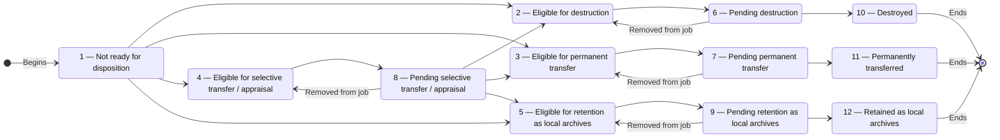

# Disposition — Product and Technical Specification

**Status:** Discussion draft — no implementation authorized  
**Prepared:** 30 September 2026  
**Project:** ERMS / Wathiq  
**Revision:** 0.1

## 1. Purpose

Disposition is the governed process applied after a disposition unit completes
its retention periods. In Wathiq, disposition may result in **destruction**,
**permanent preservation and transfer to an external archive**, **selective
transfer/appraisal**, or **retention as local archives**. Destruction is one
possible disposition action; it is not synonymous with disposition.

This specification defines the common Wathiq lifecycle shared by all four
disposition actions for a governing root aggregation and its descendants. It
covers eligibility, disposition jobs, assignment to information-governance
users, blockers, exceptional acceleration, local retention-rule overrides,
and common final-action metadata.

The action-specific review, evidence, approval, and execution requirements for
destruction, permanent transfer, selective transfer/appraisal, and retention as
local archives will be defined in separate specifications. Section 14 records
only the initial cross-cutting decisions already raised for destruction,
including the treatment of metadata and mixed physical/digital holdings. It
does not give destruction priority over the other disposition actions. Until
the relevant action-specific specification is approved, Wathiq must not permit
a job of that type to execute its final action.

This revision is a discussion draft. It records unresolved decisions in
Section 18 and does not authorize implementation.

## 2. Relationship to existing Wathiq rules

1. The governing root aggregation remains the disposition unit defined by the
   classification-scheme subsystem. A child aggregation or record is not
   independently scheduled for disposition.
2. The effective retention rule is resolved in this order:
   - a local retention rule on the governing root aggregation; otherwise
   - the root aggregation's effective classification retention rule.
3. The due-date calculation uses the governing root's closure date plus the
   effective current and intermediate retention periods.
4. An open governing root has no disposition due date and remains not ready.
5. Legal-hold protection is effective and inherited as defined by the Legal
   Holds specification. A copied Boolean is not authoritative.
6. Security blocking uses the existing `security_levels.prevents_disposition`
   policy flag.
7. Vital protection uses the effective `is_vital` value on each aggregation
   and record.
8. Closure, authorization, security-envelope, ownership, event-history, and
   optimistic-concurrency rules continue to apply unless this specification
   explicitly defines a narrower disposition operation.

## 3. Terminology

### 3.1 Information-governance user (IGU)

In this specification, **IGU** is a convenient collective term for an
authorized information-governance user. It is not a new role or an implicit
grant. The final authorization design must use explicit privileges and the
existing Information Governance Manager and Information Governance Officer
profiles.

### 3.2 Disposition unit

The governing root aggregation and the complete subtree beneath it, including
descendant aggregations, records, and digital components.

### 3.3 Eligible aggregation

A governing root aggregation whose retention period has elapsed and whose
disposition status is one of 2 through 5. Eligibility does not mean the unit is
safe or authorized for execution. Vital status, disposition-preventing security
levels, effective legal holds, approvals, evidence, and action-specific checks
may still block it.

### 3.4 Due date

The calendar date calculated from the governing root's closure date plus the
effective current and intermediate retention periods, using the same calendar
arithmetic as the existing calculated-disposition-date feature. Under the
requested strict comparison, the unit becomes due only when the applicable
business date is later than the calculated date.

### 3.5 Disposition job

A governed batch containing disposition units of exactly one final-disposition
type. A job coordinates review, real-world work, evidence, approvals, and final
execution. A job does not weaken any resource-level protection.

## 4. Disposition status catalogue

Every aggregation and record has a required `disposition_status` with the
following controlled values:

| Code | Stable name | User-facing meaning |
| ---: | --- | --- |
| 1 | `not_ready` | Not ready for disposition |
| 2 | `eligible_destruction` | Eligible for destruction |
| 3 | `eligible_permanent_transfer` | Eligible for permanent transfer |
| 4 | `eligible_selective_appraisal` | Eligible for selective transfer / appraisal |
| 5 | `eligible_local_archives` | Eligible for retention as local archives |
| 6 | `pending_destruction` | Pending destruction |
| 7 | `pending_permanent_transfer` | Pending permanent transfer |
| 8 | `pending_selective_appraisal` | Pending selective transfer / appraisal |
| 9 | `pending_local_archives` | Pending retention as local archives |
| 10 | `destroyed` | Destroyed |
| 11 | `permanently_transferred` | Permanently transferred |
| 12 | `retained_local_archives` | Retained as local archives |

The database stores a constrained value and rejects every value outside this
catalogue. New and migrated resources default to status 1 unless a separately
approved migration rule establishes a verified historical terminal outcome.
Status labels are localized presentation; stable names and codes are not
translated.

## 5. Finite-state machine

### 5.1 Valid transitions

The following are the only valid transitions:

```text
1 -> 2    1 -> 3    1 -> 4    1 -> 5
2 -> 6    3 -> 7    4 -> 8    5 -> 9
6 -> 2    7 -> 3    8 -> 4    9 -> 5
6 -> 10   7 -> 11   9 -> 12
8 -> 2    8 -> 3    8 -> 5
```



The transition from status 8 records the appraisal outcome. Selective
appraisal has no separate terminal status: it results in destruction,
permanent transfer, or retention as local archives and then follows that
outcome's workflow.

### 5.2 Transition causes

| Transition | Cause |
| --- | --- |
| `1 -> 2/3/4/5` | Scheduled eligibility evaluation or authorized acceleration |
| `2 -> 6`, `3 -> 7`, `4 -> 8`, `5 -> 9` | Addition to a disposition job of the corresponding type |
| `6 -> 2`, `7 -> 3`, `8 -> 4`, `9 -> 5` | Removal from the disposition job before final execution |
| `8 -> 2/3/5` | Recorded and approved selective-appraisal outcome |
| `6 -> 10`, `7 -> 11`, `9 -> 12` | Authorized final execution after all common and action-specific gates pass |

No general endpoint may accept an arbitrary target status. Each transition is
performed only by its named governed operation, with server-side and database
validation.

### 5.3 Removal transitions

An aggregation may be removed from its disposition job at any time before
final execution. Removal restores the corresponding eligible status:

- pending destruction returns to eligible for destruction (`6 -> 2`);
- pending permanent transfer returns to eligible for permanent transfer
  (`7 -> 3`);
- pending selective transfer/appraisal returns to eligible for selective
  transfer/appraisal (`8 -> 4`); and
- pending retention as local archives returns to eligible for retention as
  local archives (`9 -> 5`).

Removal and its status transition occur atomically and are recorded in
immutable history. Removal does not undo review work, approvals, or evidence;
their treatment if the aggregation is later added to a job again must be
defined by the relevant action-specific specification.

## 6. Status scope and propagation

The governing root is the only independently evaluated and listed disposition
unit. The requested column nevertheless exists on every aggregation and record
so terminal outcome and resource-level reporting remain explicit.

This revision proposes, subject to approval in Section 18.1, that every valid
transition of a disposition unit updates the governing root and all descendant
aggregation and record statuses atomically to the same value. Digital
components do not have a separate disposition-status column; their state is
derived from their record. No partially transitioned subtree is valid.

Creation or movement inside a disposition unit must preserve this invariant.
The separate rules for whether content may be created, moved, or amended in an
eligible, pending, or terminal unit remain to be approved.

## 7. Automatic eligibility service

A backend scheduled service evaluates governing root aggregations in status 1
in bounded, restartable batches.

A root qualifies only when all of the following are true:

1. it has a non-null closure date;
2. it has a resolvable effective retention rule;
3. the applicable business date is strictly later than its calculated due date;
4. it and its descendants still form the same locked disposition unit when the
   update commits; and
5. its status remains 1.

The service maps the effective rule's `final_disposition` as follows:

| Effective final disposition | New status |
| --- | ---: |
| `destruction` | 2 |
| `transfer_to_external_archive` | 3 |
| `selective_preservation` | 4 |
| `retain_as_local_archives` | 5 |

Vital, security, and hold blockers do not stop the due-date transition; they
stop addition to a disposition job and final execution. This keeps “due”
separate from “safe to execute” and makes blocked eligible work visible.

The service must be idempotent, safe under overlapping workers, and use row
locking or an equivalent database mechanism so a concurrent close/reopen,
retention-rule change, hierarchy change, acceleration, or job action cannot
produce a stale transition. Each successful transition records its effective
rule and due-date basis in immutable history. A failure for one unit must not
cause silent loss of the remaining scan, and operational failures must be
observable.

## 8. Eligibility listing

Authorized IGUs receive a server-paginated listing of governing root
aggregations in statuses 2 through 5. The listing is not implemented by
downloading a tenant-grown collection to the client.

Each row shows at least:

- aggregation identifier/number and title;
- disposition status and final-disposition type;
- calculated due date and days overdue;
- owning organization unit;
- effective retention-rule source;
- subtree vital indicator and, where authorized, blocking-resource count;
- highest/effective disposition-blocking security indicator and, where
  authorized, blocking-resource count;
- effective legal-hold indicator and, where authorized, blocking-resource
  count;
- a clear **Blocked from disposition job** state and the reasons the caller may
  see; and
- current job membership, if any.

The default order is oldest due date first, with a stable identifier tie-break.
The server supports filtering and sorting by owner organization unit, due date,
status/type, subtree vital state, disposition-blocking security state, and
effective-hold state. Grouping by owner organization unit is a presentation
option over server-paginated results and must not require loading the entire
result set.

The design must follow Wathiq's established table pattern, include loading,
empty, and error states, and remain usable in LTR and RTL. Color is not the only
blocked-state cue.

Security non-disclosure still applies. A user who may see the root but not a
blocking descendant may be told that the unit is blocked, but must not receive
the descendant's identity, title, security level, hold name, or other concealed
details unless separately authorized.

## 9. Common disposition blockers

A disposition unit cannot be added to a disposition job, committed to pending,
or finally executed when any of the following applies to the root or any
descendant aggregation or record:

1. `is_vital = true`;
2. its security level has `prevents_disposition = true`; or
3. it is protected by one or more effective legal holds.

For a record protected by a hold, its digital components are protected with it.
The checks use current authoritative data, not listing snapshots or cached
booleans. They are repeated inside the write transaction under concurrency
control. Direct SQL, background work, imports, and API clients cannot bypass
them.

A later blocker appearing after job admission does not remove the unit from the
job or conceal it. It marks the job item blocked and prevents further
commitment/final execution until the blocker is lawfully resolved. The system
does not automatically clear vital status, lower security, or release a hold.

## 10. Disposition jobs

### 10.1 Common job data

Each job has at least:

- immutable identifier and human-readable job number;
- exactly one type: destruction, permanent transfer, selective
  transfer/appraisal, or retention as local archives;
- a controlled job lifecycle, to be completed by the action-specific specs;
- optional assigned IGU;
- creator and creation timestamp;
- last updater, update timestamp, and optimistic-concurrency version;
- disposition-unit membership;
- common and action-specific evidence references;
- approval records; and
- immutable event history.

Assignment gives responsibility for work; it does not grant access to the job's
resources or confer missing privileges, security clearance, or organizational
scope.

### 10.2 Membership rules

1. A job contains only governing root aggregations.
2. A unit's eligible status/final disposition must match the job type.
3. A unit may belong to no more than one active disposition job.
4. All common blockers are evaluated before admission.
5. Admission and removal are concurrency-controlled and audited.
6. A stale listing selection is revalidated; a changed or blocked item fails
   with an actionable reason without admitting that item.
7. The required atomicity of a multi-selection admission—whole selection or
   per-item results—remains an open decision in Section 18.5.
8. A unit may be removed until final execution begins. Removal atomically
   returns it to the matching eligible status under Section 5.3. Final
   execution itself is atomic or a safely resumable governed operation and
   cannot be undone by removing membership.

### 10.3 Work performed outside Wathiq

An assigned IGU reviews the aggregation and descendants, obtains the owning
organization-unit manager's approval and the organization's records manager's
approval, performs the required real-world activities, and records their
outcomes and evidence in Wathiq.

Wathiq tracks those facts; it does not claim that an uploaded file or checked
box proves the real-world activity occurred. Evidence requirements, approver
identity resolution, approval order, rejection/withdrawal, delegation, expiry,
and action-specific controls are deferred to the separate specifications.

## 11. Exceptional acceleration

An explicitly authorized IGU may accelerate a governing root in status 1 to
status 2, 3, 4, or 5 according to its effective final-disposition action,
without waiting for closure or the current/intermediate periods.

Acceleration:

- acts only on a governing root and its disposition unit;
- cannot choose an outcome different from the effective retention rule;
- requires a nonblank exceptional reason;
- does not bypass vital, security, legal-hold, approval, evidence, or final
  execution controls;
- records the ordinary calculated due date when available, effective-rule
  provenance, actor, timestamp, reason, and resulting status; and
- must be distinguished from normal scheduled eligibility in history and
  reporting.

Whether acceleration itself is allowed while a common blocker exists remains
open in Section 18.4. In all cases, a blocked accelerated unit cannot enter a
job or execute.

## 12. Local retention-rule override

The existing root-only aggregation retention rule is the local override. It
must not be duplicated as disposition-job data. Every eligibility calculation
uses the current effective rule, with the local rule taking precedence over the
classification-derived rule.

Creating, changing, or removing an override remains a separately governed,
reason-required action. This specification does not broaden who may perform it.
Rule changes must trigger prompt re-evaluation of an affected status-1 root.

Changing a rule after a unit becomes eligible or enters a job can change the
due date or final action and therefore requires an explicit conflict policy.
Revision 0.1 does not silently rewrite a job or its history; Section 18.2
requires a decision on cancellation/reversion and reassessment.

## 13. Common final-execution record

On successful final execution, every aggregation and record in the disposition
unit receives, atomically or through a safely resumable operation with one
logical outcome:

- the applicable terminal `disposition_status` (10, 11, or 12);
- `final_disposition_at` as a server-assigned `timestamptz`;
- `final_disposition_by_user_id`, referencing the IGU who executed the action;
- `disposition_job_id`; and
- the immutable event correlation identifier.

Status 10 also requires a unique destruction number. Status 11 also requires a
unique transfer number. Number format, allocation scope, and whether numbers
may ever be voided are open in Section 18.6. Status 12 has no extra number in
the current proposal.

Historical actor display must survive later user deactivation or renaming by
retaining the user reference plus an immutable execution-time display snapshot
where Wathiq's audit conventions require it.

Before final execution, the server rechecks job type, membership, status,
assignment/authority, required approvals and evidence, the complete blocker
set, and concurrency versions. A failure changes none of the resource statuses.

## 14. Destruction outcome

### 14.1 Meaning of destruction

Destruction means irreversible disposal of the records content in every medium
covered by the disposition unit. It is not merely hiding a row, deleting a UI
link, expiring a download URL, or marking status 10.

For digital holdings it includes all authoritative component bytes and every
Wathiq-managed derivative or recoverable application copy within the approved
destruction boundary. Search text, previews, thumbnails, temporary processing
artifacts, and caches derived from destroyed content must no longer expose the
content. Treatment of infrastructure backups and external replicas must be
defined by the destruction-specific specification and applicable storage
policy; Wathiq must not claim immediate physical erasure from media where the
platform can guarantee only expiry from managed backup rotation.

For physical holdings, Wathiq records confirmation of the real-world physical
destruction and its evidence; Wathiq cannot itself prove physical destruction.

### 14.2 Proposed metadata-retention rule

Revision 0.1 proposes that destruction remove record content but retain a
minimal, immutable disposition stub and the job/evidence audit record. Some
metadata must survive because the requested model sets status 10, destruction
time, executor, job ID, and destruction number on every aggregation and record.
Deleting those rows would make that requirement impossible and would weaken
proof that authorized destruction occurred.

The retained stub should contain only what is necessary to prove and explain
the disposition, including:

- stable resource identifier and resource type;
- enough former hierarchy identity to reconcile the destroyed unit;
- classification and owner organization unit at execution time;
- final disposition and effective-rule snapshot;
- closure date, calculated due date, and acceleration reason when applicable;
- destruction timestamp, executor, job ID, and destruction number;
- medium at execution and separate physical/digital confirmations where
  applicable;
- approval/evidence references and immutable event-history correlation; and
- cryptographic fixity or manifest values needed to prove what was destroyed,
  without retaining destroyed content.

The default retained stub should not expose content-derived text, previews,
component filenames, free-text descriptions, or other unnecessary descriptive
or personal metadata in ordinary search. Exactly which title/number fields must
remain visible, who may view destruction stubs, how long evidence is retained,
and whether a lawful erasure requirement can further minimize the stub require
approval in Section 18.3 and the destruction-specific specification.

Destroyed resources are read-only tombstones. They cannot be reopened,
reclassified, moved, restored from Wathiq, added to another job, or used as a
parent. Ordinary search and browse must not present them as live records; an
authorized disposition/audit view may retrieve them.

### 14.3 Mixed-medium destruction sequence

For a mixed disposition unit:

1. physical destruction is confirmed first with actor, timestamp, method, and
   required evidence;
2. Wathiq records the physical confirmation without setting terminal status 10;
3. digital destruction may proceed only after that confirmation commits;
4. digital destruction records its own actor, timestamp, outcome, and evidence;
5. status 10 and the common final-execution fields are set only after both
   required medium outcomes succeed.

A failed digital step leaves the job pending destruction and visibly records
that physical destruction is complete but digital destruction is incomplete.
Retry must be idempotent and must not pretend the physical material still
exists. The destruction-specific specification must define partial-failure
recovery, verification, storage cleanup, external-system evidence, and backup
expiry semantics.

## 15. Authorization and separation of duties

No capability is granted merely because a user is called an IGU or is assigned
to a job. The authorization specification must define distinct privileges for
at least:

- viewing the eligibility queue and visible blocker summaries;
- creating and editing jobs;
- admitting and removing disposition units;
- assigning/reassigning a job;
- accelerating eligibility;
- managing local retention overrides (existing governed action);
- recording evidence and real-world outcomes;
- approving on behalf of an owning organization unit;
- approving as the organization's records manager;
- recording selective-appraisal outcomes; and
- executing each final disposition action.

The action-specific specs must decide whether the same person may prepare,
approve, and finally execute a job. System administration alone never implies
disposition authority or content-security bypass.

## 16. Audit, reporting, and data integrity

Immutable history must record at least:

- every status transition with source and reason;
- the due-date and effective-rule snapshot used for automatic eligibility;
- acceleration and its exceptional reason;
- job creation, type, membership addition/removal, assignment, and reassignment;
- blocker detection at rejected admission or execution, without leaking
  concealed details;
- evidence addition/replacement and approval decisions;
- selective-appraisal outcome;
- physical and digital destruction confirmations;
- final execution identifiers and outcome; and
- failed or partially completed execution attempts.

Database constraints and triggers must prevent unsupported status transitions,
cross-type job membership, multiple active job membership, terminal-field
inconsistency, and partial subtree status changes. Governed operations use
transaction-local authorization markers following Wathiq's established
pattern; clients cannot obtain a bypass by writing fields through a general
update route.

## 17. Verification and traceability

Implementation is incomplete until each approved requirement has linked
database, API/service, authorization, and UI evidence as applicable. At
minimum, tests must cover:

| ID | Requirement | Minimum verification |
| --- | --- | --- |
| DISP-01 | Controlled statuses and allowed transitions | Database constraint/trigger and API tests |
| DISP-02 | Root disposition unit and atomic descendant propagation | Disposable-database hierarchy and rollback tests |
| DISP-03 | Due-date mapping and strict time boundary | Clock-controlled service tests, including leap years |
| DISP-04 | Open roots remain status 1 | Service and database tests |
| DISP-05 | Local rule takes precedence | Rule-resolution and rescheduling tests |
| DISP-06 | Eligibility scan is bounded, idempotent, and race-safe | Disposable-database concurrency tests |
| DISP-07 | Listing is server-paginated, filtered, sorted, and non-disclosing | API authorization and live-browser LTR/RTL tests |
| DISP-08 | Vital descendants block job admission/execution | Disposable-database subtree tests |
| DISP-09 | Security-level prevention blocks admission/execution | Disposable-database authorization tests |
| DISP-10 | Direct and inherited effective holds block admission/execution | Disposable-database hold-boundary tests |
| DISP-11 | One active job and matching job type | Database uniqueness and concurrent admission tests |
| DISP-12 | Assignment grants responsibility, not access | Authorization tests |
| DISP-13 | Acceleration follows effective action and requires reason | API/database/history tests |
| DISP-14 | Final fields and identifiers are consistent | Atomic execution and rollback tests |
| DISP-15 | Mixed destruction confirms physical before digital | Workflow, retry, and partial-failure tests |
| DISP-16 | Destroyed content is inaccessible while the approved stub remains auditable | Storage, search, API, and authorization tests |
| DISP-17 | Direct SQL/background paths cannot bypass protections | Disposable-database enforcement tests |

Every database-backed test must use a newly created disposable PostgreSQL
database initialized from the canonical schema or required migration path and
must drop that database after the run, including after failure.

## 18. Decisions required before approval

### 18.1 Do eligible and pending statuses propagate to every descendant?

Revision 0.1 proposes atomic propagation for all transitions. An alternative is
to keep workflow status only on the root until final execution and give
descendants status 10/11/12 only at the end. The latter conflicts with the
plain-language meaning of a descendant's status 1 while its governing unit is
already eligible or pending.

### 18.2 What happens when closure, hierarchy, or the effective rule changes
after eligibility or job admission?

The specification needs explicit rules for reopening, moving/reparenting,
changing classification, and creating/changing/removing a local override while
a unit is eligible or in a job. Recommended direction: prohibit such changes
while pending; require audited reassessment and removal/cancellation while only
eligible or assembled in a non-pending job.

### 18.3 Which metadata survives destruction, for how long, and who may see it?

Revision 0.1 recommends permanent retention of a narrowly minimized disposition
stub plus job/approval/evidence history, with destroyed resources excluded from
ordinary search and browse. Approval is needed for the precise field set,
evidence retention period, privacy/erasure exceptions, and audit-view access.

### 18.4 May a blocked status-1 unit be accelerated into the eligibility queue?

Allowing it makes exceptional due work visible while still forbidding job
admission. Prohibiting it avoids knowingly creating blocked eligible work.
Revision 0.1 leans toward allowing acceleration because blockers and due status
represent different facts.

### 18.5 Is multi-item job admission atomic?

Choose all-or-nothing admission or bounded per-item results. Revision 0.1
recommends per-item results for usability, with each individual item admitted
atomically and failures reported without disclosure.

### 18.6 How are destruction and transfer numbers allocated?

Define format, organizational or tenant scope, sequence behavior, allocation
time, uniqueness, gaps, and voiding. Numbers should not be assigned by clients.

### 18.7 Which business timezone controls automatic eligibility?

The UI calculation currently uses the user's working timezone, but a scheduled
service needs one authoritative business-date boundary. Define a tenant or
deployment governance timezone and ensure display clearly distinguishes that
due date from user-local timestamps.

### 18.8 What is the job lifecycle?

The common job states, draft/commit point, cancellation, completion, reassignment,
approval reset, and terminal history rules must be agreed together with the
four action-specific specifications.
