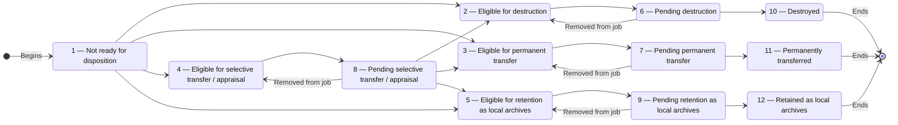

# Disposition — Product and Technical Specification

**Status:** Discussion draft — no implementation authorized
**Prepared:** 30 September 2026
**Project:** ERMS / Wathiq
**Revision:** 0.1

## 1. Purpose

Disposition is the controlled process that starts after records have been kept
for their required retention periods. In Wathiq, disposition may result in
**destruction**,
**permanent preservation and transfer to an external archive**, **selective
transfer/appraisal**, or **retention as local archives**. Destruction is one
possible disposition action; it is not synonymous with disposition.

This specification defines the rules shared by all four disposition actions.
Disposition applies to a root aggregation and everything under it. This
document covers eligibility, disposition jobs, assignment to information-
governance users, conditions that block disposition, early eligibility in
exceptional cases, local retention rules, and the information recorded when
the final action is completed.

The action-specific review, evidence, approval, and completion requirements for
destruction, permanent transfer, selective transfer/appraisal, and retention as
local archives will be defined in separate specifications. Section 14 contains
the initial rules already discussed for destruction, including what happens to
metadata and to aggregations that contain both physical and digital material.
Its inclusion does not give destruction priority over the other actions. Until
the relevant action-specific specification is approved, Wathiq must not permit
a job of that type to execute its final action.

This revision is a discussion draft. It records unresolved decisions in
Section 18 and does not authorize implementation.

## 2. Relationship to existing Wathiq rules

1. Disposition applies to a root aggregation and everything under it. Wathiq
   does not schedule a child aggregation or record separately.
2. The effective retention rule is resolved in this order:
   - a local retention rule on the governing root aggregation; otherwise
   - the root aggregation's effective classification retention rule.
3. The due-date calculation uses the governing root's closure date plus the
   effective current and intermediate retention periods.
4. An open governing root has no disposition due date and remains not ready.
5. Legal holds work as defined in the Legal Holds specification, including
   protection inherited from a parent aggregation. Wathiq must check the
   current holds; it must not rely on an old copied value.
6. Security blocking uses the existing `security_levels.prevents_disposition`
   policy flag.
7. Vital protection uses the effective `is_vital` value on each aggregation
   and record.
8. Existing rules for closure, permissions, security, ownership, event history,
   and protection against conflicting updates continue to apply unless this
   specification explicitly says otherwise.

## 3. Terminology

### 3.1 Information-governance user (IGU)

**IGU** means an authorized information-governance user. It is only a short
name used in this document. It does not create a new role or give anyone new
permissions. Access must use explicit permissions and the existing Information
Governance Manager and Information Governance Officer profiles.

### 3.2 Disposition unit

A root aggregation and everything under it: child aggregations, records, and
digital components. This complete group is processed together.

### 3.3 Eligible aggregation

A root aggregation whose retention periods have ended and whose disposition
status is 2, 3, 4, or 5. Eligible does not mean ready for the final action. A
vital record, a security level, a legal hold, missing approval, missing
evidence, or an action-specific rule may still block it.

### 3.4 Due date

The root aggregation's closure date plus its current and intermediate
retention periods. Wathiq uses the same date calculation as the existing
calculated-disposition-date feature. The aggregation becomes due on the first
calendar date after the calculated date, using the timezone chosen in Section
18.7. It does not become due on the calculated date itself.

### 3.5 Disposition job

A group of aggregations being processed together. Every aggregation in a job
must have the same disposition action. The job tracks review, work performed
outside Wathiq, evidence, approvals, and completion of the final action. Adding
an aggregation to a job does not remove any protection from it.

## 4. Disposition status catalogue

Every aggregation and record has a required `disposition_status` with the
following controlled values:

| Code | Stable name | User-facing meaning |
| ---: | --- | --- |
| 1 | `not_ready` | Not ready for disposition |
| 2 | `eligible_destruction` | Eligible for destruction |
| 3 | `eligible_permanent_transfer` | Eligible for permanent transfer |
| 4 | `eligible_selective_appraisal` | Eligible for selective transfer / appraisal |
| 5 | `eligible_local_archives` | Eligible for retention as local archives |
| 6 | `pending_destruction` | Pending destruction |
| 7 | `pending_permanent_transfer` | Pending permanent transfer |
| 8 | `pending_selective_appraisal` | Pending selective transfer / appraisal |
| 9 | `pending_local_archives` | Pending retention as local archives |
| 10 | `destroyed` | Destroyed |
| 11 | `permanently_transferred` | Permanently transferred |
| 12 | `retained_local_archives` | Retained as local archives |

The database accepts only these 12 values. New aggregations and records start
at status 1. Existing data also starts at status 1 unless an approved migration
can prove that a final disposition action already took place. The interface
translates the labels shown to users. The numeric codes and stable names do not
change between languages.

## 5. Finite-state machine

### 5.1 Valid transitions

The following are the only valid transitions:

```text
1 -> 2    1 -> 3    1 -> 4    1 -> 5
2 -> 6    3 -> 7    4 -> 8    5 -> 9
6 -> 2    7 -> 3    8 -> 4    9 -> 5
6 -> 10   7 -> 11   9 -> 12
8 -> 2    8 -> 3    8 -> 5
```



The transition from status 8 records the appraisal outcome. Selective
appraisal has no separate terminal status: it results in destruction,
permanent transfer, or retention as local archives and then follows that
outcome's workflow.

### 5.2 Transition causes

| Transition | Cause |
| --- | --- |
| `1 -> 2/3/4/5` | Scheduled eligibility evaluation or authorized acceleration |
| `2 -> 6`, `3 -> 7`, `4 -> 8`, `5 -> 9` | Addition to a disposition job of the corresponding type |
| `6 -> 2`, `7 -> 3`, `8 -> 4`, `9 -> 5` | Removal from the disposition job before final execution |
| `8 -> 2/3/5` | Recorded and approved selective-appraisal outcome |
| `6 -> 10`, `7 -> 11`, `9 -> 12` | Authorized final execution after all common and action-specific gates pass |

Clients cannot set any status they choose. Each transition is made only by the
operation named in this specification. Both the server and the database check
that the transition is allowed.

### 5.3 Removal transitions

An aggregation may be removed from its disposition job at any time before
final execution. Removal restores the corresponding eligible status:

- pending destruction returns to eligible for destruction (`6 -> 2`);
- pending permanent transfer returns to eligible for permanent transfer
  (`7 -> 3`);
- pending selective transfer/appraisal returns to eligible for selective
  transfer/appraisal (`8 -> 4`); and
- pending retention as local archives returns to eligible for retention as
  local archives (`9 -> 5`).

The job removal and status change must either both succeed or both fail. Wathiq
records the removal in permanent event history. If the aggregation is later
added to a job again, it follows the same transition from eligible to pending.
Every addition and every removal creates a new event. A later event never
changes or deletes an earlier one, so the full history is kept.

## 6. Status scope and propagation

The governing root is the only independently evaluated and listed disposition
unit. Every aggregation and record stores its own `disposition_status` so its
current disposition state and final outcome can be reported explicitly.

Subject to the decision in Section 18.1, this draft proposes that each
transition changes the status of the root aggregation and all its descendant
aggregations and records. All those changes must succeed or fail together.
Digital components do not store a separate disposition status; they use the
status of their record. Wathiq must never leave only part of the group in the
new status.

Creating or moving content must not break this rule. A later decision must
define whether users may create, move, or edit content after the group becomes
eligible, pending, or complete.

## 7. Automatic eligibility service

A scheduled backend service checks root aggregations in status 1. It processes
a limited number at a time and can safely continue after an interruption.

A root qualifies only when all of the following are true:

1. it has a closure date;
2. Wathiq can find the retention rule that applies to it;
3. the applicable business date is strictly later than its calculated due date;
4. the root and its descendants have not changed while Wathiq performs the
   update; and
5. its status remains 1.

The service maps the effective rule's `final_disposition` as follows:

| Effective final disposition | New status |
| --- | ---: |
| `destruction` | 2 |
| `transfer_to_external_archive` | 3 |
| `selective_preservation` | 4 |
| `retain_as_local_archives` | 5 |

Vital status, security levels, and legal holds do not stop an aggregation from
becoming eligible. They stop it from being added to a job or reaching the final
status. In this way, Wathiq shows that the retention period has ended while
also showing that disposition is currently blocked.

Running the service more than once must not create extra changes or duplicate
events. Two service processes may run at the same time, but they must not
process the same aggregation twice. Database locking, or an equally safe
method, must prevent a simultaneous close, reopen, retention-rule change,
hierarchy change, acceleration, or job action from causing a wrong transition.
For each successful transition, Wathiq permanently records the rule and dates
used in the calculation. If one aggregation fails, Wathiq continues safely and
reports the failure instead of silently skipping work.

## 8. Eligibility listing

Authorized IGUs receive a paginated list of governing root aggregations in
statuses 2 through 5. The server returns one page at a time. The browser must
not download the full list of eligible aggregations.

Each row shows at least:

- aggregation identifier/number and title;
- disposition status and final-disposition type;
- calculated due date and days overdue;
- owning organization unit;
- effective retention-rule source;
- an indication of whether the root or any descendant is vital and, when the
  user may see it, the number of blocking resources;
- an indication of whether any security level blocks disposition and, when the
  user may see it, the number of blocking resources;
- an indication of whether a legal hold applies and, when the user may see it,
  the number of blocking resources;
- a clear **Blocked from disposition job** state and the reasons the caller may
  see; and
- current job membership, if any.

The default order is oldest due date first. If two due dates are the same,
Wathiq uses the aggregation identifier to keep the order consistent.
The server supports filtering and sorting by owner organization unit, due date,
status/type, whether the root or a descendant is vital, whether a security
level blocks disposition, and whether a legal hold applies. Users may group
the displayed results by owner organization unit. Grouping must still work one
server-provided page at a time; the browser must not load the full list.

The design must follow Wathiq's established table pattern, include loading,
empty, and error states, and remain usable in LTR and RTL. Color is not the only
blocked-state cue.

Existing security rules still apply. A user who may see the root but not a
blocking descendant may be told that the unit is blocked, but must not receive
the descendant's identity, title, security level, hold name, or other concealed
details unless separately authorized.

## 9. Common disposition blockers

A disposition unit cannot be added to a disposition job or finally executed
when any of the following applies to the root or any descendant aggregation or
record:

1. `is_vital = true`;
2. its security level has `prevents_disposition = true`; or
3. it is protected by one or more effective legal holds.

For a record protected by a hold, its digital components are protected with it.
Wathiq checks the current database values. It must not rely on values copied
into a list or saved by the browser. It repeats the checks while adding the
aggregation to a job and while completing the final action. The database must
prevent another change from slipping between the check and the update. Direct
SQL, background services, imports, and API clients cannot bypass these rules.

### 9.1 Blocker arising after addition to a job

Vital status may be set, security may be upgraded to a level that prevents
disposition, or an effective legal hold may begin protecting a disposition
unit after that unit has been added to a job but before the final action.
Wathiq must allow these protective changes even when disposition is pending.

When a blocker arises after addition to a job:

1. the unit remains a member of its current disposition job;
2. its disposition status remains 6, 7, 8, or 9, as applicable; becoming
   blocked does not cause a state transition;
3. the job item is clearly marked **Blocked** and shows every blocker category
   the caller is authorized to see;
4. the final action is prohibited while any blocker remains;
5. completed review work, approvals, evidence, and all earlier event history
   remain intact; and
6. the system never automatically clears vital status, lowers security,
   releases a hold, or removes the unit from the job.

Wathiq calculates whether an item is blocked from the current resource,
security, hierarchy, and legal-hold data. Users cannot edit the blocked state,
and Wathiq must not rely on a saved copy that may become out of date. The
assigned IGU and other authorized job participants must see the blocked state
in Wathiq. Email, text messages, and other notification channels are outside
this specification.

When a user action causes a pending item to become blocked, that action creates
a permanent event-history entry. A legal hold may also become active because
its start time arrives. In that case, Wathiq records the event when it first
detects the new blocker. The event records the job, root aggregation, type of
blocker, user or system source, and time. It must not reveal protected details
to a user who is not allowed to see them.

### 9.2 A protective change at the same time as the final action

Immediately before every action that cannot be undone, Wathiq checks the root
and all descendants again for vital resources, security levels that prevent
disposition, and direct or inherited legal holds. The final action and changes
to these protections must use the same database locking rules and lock records
in the same order. This prevents a protection added at the same time from being
missed.

If a blocker exists, the final action fails and no status changes to 10, 11, or
12. The error shows only information the user is allowed to see. An IGU may
still remove the blocked aggregation from its job. Section 5.3 defines the
resulting status. The eligibility list continues to show that it is blocked.

### 9.3 Resolution of blockers

When every blocker has been lawfully resolved, the item remains in its job and
retains the same pending status. Wathiq marks it unblocked and appends a new
permanent event-history entry. Removing a blocker never starts or resumes the
final action automatically. An authorized IGU must choose to continue, and
Wathiq checks the whole group again. Existing review work, approvals, and
evidence are not deleted because the item was blocked. Any additional rules in
the specification for that disposition action still apply.

## 10. Disposition jobs

### 10.1 Common job data

Each job has at least:

- a permanent internal identifier and a job number shown to users;
- exactly one type: destruction, permanent transfer, selective
  transfer/appraisal, or retention as local archives;
- a controlled set of job states, to be completed by the action-specific
  specifications;
- optional assigned IGU;
- creator and creation timestamp;
- the last user to update it, the update time, and a version number used to
  prevent one user's changes from silently overwriting another's;
- disposition-unit membership;
- common and action-specific evidence references;
- approval records; and
- immutable event history.

Assignment makes the IGU responsible for the work. It does not give the IGU
access to records they could not already access, add permissions, increase
security clearance, or expand organizational access.

### 10.2 Membership rules

1. A job contains only governing root aggregations.
2. A unit's eligible status/final disposition must match the job type.
3. A unit may belong to no more than one active disposition job.
4. Wathiq checks all common blockers before adding the aggregation.
5. Wathiq prevents conflicting additions and removals and records each action.
6. Wathiq checks a selected aggregation again before adding it. If it changed
   or became blocked after the list was displayed, Wathiq does not add it and
   explains why using only information the user may see.
7. Section 18.5 asks whether adding several selected aggregations must succeed
   or fail as a group, or whether Wathiq may add the valid ones and report the
   failures.
8. A unit may be removed until the final action begins. The removal and status
   change must both succeed or both fail. It returns to the matching eligible
   status under Section 5.3. The final action must either complete as one
   operation or safely continue after interruption. Removing job membership
   cannot undo a completed final action.

### 10.3 Work performed outside Wathiq

An assigned IGU reviews the aggregation and descendants, obtains the owning
organization-unit manager's approval and the organization's records manager's
approval, performs the required real-world activities, and records their
outcomes and evidence in Wathiq.

Wathiq records these facts, but an uploaded file or checked box does not by
itself prove that work outside Wathiq occurred. The separate specifications
will define required evidence, who may approve, approval order, rejection,
withdrawal, delegation, expiry, and controls for each disposition action.

## 11. Exceptional acceleration

An IGU with the required permission may make a root aggregation eligible early.
The aggregation moves from status 1 to status 2, 3, 4, or 5 according to its
retention rule. The IGU does not need to wait for the aggregation to close or
for its retention periods to end.

Acceleration:

- acts only on a governing root and its disposition unit;
- cannot choose an outcome different from the effective retention rule;
- requires an exceptional reason that is not empty;
- does not bypass vital, security, legal-hold, approval, evidence, or
  final-action controls;
- records the normal calculated due date when available, the source of the
  retention rule, the IGU, time, reason, and new status; and
- is clearly identified as early eligibility in history and reports.

Whether acceleration itself is allowed while a common blocker exists remains
open in Section 18.4. In all cases, a blocked accelerated unit cannot enter a
job or execute.

## 12. Local retention-rule override

The existing local retention rule on a root aggregation is the local override.
The disposition job must not store a second copy. Every eligibility calculation
uses the rule currently in effect. A local rule takes priority over the rule
inherited from the classification.

Creating, changing, or removing a local rule still requires the existing
permission and a reason. This specification gives no additional user that
permission. After the rule changes, Wathiq must promptly check any affected
status-1 root again.

Changing a rule after an aggregation becomes eligible or enters a job may
change its due date or disposition action. Section 18.2 asks what Wathiq should
do in that situation. This draft does not change the job or its history
silently.

## 13. Information recorded after the final action

When the final action succeeds, Wathiq sets the following values on the root
aggregation and every descendant aggregation and record. The whole update must
either succeed together or safely continue after an interruption as one final
outcome:

- the applicable terminal `disposition_status` (10, 11, or 12);
- `final_disposition_at` as a server-assigned `timestamptz`;
- `final_disposition_by_user_id`, referencing the IGU who executed the action;
- `disposition_job_id`; and
- the identifier that links the change to its permanent event-history entry.

Status 10 also requires a unique destruction number. Status 11 also requires a
unique transfer number. Number format, numbering coverage, and whether numbers
may ever be voided are open in Section 18.6. Status 12 has no extra number in
the current proposal.

The history must still identify the IGU if that user is later renamed or
deactivated. Wathiq keeps the user reference and, when required by its audit
rules, the name displayed at the time of execution.

Before completing the final action, the server checks the job type, membership,
status, assigned user and permissions, required approvals and evidence, all
blockers, and record versions. If any check fails, no resource status changes.

## 14. Destruction outcome

### 14.1 Meaning of destruction

Destruction means disposing of the records content so that it cannot be
recovered through Wathiq. It covers every physical and digital medium in the
group. Hiding a database row, removing a link, expiring a download URL, or
setting status 10 is not destruction by itself.

For digital material, destruction covers the original component files and all
copies managed by Wathiq within the approved scope. Search text, previews,
thumbnails, temporary processing files, and caches must no longer reveal the
destroyed content. The destruction-specific specification and storage policy
must define what happens to backups and copies held outside Wathiq. Wathiq must
not claim that data has been erased immediately from backup media when it can
only guarantee removal through the normal backup-expiry process.

For physical material, Wathiq records that an authorized person confirmed the
destruction and supplied the required evidence. Wathiq cannot itself verify a
physical act performed outside the system.

### 14.2 Proposed metadata-retention rule

This draft proposes removing the record content while keeping a small,
permanent record of the disposition, together with the job, evidence, and event
history. Some metadata must remain because every aggregation and record must
keep status 10, the destruction time, the IGU, the job ID, and the destruction
number. Deleting those rows would make that impossible and would remove proof
that authorized destruction took place.

This remaining record should contain only the information needed to prove and
explain the disposition:

- stable resource identifier and resource type;
- enough information about its former place in the hierarchy to identify what
  was destroyed;
- classification and owner organization unit at execution time;
- final disposition and a copy of the retention rule used at the time;
- closure date, calculated due date, and acceleration reason when applicable;
- destruction timestamp, executor, job ID, and destruction number;
- medium at execution and separate physical/digital confirmations where
  applicable;
- references to approvals, evidence, and permanent event history; and
- checksums or manifest values needed to identify what was destroyed, without
  keeping the destroyed content.

The remaining record must not appear in ordinary search with extracted text,
previews, filenames, free-text descriptions, or personal information that is
no longer needed. Section 18.3 and the destruction-specific specification must
decide exactly which titles and numbers remain, who may view them, how long
evidence is kept, and whether a legal erasure requirement may remove more
metadata.

The remaining database rows are read-only records of destroyed resources. They
cannot be reopened, reclassified, moved, restored, added to another job, or
used as a parent. Ordinary search and browse must not show them as live records.
Authorized disposition and audit views may show them.

### 14.3 Mixed-medium destruction sequence

For a mixed disposition unit:

1. physical destruction is confirmed first with actor, timestamp, method, and
   required evidence;
2. Wathiq records the physical confirmation without setting terminal status 10;
3. digital destruction may proceed only after that confirmation commits;
4. digital destruction records its own actor, timestamp, outcome, and evidence;
5. status 10 and the common final-execution fields are set only after both
   required medium outcomes succeed.

If digital destruction fails, the job remains pending destruction. Wathiq must
clearly show that physical destruction is complete and digital destruction is
not. Retrying must be safe and must not create duplicate results. Wathiq must
not suggest that the physical material still exists. The destruction-specific
specification must define recovery, verification, storage cleanup, evidence
from external systems, and backup expiry.

If a vital designation, disposition-preventing security level, or effective
legal hold arises after physical destruction is confirmed but before digital
destruction completes, Wathiq must stop before digital destruction. The unit
remains in the destruction job with status 6 and is marked both **Blocked** and
**Partially destroyed**. Wathiq preserves the physical-destruction confirmation
and complete event history. It clearly states that the physical destruction
cannot be undone. The destruction-specific specification must define how an
authorized user resolves this exceptional case. Removing the blocker does not
automatically start digital destruction.

## 15. Authorization and separation of duties

Calling a user an IGU or assigning a job does not give that user permission to
act. The authorization specification must define separate permissions for at
least:

- viewing the eligibility queue and visible blocker summaries;
- creating and editing jobs;
- admitting and removing disposition units;
- assigning/reassigning a job;
- accelerating eligibility;
- managing local retention overrides (an existing protected action);
- recording evidence and real-world outcomes;
- approving on behalf of an owning organization unit;
- approving as the organization's records manager;
- recording selective-appraisal outcomes; and
- executing each final disposition action.

The specification for each action must decide whether the same person may
prepare, approve, and complete a job. A system administrator does not receive
disposition permission or bypass record security merely by being an
administrator.

## 16. Audit, reporting, and data integrity

Permanent event history must record at least:

- every status transition with source and reason;
- the due date and the copy of the retention rule used for automatic
  eligibility;
- acceleration and its exceptional reason;
- job creation, type, membership addition/removal, assignment, and reassignment;
- blocker detection when addition or a final action is rejected, a blocker arising
  during pending disposition, and resolution of all blockers, without leaking
  concealed details;
- evidence addition/replacement and approval decisions;
- selective-appraisal outcome;
- physical and digital destruction confirmations;
- final-action identifiers and outcome; and
- failed or partly completed final actions.

Database rules must prevent invalid status transitions, adding an aggregation
to the wrong type of job, membership in more than one active job, missing or
inconsistent final fields, and changing only part of a disposition unit. Each
protected operation must follow Wathiq's existing database authorization
pattern. A client cannot bypass these checks by sending the fields through a
general update request.

## 17. Verification and traceability

Implementation is not complete until every approved requirement is linked to
the code that implements it and the tests that prove it. The following tests
are required at a minimum:

| ID | Requirement | Minimum verification |
| --- | --- | --- |
| DISP-01 | Controlled statuses and allowed transitions | Database constraint/trigger and API tests |
| DISP-02 | The root and every descendant change status together | Disposable-database hierarchy and rollback tests |
| DISP-03 | Due-date mapping and strict time boundary | Clock-controlled service tests, including leap years |
| DISP-04 | Open roots remain status 1 | Service and database tests |
| DISP-05 | Local rule takes precedence | Rule-resolution and rescheduling tests |
| DISP-06 | The eligibility service works in limited batches, is safe to repeat, and handles simultaneous changes | Disposable-database concurrency tests |
| DISP-07 | The server provides the list one page at a time, with correct filters, sorting, and protection of hidden information | API authorization and live-browser LTR/RTL tests |
| DISP-08 | Vital descendants block addition to a job and the final action | Disposable-database hierarchy tests |
| DISP-09 | A security level can block addition to a job and the final action | Disposable-database authorization tests |
| DISP-10 | Direct and inherited legal holds block addition to a job and the final action | Disposable-database hold-boundary tests |
| DISP-11 | An aggregation can be in only one active job, of the correct type | Database uniqueness and simultaneous-addition tests |
| DISP-12 | Assignment grants responsibility, not access | Authorization tests |
| DISP-13 | Acceleration follows effective action and requires reason | API/database/history tests |
| DISP-14 | Final fields and identifiers are complete and consistent | All-or-nothing update and rollback tests |
| DISP-15 | Mixed destruction confirms physical before digital | Workflow, retry, and partial-failure tests |
| DISP-16 | Destroyed content is inaccessible while the approved stub remains auditable | Storage, search, API, and authorization tests |
| DISP-17 | Direct SQL/background paths cannot bypass protections | Disposable-database enforcement tests |
| DISP-18 | A blocker arising after addition preserves job membership, pending status, work, evidence, approvals, and history while preventing the final action | Disposable-database workflow and UI tests |
| DISP-19 | A protective change cannot be missed during the final action, and removing a blocker does not automatically continue the action | Disposable-database simultaneous-change and explicit-resume tests |
| DISP-20 | A blocker arising between mixed-medium physical and digital destruction stops digital destruction and preserves the partial outcome | Destruction workflow and recovery tests |

Every database-backed test must use a newly created disposable PostgreSQL
database initialized from the canonical schema or required migration path and
must drop that database after the run, including after failure.

## 18. Decisions required before approval

### 18.1 Do eligible and pending statuses propagate to every descendant?

This draft proposes changing the root and all descendants together for every
transition. The alternative is to change only the root while work is in
progress, then give descendants status 10, 11, or 12 at the end. Under that
alternative, a descendant would still say “not ready” while its root is already
eligible or pending, which is misleading.

### 18.2 What happens when closure, hierarchy, or the effective rule changes
after eligibility or addition to a job?

The specification must define what happens if someone reopens an aggregation,
moves it, changes its parent or classification, or changes its local retention
rule after it becomes eligible or enters a job. The recommendation is to block
these changes while disposition is pending. Before the pending stage, Wathiq
should require a recorded reassessment and, when needed, removal from or
cancellation of the job.

### 18.3 Which metadata survives destruction, for how long, and who may see it?

This draft recommends keeping a small permanent record of the disposition,
together with job, approval, evidence, and event history. Destroyed resources
would not appear in ordinary search and browse. A decision is still needed on
the exact fields, how long to keep evidence, privacy and erasure exceptions,
and who may use the audit view.

### 18.4 May a blocked status-1 unit be accelerated into the eligibility queue?

Allowing early eligibility would show the exceptional case in the eligibility
list, but the blocker would still prevent adding it to a job. Prohibiting early
eligibility would avoid placing blocked work in that list. This draft leans
toward allowing it because “eligible by date or exception” and “currently
blocked” describe different facts.

### 18.5 What happens when some selected aggregations cannot be added?

Choose whether all selected aggregations must be added together or none are
added, or whether Wathiq may add each valid aggregation and report the failures.
This draft recommends the second option. Each individual addition must still
fully succeed or fully fail, and failure messages must not reveal protected
information.

### 18.6 How are destruction and transfer numbers allocated?

Define the number format, whether numbering applies across the whole Wathiq
installation or within an organization, when a number is issued, how uniqueness
is enforced, whether gaps are allowed, and whether a number can be voided. The
server, not the browser or another client, must issue the number.

### 18.7 Which business timezone controls automatic eligibility?

The current interface calculates dates in the user's working timezone. The
scheduled service needs one agreed timezone to decide when a new business day
begins. Define that timezone for the Wathiq installation or organization, and
make the interface distinguish the disposition due date from timestamps shown
in the user's local timezone.

### 18.8 What states can a job have?

The four action-specific specifications must define the job states, when a
draft job becomes active, cancellation, completion, reassignment, when an
approval must be obtained again, and what history remains after the job ends.
