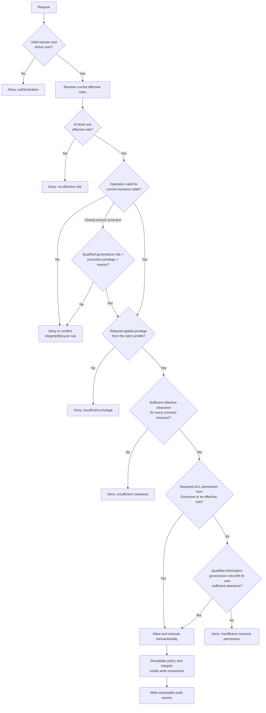

# Security and Authorization Subsystem — Technical Specification

**Status:** Approved
**Approved:** 19 September 2026
**Project:** ERMS / wathiq  
**Prepared:** 19 September 2026  
**Revision:** 0.6 — explicit ACL-mode contract and deployment policy decisions

## 1. Purpose

This specification defines the security-classification and authorization model
for wathiq. It covers:

- security levels for roles, aggregations, and records;
- global privileges collected into reusable profiles;
- role-based access-control lists for aggregations and records, including the
  non-user-specific synthetic Everyone principal;
- effective-role and assignment rules;
- information-governance access;
- authorization enforcement in the database, API, and UI;
- audit, cache, information-disclosure, and recovery requirements; and
- a phased implementation plan with a mandatory verification gate after every
  phase.

This is a role-based access-control design. Users acquire global privileges and
security clearance only through currently effective role assignments. Users
and organizational units never receive profiles, privileges, security
clearances, or individually addressed resource ACL grants. Everyone is an
ACL-only match for all authenticated users and does not alter that rule.

Authentication establishes who the caller is. Authorization determines what
that authenticated caller may do. The two subsystems remain separate.

## 2. Design principles

1. **Default deny.** An operation is denied unless every applicable gate grants
   it.
2. **Roles are the only named grant-bearing principals.** There are no direct
   user grants and no organizational-unit grants. Everyone is the sole
   synthetic ACL principal and is never user-specific.
3. **Allow grants only.** This version has no deny ACL and no conflict-resolution
   precedence.
4. **Profiles grant capabilities; ACLs grant scope.** A profile says what a role
   may do in principle. An ACL says where an effective role—or the synthetic
   Everyone match—may do it.
5. **Security clearance is an independent mandatory gate.** Neither a privilege
   nor an ACL grant can reveal content above the caller's effective clearance.
6. **Lifecycle and structural integrity remain authoritative.** Authorization
   never overrides aggregation closure, optimistic concurrency, validation,
   retention, or database integrity unless a separately specified, audited
   override explicitly says so.
7. **No existence leakage.** Lists, searches, counts, favourites, trees,
   breadcrumbs, relationship summaries, and error messages must not reveal an
   inaccessible aggregation, record, or component.
8. **Server-side enforcement is authoritative.** Hiding or disabling a UI
   control is useful guidance, not security enforcement.
9. **Decisions are explainable and auditable.** The policy engine produces a
   stable reason code for internal use, while public responses avoid disclosing
   protected facts.
10. **Authorization changes are immutable audit events.** Profile, privilege,
    clearance, governance-role, and ACL changes must be attributable and
    reconstructable.

## 3. Terminology

### 3.1 Principal

The authenticated user for whom an authorization decision is being made.

### 3.2 Effective role

A role contributes authorization to a user only when all of the following are
true at the time of the request:

- the user account is `active`;
- the user-role assignment has reached its inclusive `valid_from` time;
- the assignment has no `valid_until`, or server time is earlier than that
  exclusive time;
- the role is active; and
- the role's owning organizational unit and every ancestor organizational unit
  are active.

An inactive or suspended user cannot authenticate. An inactive role, an
inactive organizational ancestor, a future assignment, and an expired
assignment contribute no authorization. They do not change the user's own
account status.

### 3.3 Global privilege

A stable, system-wide capability code describing an operation a role may
perform in principle. For resource operations it is necessary but not normally
sufficient: security clearance and an ACL permission are also required.

### 3.4 Profile

A named, reusable set of global privileges. Profiles are assigned only to
roles. Each role has exactly one profile, and the role's effective privileges
are the privileges currently contained in that profile.

Restricting a role to one profile is intentional. It makes the answer to “what
can this role do globally?” visible in one place and avoids administrators
having to mentally merge several overlapping privilege bags. When a role needs
the combined privileges of two existing profiles, the security officer creates
a clearly named composite profile containing the approved union and assigns
that one profile to the role. The modest duplication is preferable to opaque
runtime composition in this project.

### 3.5 Resource permission

An allow grant connecting one role, one permission code, and an aggregation or
record scope. It determines where the role may exercise a global capability.

### 3.6 Security level and effective clearance

A security level is an ordered classification such as `R — Restricted — 50` or
`TS — Top Secret — 100`. A role has exactly one security level. A user's
effective clearance number is the greatest level number among that user's
effective roles.

A resource is within clearance when:

```text
effective_user_clearance_number >= resource_security_level_number
```

Lower-clearance roles do not reduce or veto the clearance supplied by another
effective role. The phrase “if any role fails the security level check, deny”
must therefore not be implemented: it would make adding a harmless
lower-clearance role unexpectedly remove access. The correct failure condition
is **no effective role supplies sufficient clearance**.

### 3.7 Information-governance role

An effective role marked as an information-governance role may bypass a
resource ACL for governed content, subject to the restrictions in Section 12.
It is not a system-administrator role and is not a universal authorization
bypass.

## 4. Security levels

### 4.1 Data and ordering

Every security level contains:

| Field | Requirement |
| --- | --- |
| `id` | Internal immutable identifier |
| `code` | Required, unique, case-insensitive stable code |
| `name` | Required, unique human-readable name |
| `level_number` | Required, unique non-negative integer establishing a total order |
| `prevents_disposition` | Required Boolean; defaults to `false` |
| `version` | Optimistic-concurrency version |
| timestamps | Creation and last-update timestamps |

Higher numbers represent more restrictive information and greater clearance.
Code and level number are not interchangeable: integrations store the stable
code while decisions use the number.

At least one baseline level must exist. The canonical initial catalogue should
be supplied by a seed, not hard-coded into application logic. A proposed test
catalogue is:

| Code | Name | Number | Prevents disposition |
| --- | --- | ---: | --- |
| `G` | General | 0 | No |
| `R` | Restricted | 50 | No |
| `S` | Secret | 75 | No |
| `TS` | Top Secret | 100 | Yes |

The business must approve the production catalogue before its seed is treated
as canonical.

`prevents_disposition` is policy metadata for the future disposition subsystem.
In this subsystem it is stored, administered, displayed, audited, and exposed,
but it does not itself change ordinary read or write authorization.

### 4.2 Assignments and defaults

- Every role has one non-null `security_level_id` and one non-null `profile_id`.
- Every aggregation has one non-null `security_level_id`.
- Every record has one non-null `security_level_id`.
- The baseline is always the active security level having the lowest
  `level_number`; it is never selected by alphabetical position, insertion
  order, or internal identifier.
- Existing roles, aggregations, and records are migrated to that lowest-numbered
  baseline level.
- Every UI create form initially selects that lowest-numbered baseline level.
- A new child aggregation defaults to its parent's security level.
- A new record defaults to the lowest-numbered baseline level, not to its
  containing aggregation's level. Content placed in a Top Secret aggregation
  is not automatically Top Secret.
- A new root aggregation requires an explicit level or receives the configured
  baseline level.

### 4.3 Container security invariant

An aggregation is a security envelope. Its level must be equal to or more
restrictive than every aggregation and record anywhere within its branch:

```text
parent aggregation level >= child aggregation level
parent aggregation level >= directly contained record level
ancestor level           >= every descendant level
```

Therefore:

- a new aggregation or record cannot be added beneath an aggregation when the
  new resource's level is higher than the parent's level;
- a resource cannot be moved beneath a destination whose level is lower than
  the resource or any member of its moving subtree;
- lowering an aggregation is prohibited while any descendant is higher than
  the proposed level; and
- raising a child above its parent is prohibited unless the containing ancestor
  chain is raised atomically to a sufficient level.

This rule is the opposite of the earlier draft and reflects the governing
container's responsibility to be classified at least as highly as its most
sensitive contents.

A less-restrictive child may be visible to a user who cannot view its more-
restrictive parent. In that case search and authorized direct navigation may
show the child, but the parent and every inaccessible ancestor are concealed:

- no ancestor name, code, description, counts, ACL, or security level is
  disclosed;
- breadcrumbs omit concealed segments and may show a neutral “Protected
  container” discontinuity without a link;
- the child response does not embed the hidden parent object;
- the user cannot edit, move, reclassify, or otherwise act on the parent in the
  UI; and
- direct API operations against the parent return the ordinary non-disclosing
  `404` response.

The child remains stored beneath the parent; concealment does not flatten or
rewrite the database hierarchy.

### 4.4 UI and API handling of hierarchy conflicts

Create and move forms filter the selectable security levels to those no higher
than the chosen parent or destination. They must still validate at submission
because policy or hierarchy may change while the form is open.

When a proposed add, move, or level change violates the invariant, the UI must
explain the exact conflict without changing data and offer only solutions the
caller is authorized to perform:

1. **Raise the containing aggregation chain.** Preview every affected ancestor
   and raise each insufficient level atomically to the required number. This is
   normally the safer correction because it does not broaden access to the
   child. The caller needs clearance for the target level and the security-
   change privilege and ACL permission on every affected aggregation.
2. **Use a level no higher than the parent.** For a new unsaved resource, select
   a permitted lower level. For an existing resource or moving subtree, this is
   a security downgrade and requires `security.resource.downgrade`, all
   applicable resource permissions, a reason, and a complete preview. If an
   aggregation subtree contains higher descendants, every affected descendant
   must be included in one explicit atomic downgrade workflow.
3. **Cancel.** Make no change.

The UI must never silently upgrade a parent or downgrade a child. An automatic
option means one explicit, confirmed bulk transaction after preview, not an
implicit side effect.

The ordinary API does not choose a remedy for the caller. It rejects a conflict
with `409 Conflict` and a stable `security_hierarchy_violation` body containing
safe IDs, required level number, current level number, and affected counts.
Separate preview-and-apply bulk endpoints perform authorized ancestor upgrades
or subtree downgrades atomically using `If-Match` versions for every affected
resource. PostgreSQL constraints/triggers revalidate the invariant so direct
writes and races cannot bypass it.

Lowering a resource's security level is more sensitive than raising it because
it expands the audience. It requires the dedicated global privilege
`security.resource.downgrade`, the resource's `security_level.change`
permission, a non-blank reason, and an immutable domain event.

A caller may not assign a resource or role a security level higher than the
caller's own effective clearance, except through a separately specified
break-glass procedure. This prevents administrators from creating information
that neither they nor any operational custodian can subsequently inspect.

### 4.5 Catalogue changes and deletion

Changing a level number immediately changes access for every referencing role
and resource. Changing a role's assigned level can likewise add or remove
clearance for every currently assigned user. Both operations therefore require
previewing affected counts, optimistic concurrency, a reason, explicit
confirmation, access-continuity re-evaluation, and immediate policy-cache
invalidation.

A referenced security level cannot be deleted. Deletion is allowed only when no
role, aggregation, or record references it and it is not the configured
baseline. Merging or replacing levels must be a separate bulk migration, not a
cascade delete.

## 5. Privileges and profiles

### 5.1 Privilege catalogue

Privilege codes are immutable lowercase dotted identifiers. Display names and
descriptions may change. Privileges are seeded system definitions, not
free-form administrator input.

The initial catalogue is:

#### Platform and administration

| Code | Purpose |
| --- | --- |
| `authorization.administer` | Create and maintain profiles, profile privileges, role-profile assignments, governance-role flags, and resource ACLs |
| `authorization.explain` | Diagnose effective access for another user, subject to the examiner's own resource access and clearance |
| `security_levels.administer` | Create and maintain the security-level catalogue |
| `identity.users.administer` | Create, edit, activate, deactivate, suspend, unsuspend, issue temporary passwords for, and eventually delete users |
| `identity.sessions.administer` | Inspect and revoke other users' login sessions |
| `organization.browse` | Browse the organization hierarchy and view concise organizational-unit, role, and user summaries without receiving administration rights |
| `organization.administer` | Create, edit, activate, deactivate, and eventually delete organizational units and roles; maintain role supervision and assignments |
| `classifications.administer` | Create, edit, publish, unpublish, activate, deactivate, migrate, and delete classification schemes and classifications |
| `audit.view` | View the system-wide audit trail and entity histories |

`identity.users.administer` and `organization.administer` are deliberately
separate. The old example `ADMINISTER_USERS` is too broad if it also silently
controls roles and organizational units.

`organization.browse` is deliberately separate from
`organization.administer`. It controls disclosure through the read-only
organization browser, while the full User page continues to require
`identity.users.administer` and the full Role and Organization Unit pages
continue to require `organization.administer`.

#### Aggregations

| Code | Purpose |
| --- | --- |
| `aggregation.view` | Discover and view aggregation metadata |
| `aggregation.create_root` | Create a root aggregation |
| `aggregation.create_child` | Create a child aggregation, subject to the parent ACL |
| `aggregation.modify` | Change aggregation metadata |
| `aggregation.move` | Move an aggregation branch |
| `aggregation.reclassify` | Change its governing classification |
| `aggregation.close` | Close an aggregation |
| `aggregation.reopen` | Reopen a directly closed aggregation |
| `aggregation.delete` | Permanently delete an otherwise eligible aggregation |
| `aggregation.security_level.change` | Raise or otherwise change its security level; lowering also requires `security.resource.downgrade` |
| `aggregation.acl.manage` | Maintain aggregation-scoped ACL grants |

#### Records and digital components

| Code | Purpose |
| --- | --- |
| `record.view` | Discover and view record metadata |
| `record.create` | Commit a new record into an aggregation, subject to the aggregation ACL |
| `record.modify` | Change record metadata |
| `record.move` | Move a record to another aggregation |
| `record.delete` | Permanently delete an otherwise eligible record |
| `record.security_level.change` | Raise or otherwise change its security level; lowering also requires `security.resource.downgrade` |
| `record.acl.manage` | Maintain direct record ACL grants |
| `record.component.view` | Render or preview component content |
| `record.component.download` | Download original component content |
| `record.component.add` | Add a new committed component |
| `record.component.replace` | Atomically replace the content of an existing component |
| `record.component.remove` | Remove a committed component |
| `record.component.reorder` | Change component order |
| `record.component.share` | Use a future controlled external/internal sharing workflow |
| `record.component.print` | Use a future controlled printing workflow |

#### Exceptional operations

| Code | Purpose |
| --- | --- |
| `security.resource.downgrade` | Lower an aggregation or record security level |
| `closure.correct_record_placement` | Permit a qualified information-governance role to add or move a record into a closed aggregation without reopening it |
| `authorization.recovery` | Use a future audited break-glass recovery workflow |

Reserved future privileges grant nothing until the corresponding workflow is
implemented. They must not become generic Boolean bypasses.

### 5.2 Profile structure and assignment

Each profile contains a stable code, name, description, version, timestamps,
and a set of privileges. A profile has no activate/deactivate lifecycle. It is
a configuration bundle, not an operational identity or organizational entity;
adding lifecycle state would introduce another hidden reason for lost access
without adding a useful business distinction.

Each role must reference exactly one profile. Users and organizational units
cannot receive profiles. The database and API must reject missing, multiple,
user, or organizational-unit profile assignments rather than merely omitting
them from the UI.

Changing a profile affects every role using it. The UI must show the number of
affected roles and effective users before saving a privilege-set change.

A profile cannot be deleted while any role references it. The administrator
must first assign every affected role another profile. Editing or deleting a
profile and assigning a different profile to a role require optimistic
concurrency, an impact preview, a non-blank reason, custody-continuity checking,
and immutable audit events.

Profiles must not contain resource ACL permissions. A profile grants capability
everywhere in principle; resource ACLs restrict the locations where that
capability can be exercised.

### 5.3 Compatibility profile and migration order

The canonical privilege seed includes a protected profile with code
`ALL_PRIVS` and display name **All privileges**. It contains every
privilege present in the seeded privilege catalogue. Its purpose is migration
and controlled compatibility, not the recommended long-term assignment for
ordinary roles.

Because `roles.profile_id` is mandatory, migration and clean installation must
run in this order within a safe migration boundary:

1. create and seed the privilege catalogue;
2. create **All privileges** and populate all profile-privilege mappings;
3. add `roles.profile_id` as temporarily nullable;
4. assign **All privileges** to every existing role;
5. verify that no role remains unassigned;
6. make `roles.profile_id` non-null and add its foreign key; and
7. record the migration and resulting counts.

The canonical schema and seed scripts must produce the same profile and
assignments without relying on migration history. A fresh test or development
database therefore also starts with existing seeded roles assigned **All
privileges**.

This compatibility assignment preserves existing behavior while enforcement is
introduced phase by phase. Security clearance and ACL gates still apply when
their phases become active. Replacing **All privileges** on ordinary roles with
purpose-specific profiles is the deployment owner's responsibility; the
application does not block production startup, activation, deployment, or use
merely because roles still reference this profile. The UI prominently marks
roles still using it, and an optional production-readiness report lists them as
an advisory finding. The profile cannot be deleted while referenced and cannot
silently acquire a newly introduced privilege; adding a new privilege requires
an explicit migration/update to this profile so the compatibility impact is
reviewable.

There is no application concept of “production activation” introduced for this
purpose. A blocking design would have required either a deployment-pipeline
readiness check that fails when queried roles still use this profile, or a
production-mode startup guard backed by the same query. Neither mechanism is a
requirement: any readiness endpoint or operational report must return this as a
warning, not a failing condition or startup barrier.

### 5.4 Mandatory governance-custody profiles

The canonical production setup must include the built-in Information Governance
Manager (`INFO_GOV_MGR`) and Information Governance Officer
(`INFO_GOV_OFFICER`) profiles. Both contain the same global privileges needed to
discover, view, manage, classify, close/reopen, correct placement, administer
classification schemes and security levels, and administer access to governed aggregations and
records. They do not contain user, platform, or unrelated technical-
administration privileges. The distinct profiles allow later policy evolution
without changing existing role assignments.

At least one effective information-governance role must:

- use either built-in governance profile or an approved successor with the required custody
  privileges;
- have the highest configured security level;
- belong to the designated information-governance office; and
- have at least one current assignment to an active person account.

Two independently assigned active people are strongly recommended to avoid a
single absence or account incident becoming an operational lockout.

## 6. Resource permission catalogue

Permission codes are also stable lowercase dotted identifiers. They are
separate definitions from global privileges even when their names are similar.
This deliberate two-key model answers two different questions:

```text
Global privilege: may this role perform this kind of action at all?
ACL permission:   may this role perform it on this resource's current ACL?
```

### 6.1 Aggregation permissions

| Permission | Applies to |
| --- | --- |
| `aggregation.view` | View/discover aggregation metadata and its permitted summary counts |
| `aggregation.modify_metadata` | Edit ordinary aggregation metadata |
| `aggregation.delete` | Delete an eligible aggregation |
| `aggregation.close` | Close the aggregation |
| `aggregation.reopen` | Reopen a directly closed aggregation |
| `aggregation.add_child` | Create a direct child aggregation |
| `aggregation.add_record` | Commit a record directly into the aggregation |
| `aggregation.move` | Move this aggregation as a source |
| `aggregation.receive_child` | Accept an aggregation moved beneath it |
| `aggregation.receive_record` | Accept a record moved into this aggregation |
| `aggregation.reclassify` | Change the governing classification |
| `aggregation.security_level.change` | Change the aggregation security level |
| `aggregation.acl.manage` | Maintain this aggregation's ACL |
| `aggregation.history.view` | View its entity history |

Moving an aggregation requires `aggregation.move` on the source and
`aggregation.receive_child` on the destination, plus the matching global
privilege and clearance for both. This prevents a user with control over only
one side from moving information across boundaries.

### 6.2 Record permissions

| Permission | Applies to |
| --- | --- |
| `record.view` | View/discover record metadata |
| `record.modify_metadata` | Edit ordinary record metadata |
| `record.delete` | Delete an eligible record |
| `record.move` | Move the record as a source |
| `record.security_level.change` | Change the record security level |
| `record.acl.manage` | Maintain the record's direct ACL |
| `record.history.view` | View its entity history |
| `record.component.list` | See component names and metadata |
| `record.component.view` | Render or preview component content |
| `record.component.download` | Retrieve original bytes |
| `record.component.add` | Add a component |
| `record.component.replace` | Replace one component's content atomically |
| `record.component.remove` | Remove a component |
| `record.component.reorder` | Change component ordering |
| `record.component.share` | Use the future controlled sharing workflow |
| `record.component.print` | Use the future controlled printing workflow |

Viewing record metadata does not automatically permit opening or downloading
its component content. `record.component.list` permits the UI to show component
metadata without disclosing bytes.

### 6.3 Permission dependencies

An ACL permission set must be internally usable. Granting an action while
withholding the ability to view its resource creates confusing “blind” access
and makes explanations unreliable. The following dependencies are mandatory.

For aggregation ACLs, every aggregation permission other than
`aggregation.view` depends on `aggregation.view`:

```text
aggregation.modify_metadata       -> aggregation.view
aggregation.delete                -> aggregation.view
aggregation.close                 -> aggregation.view
aggregation.reopen                -> aggregation.view
aggregation.add_child             -> aggregation.view
aggregation.add_record            -> aggregation.view
aggregation.move                  -> aggregation.view
aggregation.receive_child         -> aggregation.view
aggregation.receive_record        -> aggregation.view
aggregation.reclassify            -> aggregation.view
aggregation.security_level.change -> aggregation.view
aggregation.acl.manage             -> aggregation.view
aggregation.history.view          -> aggregation.view
```

For direct record ACLs and default child-record ACL templates:

```text
record.modify_metadata       -> record.view
record.delete                -> record.view
record.move                  -> record.view
record.security_level.change -> record.view
record.acl.manage             -> record.view
record.history.view          -> record.view
record.component.list        -> record.view
record.component.view        -> record.component.list -> record.view
record.component.download    -> record.component.list -> record.view
record.component.add         -> record.component.list -> record.view
record.component.replace     -> record.component.list -> record.view
record.component.remove      -> record.component.list -> record.view
record.component.reorder     -> record.component.list -> record.view
record.component.share       -> record.component.view -> record.component.list -> record.view
record.component.print       -> record.component.view -> record.component.list -> record.view
```

`record.component.download` does not depend on preview permission: an approved
role may be allowed to retrieve an original file without using the embedded
viewer. Share and print do depend on view because those workflows disclose
rendered content.

The UI maintains dependency closure interactively:

- selecting a permission automatically selects and explains every prerequisite;
- attempting to clear a prerequisite identifies dependent permissions and asks
  whether to clear them together; and
- the final review shows the complete effective set rather than only the boxes
  the user clicked.

The API accepts a complete desired permission set, computes its transitive
dependency closure, and rejects an invalid set with `422 Unprocessable Entity`
and a stable `permission_dependency_violation` response. It does not silently
add prerequisites for non-UI clients. The response identifies missing
prerequisite codes.

The database enforces the same invariant using deferred constraint triggers so
an atomic replacement can add or remove several rows in any order but cannot
commit an invalid final set. Deleting `record.view`, for example, fails while
any dependent record permission remains for the same principal and ACL/template
scope. This enforcement applies equally to ordinary roles and the synthetic
Everyone principal.

Profile editors should apply the analogous global-privilege dependencies so a
profile cannot grant a global mutation capability without the corresponding
global view capability. The seeded privilege catalogue records these
dependencies explicitly rather than duplicating them in frontend code.

### 6.4 Replacement is an atomic operation

Replacing a component is not modeled as permission to remove followed by
permission to add. It is its own atomic operation because it:

- preserves component identity and ordering;
- provides one optimistic-concurrency boundary;
- prevents a failure between removal and addition from leaving the record
  incomplete;
- can preserve an explicit prior-content audit/version relationship; and
- supports a narrower duty in which a user may correct a component but may not
  delete it outright.

The implementation may internally write old and new content rows, but the
authorization decision and domain event are `record.component.replace`.

## 7. ACL model and default-child inheritance

### 7.1 Grant shape

An ACL grant contains:

- the ACL or default-template scope and its identifier;
- a principal type of `role` or `everyone`;
- the granted role identifier when principal type is `role`, otherwise null;
- the permission definition;
- version and timestamps; and
- no user identifier and no deny flag.

The relational design must preserve real foreign keys for role principals and
resource/template owners. A check constraint requires exactly one valid
principal representation:

```text
principal_type = 'role'     -> role_id IS NOT NULL
principal_type = 'everyone' -> role_id IS NULL
```

There may be only one Everyone grant for a given permission in a given ACL or
template. Separate FK-safe tables or partitions are preferred over an
unconstrained polymorphic `resource_type/resource_id` pair.

Duplicate effective grants are rejected by a unique constraint. Removing one
of several routes to the same effective permission does not remove the other
routes.

Creating a direct grant for a role whose clearance is presently below the
resource level is rejected because it is misleading and cannot be exercised.
If an existing role is subsequently lowered, its now-insufficient grants remain
stored but become dormant; the change preview must identify their count. They
contribute again only if the role later regains sufficient clearance. A grant
may exist before the role receives a matching global privilege, but it remains
inert until both gates are satisfied.

### 7.2 Synthetic Everyone principal

Everyone is an ACL-only synthetic principal representing every authenticated
user account. It is not a row in `roles`, is not seeded, has no organizational
unit, has no assignments, has no profile, has no security level, cannot be
renamed or deleted, and never appears in the organization tree or role
administration APIs.

The ACL resolver treats an Everyone grant as matching the principal after the
authentication and effective-role gates. Everyone supplies only the ACL
permission. It supplies no global privilege or clearance: the user must still
obtain those from effective real roles. A user with no effective role therefore
does not pass authorization merely because an ACL grants Everyone.

API representations use an explicit synthetic principal:

```json
{
  "principal_type": "everyone",
  "role_id": null,
  "display_name": "Everyone"
}
```

Clients cannot create another synthetic principal or submit a role row whose
code happens to be `Everyone`. A reserved-code check prevents confusing role
names or codes.

In ACL editors, Everyone is pinned above ordinary roles with explanatory text:
“All authenticated users who separately satisfy global privilege and security
clearance requirements.” Removing or reducing its permissions requires an
explicit confirmation showing that access will become role-specific.

### 7.3 Three ACL sets on an aggregation

Every aggregation owns three separate permission sets:

1. **Resource ACL** — controls the aggregation itself using aggregation
   permissions.
2. **Default child-aggregation ACL** — the live aggregation-permission template
   inherited by each direct child aggregation whose
   `inherit_acl_from_parent` flag is enabled.
3. **Default child-record ACL** — the live record-permission template inherited
   by each directly contained record whose `inherit_acl_from_parent` flag is
   enabled.

These are live parent defaults, not rows copied into each inheriting child.
Changing a parent's default child-aggregation ACL immediately changes the
effective ACL of every direct child aggregation still inheriting from that
parent. Changing its default child-record ACL does the same for every directly
contained inheriting record.

The persisted field `default_child_aggregation_acl_mode` determines the single
source from which an aggregation exposes its effective default ACL for direct
child aggregations. It does not control the aggregation's own resource ACL, the
default ACL for child records, or whether a particular child inherits. A
child's `inherit_acl_from_parent` flag independently determines whether that
child consumes this effective default.

`default_child_aggregation_acl_mode` is mandatory and has exactly two values:

```text
mirror_resource_acl - live-reference this aggregation's current effective
                      resource ACL; this is the default
custom              - use this aggregation's explicit child-aggregation
                      template grants
```

| Value | Effective default child-aggregation ACL | Stored custom template | Effect of later changes |
| --- | --- | --- | --- |
| `mirror_resource_acl` | The aggregation's effective resource ACL at authorization time | Retained but dormant and contributes no permissions | Changes to the aggregation's effective resource ACL immediately flow to inheriting child-aggregation branches without copying grants |
| `custom` | The aggregation's stored custom child-aggregation ACL template | Active and editable | Resource-ACL changes do not affect this default; custom-template changes immediately flow to inheriting child-aggregation branches |

The field is a source selector, not a copying instruction or ACL merge
strategy. Exactly one source is effective. The system never unions the mirrored
resource ACL with the custom template. Changing the field changes which
already-stored source is effective; it neither deletes a source nor
materializes ACL grants on descendants.

The modes have these lifecycle rules:

- New aggregations default to `mirror_resource_acl` unless an authorized caller
  explicitly selects `custom` and supplies a valid template.
- In mirror mode, the source is the aggregation's **effective** resource ACL,
  whether inherited from its parent or supplied by its local override.
- In custom mode, the source is only this aggregation's explicit custom
  child-aggregation template.
- Switching from mirror to custom activates the retained custom template. The
  user may first replace it with a one-time copy of the currently mirrored ACL.
- Switching from custom back to mirror activates the current effective resource
  ACL and retains the complete custom template dormant, including its grants,
  version, last-modified information, and audit history.
- A dormant template never grants access, participates in effective
  authorization, or satisfies custody-continuity checks.
- A mode change requires recursive impact preview, authorization, a reason,
  optimistic concurrency, continuity validation, and auditing.

In `mirror_resource_acl` mode there is no manual duplication. If aggregation A
inherits its resource ACL from its parent, A's default child-aggregation ACL
mirrors that inherited effective ACL. If A overrides its resource ACL, the
default immediately mirrors A's override. A direct child that inherits from A
therefore receives the same effective ACL, and its own default child-
aggregation ACL mirrors that ACL again. The result is a live chain down the
aggregation hierarchy.

The chain stops at either explicit boundary:

- a child aggregation disables `inherit_acl_from_parent` and uses its own
  resource ACL, after which its default mirror propagates that override farther
  down its branch; or
- an aggregation changes its default child-aggregation ACL mode to `custom`,
  so its children inherit that custom template instead of its resource ACL.

This design makes ordinary aggregation creation require no separate default-
ACL configuration while retaining deliberate branch-level control.

The default child-record ACL remains a record-permission template and cannot
directly mirror the aggregation resource ACL because the two use different
permission catalogues. It defaults to Everyone/all and can be customized.

Changing an ACL near the top of a mirrored chain may affect an arbitrarily deep
subtree. Preview and validation must therefore traverse all affected descendants
until an override or custom-template boundary, not merely direct children.

### 7.4 Child ACL modes and effective ACL resolution

Every non-root aggregation and every record has a non-null
`inherit_acl_from_parent` flag, defaulting to `true`. A root aggregation has no
parent and must have the flag set to `false`.

The effective ACL is resolved as follows:

```text
child aggregation + inherit=true -> current parent default child-aggregation ACL
record + inherit=true            -> current parent default child-record ACL
resource + inherit=false         -> resource's own override ACL
root aggregation                 -> root's own ACL
```

There is no additive merge between the inherited default and the child's own
ACL. When inheritance is enabled, the inherited parent template is the complete
effective ACL and the child's override ACL is dormant. When inheritance is
disabled, the child override is the complete effective ACL. This avoids needing
deny entries or ambiguous precedence rules.

Changing a parent default or a resource ACL feeding a mirrored default is
therefore a consequential authorization change.
Before saving, the API and UI must calculate and present:

- the number of directly and recursively affected aggregations and records,
  stopping at inheritance or custom-template boundaries;
- the roles, Everyone grants, and permissions added or removed;
- users who gain or lose effective access;
- any dormant or newly effective grants caused by clearance/privilege gates;
  and
- custody-continuity failures.

The update is atomic, versioned, reasoned, audited, and rejected if any affected
resource would lose its last effective human custodian or acquire an invalid
permission dependency set.

### 7.5 Everyone defaults and precedence

The factory default for every newly initialized root ACL, local override ACL,
custom child-aggregation template, and default child-record ACL is Everyone
with every permission valid for that ACL type. The creator may remove Everyone,
restrict its permissions, and add role grants before the first save.

A new aggregation's default child-aggregation ACL begins in
`mirror_resource_acl` mode, not custom mode. Its dormant custom template is
initialized to Everyone/all and becomes editable/effective only if the user
chooses custom mode. The UI shows both the mirrored effective value and the
dormant custom value without suggesting that both grant access simultaneously.

For a child created with inheritance enabled, the parent's current default is
the effective ACL. The child's own dormant override ACL is still initialized to
Everyone/all so that turning inheritance off has the requested visible starting
point; it grants nothing while dormant. The create form clearly separates:

- **Inherited effective ACL**, read-only while inheritance is enabled; and
- **Own override ACL**, initially Everyone/all and editable only when
  inheritance is disabled.

The server never merges Everyone back into a deliberately restricted inherited
template or override at authorization time. Everyone/all is an initialization
default, not a mandatory permanent grant.

### 7.6 Switching inheritance and overriding a child

Disabling **Inherit ACL from parent** makes the child's own ACL effective. The
UI initially offers two explicit starting choices:

1. **Start from the currently inherited ACL** — copy the current parent default
   into the override once as part of the mode-change transaction, then allow
   edits. This prevents an accidental access discontinuity.
2. **Start from the child's existing override** — use the dormant override,
   which is Everyone/all for a never-customized child.

The submitted operation contains the final complete override ACL. The API
validates dependencies, caller authority, clearance effects, and custody, then
changes the flag and ACL atomically. No intermediate state is observable.

Re-enabling inheritance makes the current parent default effective immediately.
The local override remains stored but dormant so a later authorized switch can
restore it. The UI shows its dormant status and last modification time; dormant
grants never contribute authorization. Re-enabling inheritance requires the
same impact preview, reason, optimistic concurrency, and custody checks as a
parent-default change.

Because ACLs contain only allow grants and exactly one ACL source is effective,
no deny entry or row-by-row shadowing rule is needed.

The default child-aggregation ACL's own mirror/custom mode follows the same
discipline. Switching from mirror to custom may initialize the custom template
from the aggregation's current effective resource ACL or use its existing
dormant custom template. Switching back to mirror retains the custom template
as dormant. Either switch previews every descendant whose effective ACL would
change through the chain and is atomic, versioned, reasoned, continuity-checked,
and audited.

### 7.7 Moves under live inheritance

Moving a resource with `inherit_acl_from_parent=true` changes its effective ACL
to the destination parent's applicable default as part of the move. The preview
must show the complete access difference and validate continuity before the
transaction commits.

If the current inherited ACL should remain after the move, the caller must
select **Keep current access as an override**. The server captures the source
parent's current default into the resource's override ACL and sets
`inherit_acl_from_parent=false` atomically with the move. This is an explicit
choice, not the default.

Moving a resource with inheritance already disabled retains its override ACL.
Moving a child aggregation never changes that aggregation's own default
child-aggregation or child-record templates; those govern its children and are
independent of the resource ACL governing the aggregation itself.

### 7.8 Creation and orphan prevention

Creation must not produce inaccessible content:

- A root aggregation requires global `aggregation.create_root`; its initial ACL
  must include at least one effective role capable of viewing and administering
  it, unless an approved governance role already satisfies continuity.
- Creating a child requires global `aggregation.create_child`, sufficient
  clearance, and `aggregation.add_child` on the parent.
- Committing a record requires global `record.create`, sufficient clearance,
  and `aggregation.add_record` on the destination aggregation.
- New children default to live parent ACL inheritance. Their dormant local
  override ACLs are initialized to Everyone/all. For a new aggregation, its two
  own default-child configurations are created in the same transaction: the
  child-aggregation default starts by mirroring its effective resource ACL,
  while the child-record default starts as Everyone/all. Either may be
  explicitly customized subject to impact and dependency rules.

Every ACL mutation is transactionally rejected if it would leave protected
content without an effective authorized user capable of discovering, viewing,
and administering access to it. This is the same access-continuity concept used
by the user/role deletion specification.

### 7.9 Custody continuity and orphan detection

It must never be possible for a successful ordinary application operation to
leave an information resource with no effective human custodian. An effective
custodian is an active person account with a current assignment to an effective
information-governance role that:

- has clearance at least equal to the resource;
- has a profile containing the required global custody privileges; and
- can use the governance ACL bypass to discover the resource, view it, and
  administer its access.

The continuity check runs not only for ACL removal. It runs before committing
any change to users, user-role assignments, roles, organizational ancestry,
role profiles, profile privileges, governance flags, role security
levels, resource security levels, or resource hierarchy that could remove the
last custodian. A blocked operation reports safe affected counts and remediation
guidance.

The policy requirement for a highest-clearance information-governance role
provides universal custody coverage when correctly staffed. The application
must enforce that the last effective highest-clearance governance custodian
cannot be deactivated, suspended, unassigned, expired by an administrative
edit, lowered in clearance, moved beneath inactive ancestry, given an
insufficient profile, or stripped of governance status while protected
resources remain.

The last universal custodian assignment cannot be given a `valid_until` that
would create a future zero-custodian interval. Future-dated replacements must
overlap sufficiently to preserve continuous coverage; the API evaluates the
scheduled interval, not only the state at the instant of the edit.

Transactional prevention is supplemented by a scheduled read-only custody
reconciliation job. It detects legacy data, direct privileged database changes,
clock-driven assignment expiry, and defects that create zero-custodian or
single-custodian exposure. Zero-custodian findings are system-integrity
failures. A single-custodian finding is an advisory resilience-policy finding,
not an authorization failure and not a reason to reject an operation. Findings
generate an appropriately classified security event and administrator/
information-governance notice. The job does not silently rewrite authorization
data. The operational runbook defines its schedule and response.

Organizational policy should assign at least two active person accounts to the
highest-clearance universal governance-custodian role so absence, departure, or
account failure does not leave one operational point of failure. This is a
documented recommendation rather than a system-enforced minimum: moving from
two effective assignees to one is permitted, does not block production, and
does not fail an authorization or mutation transaction. The administrator and
operations documentation produced during implementation must repeat this
recommendation and explain the risk. The separately stated rule preventing the
effective count from falling to zero remains enforced.

## 8. Global privilege to resource-permission mapping

Every protected operation has one explicit policy mapping. Representative
mappings are:

| Operation | Required global privilege | Required resource permission(s) |
| --- | --- | --- |
| List/open aggregation | `aggregation.view` | `aggregation.view` |
| Edit aggregation metadata | `aggregation.modify` | `aggregation.modify_metadata` |
| Add child | `aggregation.create_child` | `aggregation.add_child` on parent |
| Add/commit record | `record.create` | `aggregation.add_record` on destination |
| Correct record placement in closed aggregation | `record.create` or `record.move`, plus `closure.correct_record_placement` | Governance ACL bypass on destination; ordinary source permission for a move |
| Move aggregation | `aggregation.move` | `aggregation.move` on source and `aggregation.receive_child` on destination |
| Close/reopen | `aggregation.close` / `aggregation.reopen` | Matching close/reopen permission |
| Delete aggregation | `aggregation.delete` | `aggregation.delete` |
| Open record metadata | `record.view` | `record.view` |
| Edit record metadata | `record.modify` | `record.modify_metadata` |
| Move record | `record.move` | `record.move` on record and `aggregation.receive_record` on destination aggregation |
| Delete record | `record.delete` | `record.delete` |
| List components | `record.view` | `record.view` and `record.component.list` |
| Preview component | `record.component.view` | `record.view` and `record.component.view` |
| Download component | `record.component.download` | `record.view` and `record.component.download` |
| Add/replace/remove/reorder | Matching component privilege | `record.view` and matching component permission |
| Change aggregation level | `aggregation.security_level.change` | `aggregation.security_level.change` |
| Change record level | `record.security_level.change` | `record.security_level.change` |
| Manage resource ACL | Matching `*.acl.manage` plus `authorization.administer` | Matching `*.acl.manage` permission |
| View entity history | `audit.view` | Matching `*.history.view` permission |
| Explain another user's access | `authorization.explain` | Examiner must independently view and clear the resource |

Root aggregation creation has no parent ACL, so its global privilege and
clearance/default/continuity checks are the complete resource authorization.

System-wide administration operations such as user administration and
classification administration have no aggregation or record ACL gate. They
still require an effective role with the appropriate global privilege.

## 9. Authorization decision algorithm

### 9.1 Normal resource operation

The policy engine evaluates one immutable request context and returns an allow
or deny decision with an internal reason code.

1. **Authentication gate.** Require a valid, unrevoked session for an active
   user. A suspended, inactive, locked, expired, or unauthenticated principal is
   rejected according to authentication policy.
2. **Effective-role gate.** Resolve current effective roles using account,
   assignment, role, and organizational-ancestry rules. If none exist, deny.
3. **Operation and integrity gate.** Confirm the requested operation is valid
   for the resource state. Closure, retention, parent/child restrictions,
   optimistic concurrency, and validation remain independent blockers.
4. **Global-privilege gate.** If no effective role obtains the operation's
   global privilege through its assigned profile, deny.
5. **Security-clearance gate.** If the greatest security level among effective
   roles is below any involved resource's level, deny. Multi-resource
   operations such as moves must pass for source, destination, and affected
   descendants.
6. **ACL gate.** If neither Everyone nor any of the user's effective roles has
   the required permission in the resource's current ACL, deny, unless the
   narrowly defined information-governance ACL bypass applies.
7. **Allow.** Execute the operation transactionally and audit it as required.

The role supplying the global privilege, the role supplying clearance, and the
role supplying the ACL permission may differ. This is intentional union-based
RBAC and matches the rule that a user receives the union of all effective role
authorizations. The decision explanation must retain the contributing role IDs
for administrators and tests.

### 9.2 Authorization decision diagram



The diagram is a logical decision flow. Implementations may order safe internal
queries differently for efficiency, but they must produce the same result and
must not reveal which protected gate failed to an unauthorized caller.

### 9.3 Global administrative operation

For an operation with no resource ACL, evaluate authentication, effective
roles, operation integrity, and the required global privilege. Security-level
clearance is additionally required whenever the operation reads or changes a
specific protected resource.

### 9.4 Multiple required permissions

Where an operation requires several permissions, such as moving a resource or
viewing a component, all required permissions must be present. They may be
supplied by different effective roles unless a future separation-of-duties rule
explicitly requires one role to hold the complete set.

### 9.5 Denial responses

For a known resource on which the caller lacks `view`, read, update, delete,
history, component, and ACL endpoints return the same public `404` response as
an absent resource. Search and list endpoints silently omit it. This prevents
existence probing.

Once a caller can view the resource, an attempted disallowed action may return
`403 Forbidden` with a stable, non-sensitive code such as
`insufficient_privilege`, `insufficient_clearance`, or
`insufficient_resource_permission`. Integrity conflicts remain `409 Conflict`.

Detailed contributing roles, security levels, and hidden ACL contents are
available only to authorized security administrators through an explicit
explain endpoint; they are never included in ordinary denial responses.

## 10. Additional mandatory checks

The four proposed gates are necessary but not complete. The implementation must
also account for:

- authentication and user lifecycle state;
- role, organizational ancestry, and assignment effectiveness;
- resource existence without leaking it;
- source and destination authorization for moves;
- authorization over every affected descendant in bulk operations;
- aggregation closure and future disposition holds;
- optimistic concurrency and current-state re-evaluation inside the write
  transaction;
- access continuity after ACL, role, assignment, profile, security-level, or
  lifecycle changes;
- draft ownership before a record exists;
- content-specific permissions separate from record metadata;
- audit-history confidentiality;
- background jobs and service accounts; and
- a controlled recovery path for accidental lockout.

These checks must not be collapsed into a single generic `is_admin` flag.

## 11. Record drafts

Drafts are transient pre-record workspaces and do not have a role ACL. Their
rules are:

- only the active owner may view or change an open draft;
- an administrator with a future explicitly named draft-recovery privilege may
  intervene; no implicit system-administrator shortcut is assumed;
- staged components use draft ownership, not committed-record permissions;
- draft creation requires `record.create` globally;
- commit re-evaluates the destination aggregation, security level,
  `aggregation.add_record`, closure, and all component constraints in the final
  transaction; and
- a draft that was valid when created may be denied at commit when policy has
  since changed.

Draft ownership is not a grant to the committed record. The resulting record's
effective ACL comes from the destination aggregation plus any valid direct ACL
created atomically by the commit workflow.

## 12. Information-governance roles

### 12.1 Recommended behavior

Roles receive a Boolean `is_information_governance` flag. For protected
aggregations and records, an effective governance role may bypass the **ACL
gate only** when that governance role's own security level is at least the
resource level.

It does not bypass:

- authentication or role effectiveness;
- the role's global privileges from profiles;
- security clearance;
- closure (except the specific record-placement correction in Section 12.4),
  retention, disposition, concurrency, or structural integrity;
- special lowering, external sharing, printing, ACL administration, user
  administration, classification administration, or authorization
  administration privileges; or
- the requirement for an explicit reason where one is normally required.

This means governance staff can be given a standard governance profile defining
their duties and can exercise those duties across all in-clearance content
without maintaining thousands of repetitive ACL entries.

The reserved System Administrator role is not automatically an information-
governance role and is not automatically entitled to protected business
content. Platform administration and records custody are different duties. If
one installation deliberately combines them, it must explicitly mark and
clear the appropriate role under the rules in this section.

### 12.2 Why security clearance should not be bypassed

**Recommended: do not bypass it.** Advantages:

- preserves least privilege and need-to-know classification boundaries;
- permits different governance teams for Restricted and Top Secret material;
- limits the impact of a mistakenly assigned governance flag;
- keeps security-level labels meaningful and independently auditable; and
- avoids turning an ordinary role field into a permanent break-glass account.

Allowing governance roles to bypass security levels would simplify centralized
oversight and recovery, but it would grant every governance officer access to
the organization's most sensitive content. A stolen governance account or
mistaken assignment would compromise all levels, and the security-level model
would no longer be an effective mandatory boundary for those users.

If rare cross-clearance access is operationally necessary, it should use a
separate time-limited break-glass workflow requiring a reason, strong
reauthentication, approval where feasible, prominent alerts, and immutable
events. It must not be implemented by broadening the governance flag.

### 12.3 Governance bypass scope

The bypass applies only when a resource ACL would otherwise deny an operation.
It must be visible in authorization explanations and audited on security-
sensitive operations as `authorization_basis: information_governance` with the
qualifying governance role snapshot.

A non-governance high-clearance role cannot lend its clearance to a
lower-clearance governance role for this bypass. At least one effective role
must be both governance-marked and sufficiently cleared.

### 12.4 Correcting record placement in a closed aggregation

Reopening an aggregation resets or alters closure state and can interfere with
the retention period already accrued. A qualified information-governance user
may therefore perform a narrowly defined correction without reopening it:

- commit a new record into an effectively closed aggregation; or
- move an existing record into an effectively closed aggregation.

This is not a general closure bypass. It requires all of the following:

- an effective information-governance role whose own clearance is sufficient
  for the record, destination aggregation, and any other involved resource;
- the ordinary global `record.create` or `record.move` privilege;
- the additional `closure.correct_record_placement` privilege;
- destination authorization through the governance ACL bypass;
- ordinary source-side authorization for a move;
- compliance with the container security invariant;
- current optimistic-concurrency versions; and
- a non-blank correction reason.

The operation does not clear, replace, or recalculate the aggregation's
`date_closed`. It does not authorize aggregation creation, arbitrary metadata
edits, component changes to an existing closed record, deletion, or any other
closed-branch mutation.

The API exposes a distinct correction intent rather than pretending the branch
is open. After authorization, it establishes a transaction-local database
context that only the API database role may set. Database enforcement permits
only the narrowly validated record insert or placement change in that
transaction. Direct clients cannot submit a Boolean bypass flag.

The UI presents **Correct record placement** to qualified governance users,
explains that the aggregation remains closed, requires a reason and explicit
confirmation, and shows the destination and security-level effects. Success
creates a `CLOSED_AGGREGATION_RECORD_CORRECTED` domain event containing source,
destination, unchanged closure date, governance-role snapshot, authorization
basis, and reason.

## 13. Search, navigation, counts, and indirect disclosure

Authorization filtering must be part of the database query, not post-processing
after an unbounded result has been loaded.

- Search returns only viewable resources.
- Counts include only viewable resources unless an explicitly privileged
  administrative count is requested.
- Classification and aggregation trees omit inaccessible nodes. A visible
  lower-classified child may have an invisible higher-classified parent; search
  may return that child independently, while a tree must not expose or make the
  hidden ancestor interactive merely to preserve visual continuity.
- Breadcrumbs include only authorized path segments and render a neutral,
  non-interactive discontinuity where concealed ancestors exist.
- Favourite entries disappear from the user's rendered list while inaccessible
  but may remain stored so access restoration can restore them. The favourite
  endpoint must not confirm a hidden target.
- Dashboard cards and recent-item lists use the same policy predicates.
- Relationship summaries, browse endpoints, exports, and autocomplete controls
  are authorization boundaries too.
- Digital-component identifiers, filenames, sizes, checksums, and media types
  are not exposed without `record.component.list`.
- Event history for a resource requires both `audit.view` and that resource's
  history permission and clearance. The system-wide audit trail is restricted
  and must redact protected snapshot values above the viewer's clearance.

## 14. Service accounts and background work

Service accounts are stored users and receive authorization through roles in
the same way as person accounts. They do not receive hidden privileges because
of account type.

Scheduled jobs and automated processes without a stored user must run under an
explicitly configured service principal or a narrowly scoped internal policy
identity. Every such path has a documented privilege set and event source.
Direct database ownership credentials are not an application authorization
mechanism.

## 15. Data model

The implementation must add, at minimum:

```text
security_levels
privileges
profiles
profile_privileges
privilege_dependencies
permissions
permission_dependencies
aggregation_acl_grants
aggregation_child_aggregation_acl_defaults
aggregation_child_record_acl_defaults
record_acl_grants
```

It must extend:

```text
roles        + security_level_id, profile_id, is_information_governance
aggregations + security_level_id, inherit_acl_from_parent,
               default_child_aggregation_acl_mode
records      + security_level_id, inherit_acl_from_parent
```

Recommended constraints include:

- unique case-insensitive codes;
- unique security-level numbers;
- non-null foreign keys after migration backfill;
- unique profile/privilege and ACL-scope/principal/permission grant tuples;
- non-null role-to-profile foreign keys;
- principal-type/role-ID check constraints for Everyone versus real roles;
- deferred permission-dependency enforcement for resource ACLs and default
  templates;
- root aggregations constrained to `inherit_acl_from_parent = false` and
  non-root aggregations/records defaulting the flag to true;
- `default_child_aggregation_acl_mode` constrained to
  `mirror_resource_acl` or `custom`, defaulting to mirror;
- explicit versioning for each resource ACL and each default-child template so
  parent changes and inheritance-mode changes use optimistic concurrency;
- restrictive deletion for referenced catalogue rows;
- indexes beginning with role, resource, permission, and security-level keys
  according to decision-query paths; and
- event-history triggers for every new administrative and grant table.

Security-definer database functions, if used, must have a fixed safe
`search_path`, the narrowest ownership possible, and no general client execute
grant.

## 16. API contract

### 16.1 Administrative resources

Versioned CRUD APIs are required for security levels and profiles; the
privilege and permission catalogues are read-only at runtime:

```text
/api/v1/security-levels
/api/v1/privileges                 (read-only catalogue)
/api/v1/profiles
/api/v1/profiles/{id}/privileges
/api/v1/roles/{id}/profile
/api/v1/permissions                (read-only catalogue)
```

Role create/read/update adds `security_level_id` and
`is_information_governance`. Aggregation and record create/read/update add
`security_level_id` subject to field-level authorization.

Hierarchy-conflict remediation uses explicit transactional workflows:

```text
POST /api/v1/security-level-changes/preview
POST /api/v1/security-level-changes/apply
```

The request identifies the proposed create, move, ancestor upgrade, or subtree
downgrade and supplies every known entity version. Preview is read-only and
returns affected resources only to the extent the caller may see them. Apply
requires the preview token, current versions, required privileges, and a reason
for any downgrade; it recomputes rather than trusting the preview.

### 16.2 ACL resources

ACL endpoints are nested beneath their scope:

```text
GET/POST   /api/v1/aggregations/{id}/permissions
PATCH/DELETE /api/v1/aggregations/{id}/permissions/{grant_id}
GET/PUT    /api/v1/aggregations/{id}/default-child-aggregation-permissions
GET/PUT    /api/v1/aggregations/{id}/default-child-record-permissions
GET/POST   /api/v1/records/{id}/permissions
DELETE     /api/v1/records/{id}/permissions/{grant_id}
```

Bulk replacement, including either default-child template, must use optimistic
concurrency and be atomic. A partial ACL update must never leave a resource
orphaned or commit an invalid dependency set. Everyone uses
`principal_type=everyone`; these endpoints never accept a fabricated role ID
for it.

The default-child-aggregation endpoint accepts `mode=mirror_resource_acl` or
`mode=custom`. In mirror mode, submitted custom grants are stored only as a
dormant template and are never merged into the mirrored effective ACL. In
custom mode, the complete submitted custom template is effective. Mode changes
use the recursive preview and validation rules in Sections 7.3–7.6.

Resource permission responses distinguish:

```text
inherit_acl_from_parent
effective_acl
effective_acl_source
override_acl
override_acl_is_dormant
parent_default_version
resource_acl_version
default_child_aggregation_acl_mode
effective_default_child_aggregation_acl
custom_default_child_aggregation_acl
custom_default_is_dormant
```

Changing `inherit_acl_from_parent` is part of an atomic full-ACL replacement,
not a generic metadata patch. Enabling inheritance requires the current parent
default version. Disabling it requires the desired complete override and may
request server initialization from the currently inherited ACL. The server
recomputes all impacts and never trusts a client-supplied effective ACL.

Updating a resource ACL that feeds a mirrored chain, changing a mirror/custom
mode, or updating a parent's custom default-child template returns `409
Conflict` if any affected descendant's policy, clearance, dependencies,
inheritance boundary, or custody has changed since preview. The server resolves
the complete chain from current database state and never accepts a client-
supplied descendant list. Responses include only affected details the caller is
allowed to see.

### 16.3 Effective-access and explanation

The UI may use:

```text
GET /api/v1/aggregations/{id}/capabilities
GET /api/v1/records/{id}/capabilities
```

These return only Boolean capabilities and safe display guidance for the
current caller. They are conveniences; each action endpoint re-authorizes.

An access-explanation endpoint may return contributing roles, the one profile
for each role, clearance, the effective local-or-inherited ACL source, parent
default grants, dormant override grants, governance basis, and denial codes
according to the rules in Section 17. It must be
separately privileged when one user is diagnosing another and every such use is
audited.

```text
POST /api/v1/authorization/explain
```

Its body identifies resource type, resource ID, operation, and optionally a
selected `user_id`. Omitting `user_id` explains the authenticated caller.
Supplying another user invokes the stricter diagnostic rules in Section 17.1.
The endpoint evaluates policy without impersonation and performs no mutation.

### 16.4 Concurrency and mutation context

Authorization administration and security-level changes require `If-Match` and
follow the existing optimistic-concurrency contract. Sensitive removals,
downgrades, governance-flag changes, privilege-set changes, and bulk ACL
changes require `X-Change-Reason`.

An authorization check immediately before a write does not replace rechecking
current policy-relevant rows under the write transaction. Profile, role,
assignment, hierarchy, security, and ACL changes must not race a protected
mutation.

## 17. User interface

The UI must provide dedicated pages for Security Levels, Profiles, and the
read-only Privilege and Permission catalogues. Role details show its clearance,
governance flag, assigned profile, and resulting privileges.

The information-governance control on a Role form/detail page includes visible
field-level guidance, not only a tooltip:

> Information-governance roles may bypass resource ACLs for governed content.
> They do not bypass global privileges, their own security clearance, account,
> assignment, role or organizational-unit effectiveness, closure rules except
> for the defined record-placement correction, or other integrity controls.

When enabled, the page also shows the role's clearance, profile, custody scope,
current assignees, whether it contributes to highest-clearance universal
custody, and the consequences of removing or changing it. The confirmation for
enabling or disabling the flag repeats these limits so the flag cannot be
mistaken for a universal administrator bypass.

Aggregation and Record detail pages show:

- security-level code and name prominently;
- whether disposition is prevented by that level;
- an Access panel showing whether the ACL is inherited or overridden;
- for inherited access, the parent aggregation and live default-template type
  supplying the effective grants;
- the dormant override ACL, clearly marked as not contributing while
  inheritance remains enabled;
- current-user capabilities where useful; and
- disabled actions with concise safe guidance when the resource itself is
  viewable.

ACL editors select roles through the organization-structure browser. They do
not offer users or organizational units; Everyone is the only synthetic choice.
Permissions are grouped by entity and operation family, and the resource ACL,
default child-aggregation ACL, and default child-record ACL are visibly
separate.

The aggregation ACL editor presents **Default child-aggregation access** with
two clear modes:

- **Mirror this aggregation's effective ACL (recommended)** — shows the live
  source and recursively affected inheriting descendants; and
- **Use a custom child ACL** — exposes the custom template editor and marks the
  mirrored value inactive.

The hierarchy view marks inheritance, local resource overrides, mirrored
defaults, and custom-template boundaries without placing permission badges on
every tree node. Selecting a node provides the detailed effective-source chain.

Every existing action must be rendered from capabilities, including buttons,
context menus, bulk actions, upload controls, links, search results, and tree
nodes. The UI must still handle `401`, `403`, `404`, and `409` because policy can
change after rendering.

### 17.1 Effective-access explanation

An information-resource detail page includes an **Access explanation** panel.
For the current user, any caller who can view the resource may see a concise
explanation of their own effective access. This reduces support requests and
does not disclose another person's assignments. It shows:

- each decision gate and whether it passed;
- effective roles and each role's single profile;
- the role and level contributing effective clearance;
- effective ACL permissions, their local or inherited source, and any dormant
  override permissions;
- whether information-governance access was used;
- dormant or missing requirements relevant to the requested operation; and
- the resulting capabilities, expressed in user-facing language.

Diagnosing another selected user is more sensitive. It requires the examiner
to have `authorization.explain`, view access to the resource, and clearance at
least equal to the resource. The examiner selects a user and an operation; the
server evaluates policy for that user without impersonating them or creating a
session. This is appropriate for authorized security officers and sufficiently
cleared information-governance officers.

A System Administrator does not receive this ability merely because of the
role name. A system administrator may diagnose another user only when its one
assigned profile explicitly contains `authorization.explain` and the
administrator independently passes the resource view and clearance gates. A
low-clearance IT administrator therefore cannot use diagnostics to bypass
content security.

If the selected user cannot view the resource, the panel can still explain the
failed gates to the qualified examiner because the examiner, not the selected
user, is authorized to see the resource and diagnosis. The panel must not expose
credentials, session tokens, component bytes, or unrelated role membership.
Every other-user explanation records examiner, selected user, resource,
operation, outcome, reason, request, and correlation identifiers in event
history.

## 18. Audit and security monitoring

Create, update, assignment, and deletion events are required for security
levels, profiles, profile privileges, role profile assignments, governance
flags, ACL grants, and default ACL templates. Event metadata must preserve
human-readable snapshots of the affected role, profile, privilege/permission,
Everyone or role principal, ACL/default-template scope, inheritance mode,
mirror/custom mode, effective source chain, affected direct/recursive resource
counts, inheritance boundaries, security level, actor, reason, request, and
correlation context.

Domain events are required for at least:

```text
PERMISSION_GRANTED
PERMISSION_REVOKED
PROFILE_ASSIGNED
PROFILE_UNASSIGNED
SECURITY_LEVEL_DEFINITION_CHANGED
RESOURCE_SECURITY_LEVEL_UPGRADED
RESOURCE_SECURITY_LEVEL_DOWNGRADED
ROLE_SECURITY_CLEARANCE_CHANGED
GOVERNANCE_ACCESS_USED
AUTHORIZATION_DENIED
```

An upgrade is a change to a higher `level_number` and records
`RESOURCE_SECURITY_LEVEL_UPGRADED`; a downgrade is a change to a lower number
and records `RESOURCE_SECURITY_LEVEL_DOWNGRADED`. Renaming, recoding, or
renumbering a catalogue definition records
`SECURITY_LEVEL_DEFINITION_CHANGED`. A role clearance change has different
authorization consequences from a resource classification change and records
`ROLE_SECURITY_CLEARANCE_CHANGED`, including its old/new levels and affected
user/grant counts. There is therefore no missing upgrade event and no ambiguous
generic resource `SECURITY_LEVEL_CHANGED` event.

For a system-wide Audit Trail viewer whose `audit.view` privilege is valid but
whose clearance is below the affected resource, the API returns a redacted
event envelope rather than omitting the event. The envelope may contain event
ID, occurrence time, broad entity type, operation, source, and a redaction
indicator. It must redact resource identifiers and business labels, before/after
snapshots, changed values, reason, metadata, component information, actor
details when they would expose the protected activity, and navigable links.
Correlation grouping must not allow the UI to reconstruct protected details.
Once sufficient clearance is present, ordinary event authorization and resource
history permissions still apply.

Routine successful read checks need not each create an event; doing so would
overwhelm the audit trail. Content view, download, share, print, governance
bypass, break-glass use, repeated denials, and security administration are
security-relevant and must be recorded according to configurable audit policy.

Denial events must not store secrets, component content, session tokens, or
protected metadata the actor was not allowed to see. Rate limiting or
aggregation may be used for repeated identical denials without losing incident
visibility.

## 19. Caching and performance

Correctness precedes caching. The first implementation may calculate decisions
from indexed current state. If caching is introduced:

- keys include user, operation, resource, and policy revision;
- assignment, role, organizational ancestry, profile, privilege, security
  level, ACL, move, and lifecycle changes invalidate affected entries;
- a cached allow must never outlive session revocation or policy change;
- write transactions still revalidate authoritative state; and
- tests prove revocation takes effect immediately.

List and search authorization must use set-based SQL predicates. An endpoint
must not fetch 500 rows and issue per-row authorization queries. Performance
tests must detect N+1 policy evaluation and verify representative indexes.

## 20. Bootstrap, recovery, and lockout prevention

The canonical seed creates the privilege and permission catalogues, baseline
security levels, and a System Administrator profile, then assigns that one
profile to the reserved `system-administrator` role. Bootstrap is explicit
provisioning, not a runtime bypass hidden in an email address or user ID.

The System Administrator is an IT/platform function, not an information-
governance officer such as a Records Manager or Records Officer. It cannot
bypass global privileges, security clearance, resource ACLs, closure, or any
other authorization gate. It receives no content access merely from its
reserved name and is not governance-marked by default.

Any temporary hard-coded bootstrap authority must be restricted to the minimum
needed to establish the initial security-level catalogue, profiles, initial
administrative and information-governance roles, and their first assignments.
It must be available only when the database is demonstrably unprovisioned,
through a separate local administrative workflow, and must permanently disable
itself once provisioning succeeds. It must not provide ordinary aggregation,
record, component, search, audit, or ACL access and must never remain as a
runtime backdoor for the bootstrap user.

The production seed/provisioning workflow also establishes at least one
highest-clearance information-governance role with the mandatory custody
profile. Ordinary operation cannot begin until it has at least one active
person assignment. This is the policy-level universal custodian;
transactional continuity checks prevent the effective count from reaching
zero. Organizational policy should provide at least two active person
assignees, but this resilience recommendation is not a production gate or a
transactional minimum.

Changes that could remove the last effective authorization administrator or
last access-continuity custodian are rejected transactionally. The existing
reserved-role and future deletion rules continue to apply.

A future break-glass procedure must be operationally separate, time-limited,
strongly authenticated, reasoned, alerted, and audited. Until that workflow is
specified and implemented, there is no break-glass API flag.

## 21. Interaction with permanent deletion

After this subsystem is complete, the deletion specification may be
implemented. User and role deletion simulations must account for:

- effective assignment and role rules;
- global privileges and profile assignments;
- security clearance;
- local override ACLs, live parent-default inheritance, inheritance flags, and
  default-child templates;
- information-governance access; and
- the requirement that protected content retains at least one effective human
  custodian capable of viewing it and administering its access.

A service account alone does not satisfy the human-custodian continuity rule.
Role deletion remains blocked while ACL grants require explicit transfer or
removal. Its final profile reference is preserved in immutable deletion history;
the mandatory profile reference itself does not require a separate transfer
before deleting the role.

## 22. Verification requirements common to every phase

Every phase ends at a mandatory verification gate. Work does not continue to
the next phase until its tests pass and the phase result is reviewed.

All database-backed tests must:

1. create a uniquely named disposable PostgreSQL database;
2. initialize it from the canonical schema or complete migration path required
   by the test;
3. point every fixture and process only at that database;
4. run success, denial, rollback, concurrency, and audit assertions; and
5. terminate connections and drop the database whether tests pass or fail.

No authorization test may run against the local development database. Browser
tests also use a disposable database and test accounts created for that run.

Each phase must additionally pass:

- migration idempotency and canonical-schema parity checks;
- unit and API regression suites;
- event-history assertions for new mutations;
- `git diff --check` and syntax/static checks;
- documentation consistency review; and
- a recorded stop/go summary listing tests run, failures, and remaining risks.

## 23. Phased implementation plan

### Phase 0 — Policy inventory and characterization

**Goal:** Freeze the current endpoint/action inventory and existing lifecycle,
closure, draft, audit, and hierarchy behavior before enforcement changes.

**Deliverables:**

- a machine-readable operation-to-policy registry covering every API route;
- characterization tests proving current behavior;
- an explicit list of public, authenticated-only, globally privileged, and
  resource-scoped operations; and
- approved initial security-level, privilege, permission, and profile seeds.

**Verification gate:** No route or UI action is absent from the registry; all
existing regression tests pass in disposable environments.

### Phase 1 — Security-level foundation

**Goal:** Add the catalogue and non-null role/aggregation/record references
without enforcing access yet.

**Deliverables:**

- schema, constraints, seed, migration backfill, APIs, and basic admin UI;
- container security-invariant enforcement and preview support;
- audited create/update/delete and level changes; and
- security-level fields on existing entity forms and details.

**Verification gate:** Migration upgrade and clean build produce identical
schemas; lowest-level migration/defaulting, parent-at-least-child invariants,
hidden-parent behavior, conflict remedies, referenced deletion, concurrency,
and audit tests pass. Existing data remains readable.

### Phase 2 — Privilege, profile, and role profile administration

**Goal:** Implement the global capability model without enforcing it on
existing business routes.

**Deliverables:**

- seeded privilege catalogue;
- profile CRUD without lifecycle state, profile-privilege membership, and the
  required single role-profile reference;
- migration-ordered creation of **All privileges**, assignment to every
  existing role before `profile_id` becomes non-null, and canonical seed parity;
- reserved System Administrator profile;
- role governance flag and clearance administration; and
- affected-role/user previews for profile changes.

**Verification gate:** Profile privilege resolution, composite-profile use,
referentially safe deletion, assignment, optimistic concurrency,
**All privileges** completeness/backfill, last-administrator and
highest-clearance-governance-custodian protection, and complete audit tests
pass. Missing/multiple role profile references and direct user or
organizational-unit profile assignments are impossible at every layer.

### Phase 3 — Pure policy engine and decision explanations

**Goal:** Implement one reusable authorization engine before wiring it into
routes.

**Deliverables:**

- effective-role, privilege-union, clearance, and decision functions;
- stable allow/deny reason codes and contributing-role explanations;
- request-scoped principal and policy context; and
- exhaustive table-driven unit tests.

**Verification gate:** Tests cover active/inactive/suspended users; role and
ancestor inactivity; future/expired assignments; the single profile per role;
multiple clearance roles; no-role users; and policy changes during a request. The engine
contains no route-specific ad hoc administrator bypass.

### Phase 4 — Global administrative privilege enforcement

**Goal:** Protect non-resource administration routes first.

**Deliverables:**

- enforcement for user, session, organization, authorization, security-level,
  classification, and audit administration;
- bootstrap-safe system-administrator behavior; and
- UI capability handling for those sections.

**Verification gate:** For every protected route, allow, missing privilege,
inactive role, expired assignment, stale session, and audit tests pass. A
separate unprivileged account cannot reach the operation through API or UI.

### Phase 5 — ACL schema, live default-child inheritance, and continuity

**Goal:** Add role-based aggregation and record ACLs, including Everyone,
without yet filtering all read paths.

**Deliverables:**

- permission/dependency catalogues and FK-safe role/Everyone grant tables;
- aggregation resource ACLs, default child-aggregation ACLs, default
  child-record ACLs, and record resource ACLs;
- `inherit_acl_from_parent`, live effective-ACL resolution, and dormant local
  overrides;
- default `mirror_resource_acl` chaining, custom-template boundaries, and
  recursive affected-subtree resolution;
- nested ACL APIs, bulk atomic replacement, and ACL editor;
- permission-dependency UI/API/deferred-database enforcement;
- parent-default impact preview, mode-switch transactions, and move-time
  inherit-versus-keep-as-override behavior; and
- access-continuity simulation and rejection.

**Verification gate:** Direct user/org grants, fabricated Everyone roles, and
deny grants are rejected; Everyone matching, live parent-template changes,
multi-level mirror propagation, child resource overrides, custom-template
boundaries, dormant override/template exclusion, dependency closure,
inheritance/mirror-mode races, move previews, deep-subtree impact and custody
checks, duplicate prevention, atomic rollback, orphan prevention, and
ACL/template audit tests pass.

### Phase 6 — Read authorization and information-leak prevention

**Goal:** Enforce view, history, search, listing, tree, count, favourite,
breadcrumb, and component-metadata access.

**Deliverables:**

- set-based authorization predicates on every read path;
- `404` non-disclosure behavior;
- clearance enforcement and audit-history redaction; and
- current-user capability endpoints.

**Verification gate:** Cross-user matrix tests prove hidden resources cannot be
inferred through IDs, totals, pagination, sorting, searches, trees, favourites,
recent items, relationships, histories, or timing-sensitive alternate paths.
Query-count tests reject N+1 implementations.

### Phase 7 — Aggregation and record mutation enforcement

**Goal:** Enforce global privileges, clearance, and ACLs on metadata and
structural operations.

**Deliverables:**

- create, modify, delete, close, reopen, move, reclassify, security-change, and
  ACL-management enforcement;
- dual-sided move authorization;
- transactional policy revalidation; and
- UI action capabilities and safe denial handling.

**Verification gate:** An operation matrix covers each privilege/permission,
source and destination, local/inherited effective grant, clearance boundary, closure,
concurrency race, rollback, and event-history result.

### Phase 8 — Draft and digital-component enforcement

**Goal:** Protect the complete content lifecycle.

**Deliverables:**

- draft ownership and commit-time reauthorization;
- list/view/download/add/replace/remove/reorder enforcement;
- the narrowly scoped closed-aggregation record-placement correction;
- reserved share and print behavior that remains unavailable until implemented;
  and
- atomic replacement authorization and audit.

**Verification gate:** Tests prove metadata-only viewers cannot see bytes or
component metadata, replacement is not achievable through partial remove/add,
draft policy changes are caught at commit, closed branches remain frozen except
for the explicitly authorized placement correction, closure dates remain
unchanged by that correction, and failed content operations leave no orphaned
blobs or rows.

### Phase 9 — Information-governance ACL bypass

**Goal:** Add the narrowly scoped governance behavior only after normal policy
is proven.

**Deliverables:**

- governance-role ACL bypass requiring that same role's sufficient clearance;
- continued global-privilege and integrity enforcement;
- governance-basis explanations and events; and
- administrative warnings and assignment visibility.

**Verification gate:** Tests prove governance bypasses ACL only; never bypasses
clearance, missing privilege, inactive ancestry, invalid assignment, special
downgrade, or unrelated administration. The separately authorized record-
placement correction is the only closure exception. A non-governance high-
clearance role cannot lend clearance to a low-clearance governance role.

### Phase 10 — Complete authorization-aware UI

**Goal:** Make every interface accurately reflect enforced capabilities without
depending on the UI for security.

**Deliverables:**

- Security Levels, Profiles, catalogues, role authorization, and ACL pages;
- capability-aware buttons, selectors, tables, trees, dialogs, bulk actions,
  and explanatory disabled states;
- polished security-level, live-inheritance, override, and effective-source
  presentation;
  and
- accessible keyboard and screen-reader behavior.

**Verification gate:** Disposable-database browser tests cover representative
personas and policy changes between render and click. Direct API tests prove
hidden controls cannot be bypassed.

### Phase 11 — Audit, monitoring, performance, and recovery hardening

**Goal:** Prove the subsystem is operable under load and diagnosable without
weakening confidentiality.

**Deliverables:**

- security-event dashboards and denial monitoring;
- authorization explain tooling;
- zero/single-custodian reconciliation, alerting, and operational runbook;
- index and query-plan review;
- cache design only if measurements require it;
- last-administrator and access-continuity operational tooling; and
- a separately reviewed break-glass specification, if still required.

**Verification gate:** Load and query-count targets pass; revocation is
immediate; audit snapshots remain intelligible after renames/deletions; denial
logs contain no protected content; backup/restore and recovery exercises are
documented.

### Phase 12 — Authorization-dependent permanent deletion

**Goal:** Implement the previously approved user, role, and organizational-unit
deletion semantics now that access-continuity decisions are reliable.

**Deliverables:**

- transactional deletion preflight and execution;
- role ACL/profile dependency reporting;
- human-custodian continuity simulation; and
- UI explanations and immutable deletion events.

**Verification gate:** All blocker, allowed deletion, race, cascade, audit, and
rollback scenarios in the deletion specification pass against a disposable
database. No protected resource becomes inaccessible after a permitted
deletion.

## 24. Review decisions

Revision 0.2 incorporates these approved review decisions:

1. The seed catalogue is `G — General`, `R — Restricted`, `S — Secret`, and
   `TS — Top Secret`; there is no Unclassified level.
2. Existing roles, aggregations, and records migrate to the lowest-numbered
   level, and UI defaults are selected by `level_number`.
3. New records default to the lowest-numbered level rather than inheriting the
   containing aggregation's level.
4. A parent aggregation must be at least as restrictive as every descendant;
   lower-classified children can be discoverable while their higher-classified
   ancestors remain concealed and unmodifiable.
5. Every role has exactly one profile. Combined duties use an explicitly named
   composite profile rather than multiple profile assignments.
6. System administration is distinct from information governance and never
   creates a content-security bypass.
7. A highest-clearance information-governance custodian is mandatory, with
   transactional continuity checks and proactive reconciliation.
8. Qualified governance users can correct record placement in a closed
   aggregation without changing its closure date through a narrow audited
   operation.
9. Access explanations are available for the current viewer and, under an
   explicit diagnostic privilege and clearance controls, for another selected
   user.

Revision 0.3 incorporates these additional review decisions:

1. Profiles have no activate/deactivate lifecycle; they are editable,
   assignable configuration bundles and cannot be deleted while referenced.
2. The **All privileges** compatibility profile is created before
   `roles.profile_id` becomes non-null and is assigned to all existing and
   canonically seeded roles during migration/installation.
3. Global privilege names consistently use
   `aggregation.security_level.change` and `record.security_level.change`.
4. Every aggregation has a resource ACL plus separate default child-aggregation
   and default child-record ACL templates. Revision 0.4 supersedes revision
   0.3's former snapshot-copy interpretation with live inheritance.
5. Everyone is an ACL-only synthetic principal, not a seeded role, and supplies
   neither a profile nor security clearance.
6. Aggregation and record permission dependencies are enforced consistently by
   the UI, API, and deferred database constraints.
7. Resource security-level upgrades and downgrades have distinct domain events;
   catalogue-definition and role-clearance changes use separately named events.

Revision 0.4 corrects the ACL inheritance interpretation:

1. Parent default child ACLs are live effective ACLs for direct children whose
   `inherit_acl_from_parent` flag is enabled; they are not copied snapshots.
2. Every non-root aggregation and record defaults to inheritance enabled. Root
   aggregations cannot inherit.
3. A child with inheritance disabled uses its complete local override ACL
   instead of, not in addition to, the parent default.
4. Local override ACLs remain stored but dormant while inheritance is enabled
   and contribute no authorization.
5. Parent-default edits immediately affect inheriting direct children and
   require impact preview, continuity validation, concurrency control, reason,
   and audit.
6. Moving an inheriting resource adopts the destination parent's default. An
   explicit **Keep current access as an override** option converts the source
   effective ACL into a local override atomically with the move.
7. The schema, APIs, access explanations, UI, audit metadata, deletion analysis,
   and Phase 5 tests now distinguish inherited, overridden, and dormant ACLs.

Revision 0.5 adds and confirms:

1. Every new aggregation's default child-aggregation ACL initially live-mirrors
   the aggregation's effective resource ACL. This naturally mirrors access down
   an aggregation chain until a resource-ACL override or custom-default boundary.
2. Mirror/custom mode, recursive impact analysis, dormant custom templates,
   API fields, UI guidance, audit context, and Phase 5 verification are now
   explicit.
3. A user's effective clearance is the maximum across effective roles; a
   lower-clearance role does not veto a sufficient role.
4. Normal RBAC is union-based: global privilege, clearance, and ACL permission
   may be supplied by different effective roles.
5. An information-governance role bypasses only the ACL, must itself be
   sufficiently cleared, and still requires global privileges and every other
   applicable gate. Role UI must explain this visibly.
6. Component preview, download, share, and print remain separate permissions.
7. Component replacement remains an atomic permission distinct from add and
   remove.
8. A system-wide Audit Trail viewer with insufficient clearance may see a
   redacted event envelope for an above-clearance resource, but not its
   protected snapshots or identifying content.

Revision 0.6 resolves the remaining ACL and deployment-policy questions:

1. `default_child_aggregation_acl_mode` is explicitly a two-value source
   selector. The specification defines what each value reads, stores,
   propagates, and excludes, its transitions, and its relationship to a child's
   separate `inherit_acl_from_parent` flag.
2. Switching a default child-aggregation ACL from `custom` back to
   `mirror_resource_acl` retains the complete custom template as dormant
   configuration. It is not deleted and contributes no effective permission.
3. Continued assignment of **All privileges** to ordinary roles is an advisory
   condition only. It does not block production startup, activation,
   deployment, or application use; replacing it is the deployment owner's
   responsibility.
4. At least two active person assignees for the highest-clearance universal
   governance-custodian role is an organizational resilience recommendation,
   not a system-enforced constraint. The system continues to prevent the
   effective custodian count from reaching zero.

No authorization-policy decisions remain open from the revision 0.5 review.
